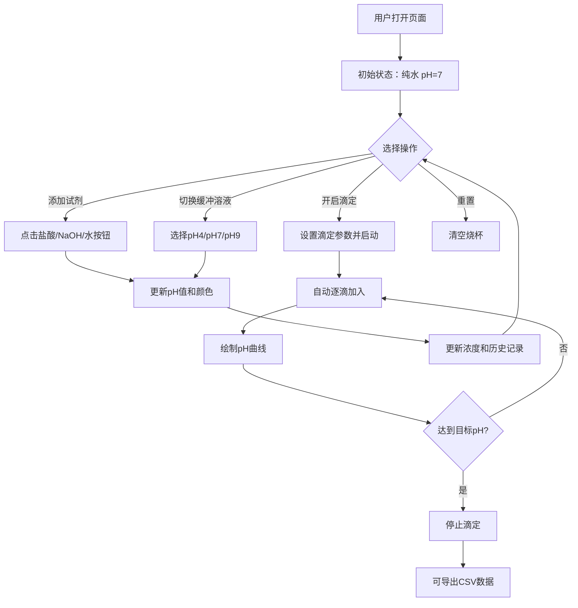

## 1. 产品概述

化学实验pH值模拟器是一款面向化学教学和学习的交互式Web应用，通过可视化烧杯、颜色变化和实时数据，帮助用户直观理解酸碱中和、pH值变化及滴定实验原理。目标用户为中学生、大学生及化学爱好者。

## 2. 核心功能

### 2.1 功能模块

1. **主实验页面**：烧杯可视化、试剂添加、pH值显示、指示剂开关、浓度显示、滴定实验、pH曲线绘制、数据导出

### 2.2 页面详情

| 页面名称 | 模块名称 | 功能描述 |
|----------|----------|----------|
| 主实验页面 | 烧杯可视化 | 显示烧杯及溶液，溶液颜色根据pH值实时变化（酸性红色、中性黄色、碱性蓝色） |
| 主实验页面 | 试剂添加 | 提供盐酸、氢氧化钠、水三种试剂按钮，每次点击加入固定量试剂，实时更新pH值 |
| 主实验页面 | pH值显示 | 数字显示当前pH值（0-14），附带pH标尺 |
| 主实验页面 | 浓度显示 | 显示当前溶液中H⁺和OH⁻的浓度（mol/L） |
| 主实验页面 | 试剂历史 | 列表记录每次加入的试剂名称、体积和加入后pH值变化 |
| 主实验页面 | 指示剂开关 | 酚酞和甲基橙两种指示剂的开关切换，开启后溶液颜色按指示剂变色规律变化 |
| 主实验页面 | 滴定实验 | 设置自动滴定试剂、滴定速度和目标pH值，程序自动逐滴加入试剂 |
| 主实验页面 | pH曲线 | Canvas绘制pH值随滴定体积变化的曲线图 |
| 主实验页面 | 缓冲溶液 | 预设pH4、pH7、pH9三种标准缓冲溶液，一键切换 |
| 主实验页面 | 数据导出 | 导出实验数据为CSV文件，包含每次滴定的体积和pH值 |
| 主实验页面 | 重置烧杯 | 一键清空烧杯，恢复初始状态 |
| 主实验页面 | 声音提示 | pH值跨过7时发出提示音 |

## 3. 核心流程

### 3.1 基本操作流程
用户打开页面 → 看到空烧杯和pH=7的中性水 → 选择添加试剂（盐酸/氢氧化钠/水）→ 烧杯颜色实时变化 → 查看pH值和浓度 → 可选择添加指示剂观察变色 → 可开启滴定实验自动滴加并绘制曲线

### 3.2 滴定实验流程
用户设置滴定试剂和目标pH值 → 点击开始滴定 → 程序按设定速度自动逐滴加入试剂 → Canvas实时绘制pH曲线 → 达到目标pH值停止 → 可导出实验数据

## 4. 用户界面设计

### 4.1 设计风格
- 主色调：深蓝科技感 + 酸碱指示剂渐变色点缀（红-黄-蓝）
- 按钮风格：圆角胶囊按钮，带有微光效果和悬浮动画
- 字体：标题使用等宽科技字体，正文使用清晰的无衬线字体
- 布局风格：左侧烧杯可视化区 + 右侧控制面板和数据区
- 图标风格：简洁线条图标，搭配化学实验主题

### 4.2 页面设计概览

| 页面名称 | 模块名称 | UI元素 |
|----------|----------|--------|
| 主实验页面 | 烧杯可视化区 | 大号SVG烧杯，溶液颜色渐变动画，液面波动效果，体积刻度 |
| 主实验页面 | pH显示区 | 大号数字pH值，环形pH标尺（0-14），颜色指示 |
| 主实验页面 | 试剂按钮组 | 三个彩色胶囊按钮（盐酸-红、NaOH-蓝、水-灰），带点击反馈 |
| 主实验页面 | 浓度面板 | H⁺和OH⁻浓度数值，科学计数法显示 |
| 主实验页面 | 试剂历史 | 滚动列表，每行显示试剂名、体积、pH变化，带时间线样式 |
| 主实验页面 | 指示剂面板 | 两个拨动开关，带指示剂颜色预览 |
| 主实验页面 | 滴定控制 | 下拉选择试剂、速度滑块、目标pH输入框、开始/暂停按钮 |
| 主实验页面 | pH曲线 | Canvas图表，X轴体积、Y轴pH值，实时绘制 |
| 主实验页面 | 缓冲溶液按钮 | 三个小按钮（pH4/pH7/pH9），一键切换 |
| 主实验页面 | 工具栏 | 重置按钮、导出CSV按钮、声音开关 |

### 4.3 响应式设计
- 桌面优先设计，最小宽度1024px
- 大屏：左右分栏布局（烧杯60% + 面板40%）
- 中屏：上下布局（烧贝上方 + 控制面板下方）

### 4.4 化学指示剂变色规律
- **酚酞**：pH < 8.2 无色，pH 8.2-10 浅红至深红，pH > 10 深红
- **甲基橙**：pH < 3.1 红色，pH 3.1-4.4 橙色，pH > 4.4 黄色
