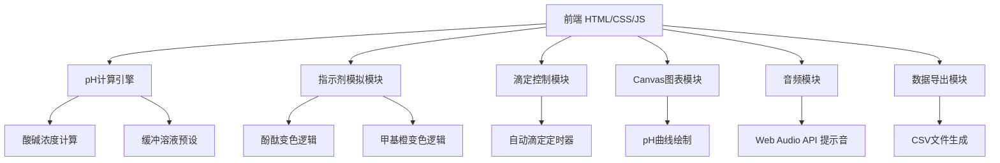

## 1. 架构设计



## 2. 技术说明

- **前端**：纯HTML5 + CSS3 + 原生JavaScript（ES2020），无框架依赖
- **图形渲染**：SVG绘制烧杯，Canvas绘制pH曲线
- **音频**：Web Audio API 生成提示音，无需外部音频文件
- **数据导出**：Blob API 生成CSV文件下载
- **无后端**：纯前端应用，所有计算在浏览器完成

## 3. 文件结构

| 文件 | 用途 |
|------|------|
| index.html | 主页面结构，包含所有UI布局 |
| style.css | 样式文件，烧杯样式、布局、动画 |
| app.js | 主逻辑，pH计算、试剂管理、UI交互 |

## 4. 核心计算模型

### 4.1 pH值计算
- 维护溶液总体积 `V_total` 和 H⁺摩尔数 `n_H`
- 每次加入试剂更新 `n_H` 和 `V_total`
- `[H⁺] = n_H / V_total`
- `pH = -log10([H⁺])`，限制在 0-14 范围
- `[OH⁻] = 1e-14 / [H⁺]`

### 4.2 试剂参数
| 试剂 | 浓度 | 每次加入体积 | H⁺摩尔数变化 |
|------|------|------------|-------------|
| 盐酸 (HCl) | 0.1 mol/L | 10 mL | +1e-3 mol |
| 氢氧化钠 (NaOH) | 0.1 mol/L | 10 mL | -1e-3 mol |
| 水 (H₂O) | 中性 | 10 mL | 0（稀释效果） |

### 4.3 缓冲溶液预设
| 缓冲液 | H⁺浓度 | OH⁻浓度 |
|--------|--------|---------|
| pH 4 | 1e-4 mol/L | 1e-10 mol/L |
| pH 7 | 1e-7 mol/L | 1e-7 mol/L |
| pH 9 | 1e-9 mol/L | 1e-5 mol/L |

### 4.4 滴定实验
- 滴定速度：1-10滴/秒，每滴0.5mL
- 目标pH：0-14，精度0.1
- 自动模式：使用 `setInterval` 按速度逐滴加入
- pH曲线：X轴为累计滴定体积(mL)，Y轴为pH值

## 5. 指示剂变色逻辑

### 5.1 无指示剂
- pH 0-6：红色（酸性），颜色随pH从深红渐变到浅红
- pH 7：黄色（中性）
- pH 8-14：蓝色（碱性），颜色随pH从浅蓝渐变到深蓝

### 5.2 酚酞指示剂
- pH < 8.2：无色透明
- pH 8.2-10：粉红到深红渐变
- pH > 10：深红/品红

### 5.3 甲基橙指示剂
- pH < 3.1：红色
- pH 3.1-4.4：橙色渐变
- pH > 4.4：黄色

### 5.4 同时开启两种指示剂
- 颜色混合叠加

## 6. 数据导出格式

CSV列：
```
步骤,试剂,体积(mL),累计体积(mL),pH值,H⁺浓度(mol/L),OH⁻浓度(mol/L)
```
