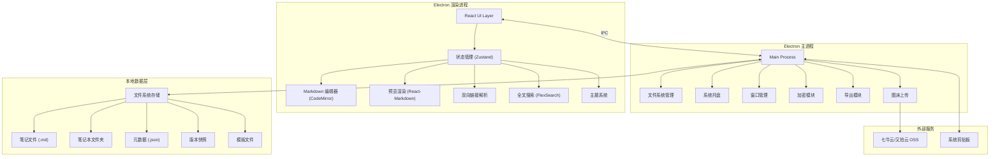
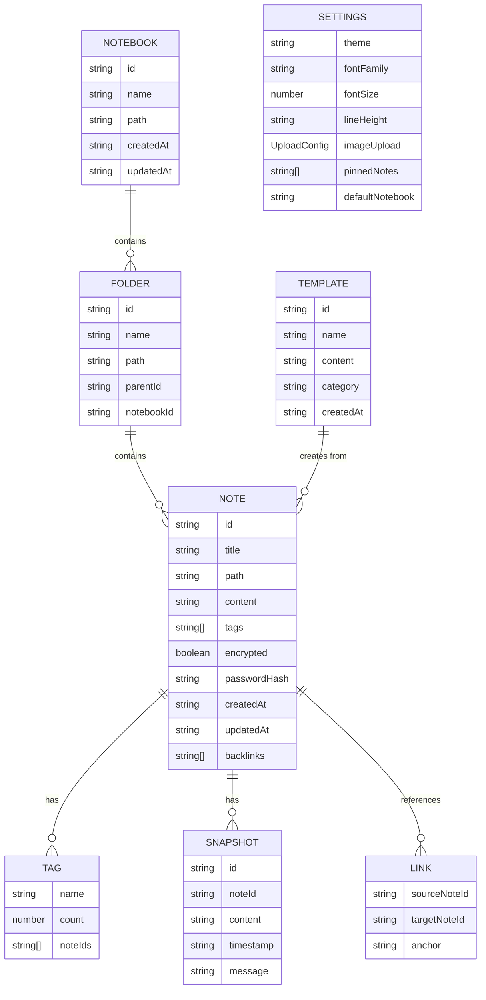

## 1. 架构设计



## 2. 技术栈描述

| 层级 | 技术选型 | 用途 |
|------|----------|------|
| 桌面框架 | Electron 28.x | 跨平台桌面应用 |
| 前端框架 | React 18.x + TypeScript | UI 构建 |
| 构建工具 | Vite 5.x | 开发构建和热更新 |
| 状态管理 | Zustand 4.x | 全局状态管理 |
| 编辑器 | CodeMirror 6 | Markdown 编辑器 |
| Markdown 渲染 | react-markdown + remark/rehype 插件 | Markdown 转 HTML |
| 语法高亮 | shiki/rehype-highlight | 代码块语法高亮 |
| 数学公式 | KaTeX + remark-math | LaTeX 公式渲染 |
| 图表 | Mermaid 10.x | 流程图/时序图绘制 |
| 全文搜索 | FlexSearch 0.7.x | 本地全文索引和搜索 |
| 拖拽 | react-dnd + HTML5 backend | 拖拽移动文件 |
| 加密 | crypto-js / Web Crypto API | AES 加密存储 |
| 导出 | html2canvas + jspdf | PDF/图片导出 |
| 压缩 | jszip | 笔记本 Zip 导出 |
| HTTP | axios | 图床 API 调用 |
| UI 组件 | TailwindCSS 3.x + Headless UI | 样式和组件 |
| 图标 | Lucide React | 图标库 |

## 3. 项目结构

```
marknote/
├── electron/                    # Electron 主进程代码
│   ├── main.ts                 # 主进程入口
│   ├── preload.ts              # 预加载脚本
│   ├── modules/
│   │   ├── fileManager.ts      # 文件系统管理
│   │   ├── tray.ts             # 系统托盘
│   │   ├── windowManager.ts    # 窗口管理
│   │   ├── encryptor.ts        # AES 加密模块
│   │   ├── exporter.ts         # 导出功能
│   │   ├── uploader.ts         # 图床上传
│   │   └── versionControl.ts   # 版本控制
│   └── ipc/
│       └── handlers.ts         # IPC 事件处理器
├── src/                         # React 渲染进程代码
│   ├── main.tsx                # 应用入口
│   ├── App.tsx                 # 根组件
│   ├── store/
│   │   ├── useAppStore.ts      # 应用状态
│   │   ├── useEditorStore.ts   # 编辑器状态
│   │   ├── useSearchStore.ts   # 搜索状态
│   │   └── useSettingsStore.ts # 设置状态
│   ├── components/
│   │   ├── Layout/             # 布局组件
│   │   ├── Sidebar/            # 侧边栏
│   │   ├── Editor/             # Markdown 编辑器
│   │   ├── Preview/            # 预览渲染
│   │   ├── Search/             # 搜索组件
│   │   ├── Tags/               # 标签相关
│   │   ├── Links/              # 双向链接
│   │   ├── Settings/           # 设置页面
│   │   ├── Templates/          # 模板管理
│   │   └── common/             # 通用组件
│   ├── hooks/                  # 自定义 Hooks
│   ├── utils/
│   │   ├── markdown.ts         # Markdown 处理
│   │   ├── search.ts           # 搜索工具
│   │   ├── linkParser.ts       # 链接解析
│   │   └── crypto.ts           # 加密工具
│   ├── types/                  # TypeScript 类型定义
│   └── styles/                 # 全局样式和主题
├── public/                     # 静态资源
├── package.json
├── vite.config.ts
├── electron-builder.json
└── tsconfig.json
```

## 4. IPC 通信定义

### 4.1 文件操作

| 通道 | 类型 | 参数 | 返回值 |
|------|------|------|--------|
| `file:read` | invoke | path: string | content: string \| encrypted |
| `file:write` | invoke | path: string, content: string, encrypted?: boolean | success: boolean |
| `file:delete` | invoke | path: string | success: boolean |
| `file:move` | invoke | from: string, to: string | success: boolean |
| `dir:list` | invoke | path: string | FileTree[] |
| `dir:create` | invoke | path: string | success: boolean |

### 4.2 版本控制

| 通道 | 类型 | 参数 | 返回值 |
|------|------|------|--------|
| `version:save` | invoke | notePath: string, content: string | snapshotId: string |
| `version:list` | invoke | notePath: string | Snapshot[] |
| `version:restore` | invoke | notePath: string, snapshotId: string | content: string |
| `version:delete` | invoke | notePath: string, snapshotId: string | success: boolean |

### 4.3 导出功能

| 通道 | 类型 | 参数 | 返回值 |
|------|------|------|--------|
| `export:pdf` | invoke | html: string, outputPath: string | success: boolean |
| `export:html` | invoke | html: string, outputPath: string | success: boolean |
| `export:image` | invoke | elementId: string, outputPath: string | success: boolean |
| `export:zip` | invoke | notebookPath: string, outputPath: string | success: boolean |

### 4.4 系统功能

| 通道 | 类型 | 参数 | 返回值 |
|------|------|------|--------|
| `tray:pin` | invoke | notePath: string | success: boolean |
| `tray:unpin` | invoke | notePath: string | success: boolean |
| `tray:getPinned` | invoke | - | PinnedNote[] |
| `upload:image` | invoke | imagePath: string, config: UploadConfig | url: string |

## 5. 数据模型

### 5.1 数据结构定义



### 5.2 元数据文件格式

每个笔记本根目录下存储 `.metadata.json`：

```json
{
  "notebook": {
    "id": "nb-xxx",
    "name": "我的笔记",
    "createdAt": "2024-01-01T00:00:00Z",
    "updatedAt": "2024-01-01T00:00:00Z"
  },
  "files": [
    {
      "id": "note-xxx",
      "type": "note",
      "path": "/folder/note.md",
      "title": "笔记标题",
      "tags": ["work", "important"],
      "encrypted": false,
      "createdAt": "2024-01-01T00:00:00Z",
      "updatedAt": "2024-01-01T00:00:00Z"
    }
  ],
  "tags": {
    "work": { "count": 5, "notes": ["note-xxx"] },
    "important": { "count": 3, "notes": ["note-xxx"] }
  }
}
```

### 5.3 版本快照存储

```
.notebook/
└── .versions/
    └── note-xxx/
        ├── snap-20240101-000000.json
        ├── snap-20240101-120000.json
        └── index.json
```

快照文件格式：
```json
{
  "id": "snap-xxx",
  "noteId": "note-xxx",
  "content": "笔记内容...",
  "timestamp": "2024-01-01T00:00:00Z",
  "size": 1024
}
```

## 6. 核心算法说明

### 6.1 双向链接解析

```typescript
// 解析 [[笔记名]] 和 [[笔记名#锚点]] 格式
const LINK_REGEX = /\[\[([^\]#]+)(?:#([^\]]+))?\]\]/g;

function parseLinks(content: string): LinkInfo[] {
  const links: LinkInfo[] = [];
  let match;
  while ((match = LINK_REGEX.exec(content)) !== null) {
    links.push({
      targetName: match[1].trim(),
      anchor: match[2]?.trim(),
      position: match.index,
      length: match[0].length
    });
  }
  return links;
}
```

### 6.2 全文搜索索引

使用 FlexSearch 构建本地索引，支持中文分词和模糊搜索：

```typescript
import FlexSearch from 'flexsearch';

const index = new FlexSearch.Document({
  document: {
    id: 'id',
    index: [
      { field: 'title', tokenize: 'forward', optimize: true },
      { field: 'content', tokenize: 'strict', minlength: 2 }
    ],
    store: ['title', 'path', 'tags']
  },
  charset: 'latin:advanced'
});
```

### 6.3 AES 加密

使用 AES-256-CBC 加密笔记内容：

```typescript
import CryptoJS from 'crypto-js';

function encrypt(content: string, password: string): string {
  const salt = CryptoJS.lib.WordArray.random(128 / 8);
  const key = CryptoJS.PBKDF2(password, salt, {
    keySize: 256 / 32,
    iterations: 1000
  });
  const iv = CryptoJS.lib.WordArray.random(128 / 8);
  const encrypted = CryptoJS.AES.encrypt(content, key, { iv: iv });
  return salt.toString() + iv.toString() + encrypted.toString();
}
```

## 7. 安全考虑

1. **密码安全**：密码不直接存储，使用 PBKDF2 派生密钥，加密内容包含随机 salt 和 iv
2. **文件权限**：笔记文件设置为仅用户可读可写 (0600)
3. **剪贴板处理**：粘贴图片时先缓存到本地临时目录，处理完成后清理
4. **图床凭证**：Access Key 等敏感信息使用系统钥匙串存储（keytar 库）
5. **XSS 防护**：Markdown 渲染启用 DOMPurify 过滤，禁止危险 HTML 标签
