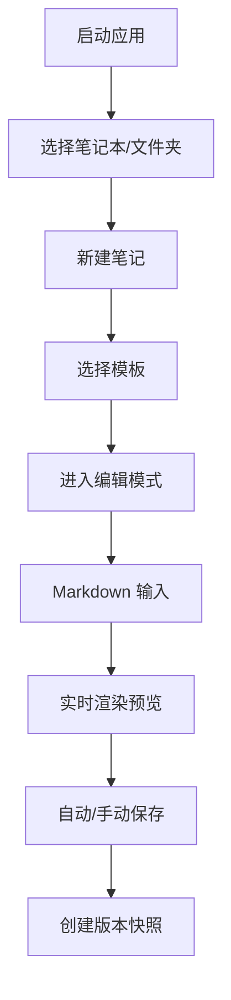

## 1. 产品概述

MarkNote 是一款基于 Electron 的本地 Markdown 笔记应用，为知识工作者提供强大的笔记管理和创作体验。所有数据存储在本地文件系统，保障数据隐私和安全。

- 核心价值：提供集编辑、预览、组织、搜索、导出于一体的全功能笔记管理体验
- 目标用户：程序员、学生、研究人员、内容创作者等需要高效知识管理的用户
- 产品定位：轻量、强大、可离线使用的本地优先笔记应用

## 2. 核心功能

### 2.1 用户角色

| 角色 | 注册方式 | 核心权限 |
|------|----------|----------|
| 普通用户 | 无需注册，本地使用 | 使用所有笔记管理功能，本地存储数据 |

### 2.2 功能模块

1. **笔记编辑模块**：Markdown 双栏编辑预览、语法高亮、LaTeX 公式、Mermaid 图表
2. **文件管理模块**：笔记本、多级文件夹、拖拽移动、笔记组织
3. **搜索模块**：全文搜索、高亮显示、上下文片段
4. **标签系统**：多标签管理、标签云、按标签筛选
5. **双向链接**：`[[笔记名]]` 链接、反向链接列表、快捷跳转
6. **导出模块**：单篇导出 PDF/HTML/图片、笔记本导出 Zip
7. **版本历史**：自动快照、历史版本浏览、版本恢复
8. **主题设置**：暗色/亮色主题、自定义字体字号
9. **系统托盘**：快速访问、固定笔记、快捷操作
10. **模板系统**：日记模板、会议记录模板、自定义模板
11. **图床配置**：本地保存、七牛云、又拍云上传
12. **加密功能**：单笔记密码保护、AES 加密存储

### 2.3 页面详情

| 页面名称 | 模块名称 | 功能描述 |
|----------|----------|----------|
| 主界面 | 侧边栏导航 | 笔记本列表、文件夹树、标签云、快速访问 |
| 主界面 | 编辑区域 | 左侧 Markdown 编辑器、右侧实时预览 |
| 主界面 | 工具栏 | 新建笔记、保存、导出、搜索、设置 |
| 搜索结果页 | 搜索展示 | 匹配结果列表、高亮关键词、上下文预览 |
| 历史版本页 | 版本管理 | 版本列表、版本对比、恢复操作 |
| 设置页面 | 偏好设置 | 主题切换、字体字号、图床配置、加密设置 |
| 模板管理页 | 模板设置 | 模板列表、新建模板、编辑删除模板 |
| 标签管理页 | 标签展示 | 标签云、按使用频率排序、笔记筛选 |

## 3. 核心流程

### 3.1 笔记创建与编辑流程

用户启动应用 → 选择笔记本/文件夹 → 点击新建笔记 → 选择模板（可选）→ 进入双栏编辑模式 → 左侧输入 Markdown → 右侧实时预览 → 自动保存/手动保存 → 创建版本快照

### 3.2 双向链接使用流程

编辑笔记 → 输入 `[[笔记名]]` → 自动识别并创建链接 → 点击链接跳转至目标笔记 → 侧边栏显示反向链接列表 → 可点击反向链接回溯

### 3.3 搜索流程

点击搜索框 → 输入关键词 → 实时搜索标题和正文 → 展示匹配结果列表 → 高亮显示关键词 → 显示上下文片段 → 点击结果跳转到对应笔记位置

## 4. 用户界面设计

### 4.1 设计风格

- **设计方向**：精致简约的编辑器风格，注重内容展示和阅读体验
- **主色调**：深靛蓝 `#1e40af` 作为品牌色，用于重要操作和高亮
- **辅助色**：温暖的琥珀色 `#d97706` 用于强调和提示，翠绿色 `#059669` 用于成功状态
- **背景色**：亮色模式使用近白色 `#fafaf9`，暗色模式使用深灰 `#18181b`
- **按钮风格**：圆角矩形，轻微阴影，hover 时有微妙的缩放和颜色加深效果
- **字体**：正文使用 "IBM Plex Sans" 或 "LXGW WenKai"（中文），等宽字体使用 "JetBrains Mono" 或 "Fira Code"
- **布局**：三栏布局（左侧导航 + 中间编辑器 + 右侧预览），可拖拽调整宽度
- **图标**：使用 Lucide React 图标库，线条风格统一

### 4.2 页面设计概述

| 页面名称 | 模块名称 | UI 元素 |
|----------|----------|---------|
| 主界面 | 侧边栏 | 折叠式笔记本树、渐变背景标签云、固定笔记区 |
| 主界面 | 编辑器 | 行号显示、语法高亮、当前行高亮、迷你地图 |
| 主界面 | 预览区 | 优雅的排版、数学公式渲染、Mermaid 图表、代码块复制 |
| 主界面 | 底部状态栏 | 字数统计、当前笔记路径、保存状态、光标位置 |
| 搜索结果页 | 结果列表 | 卡片式布局、关键词高亮、渐变边框、上下文片段 |
| 设置页面 | 设置项 | 分组卡片、开关组件、颜色选择器、字体预览 |

### 4.3 响应式

- **桌面端优先**：针对 1280px 及以上宽度优化，三栏布局
- **窗口缩放**：各区域可通过拖拽分隔线调整宽度
- **小窗口适配**：当窗口宽度小于 900px 时，自动切换为单栏模式，编辑器和预览通过标签切换

### 4.4 动效设计

- 页面加载：各区域淡入动画，延迟 50ms 依次出现
- 编辑器：输入时光标闪烁动画，滚动时平滑滚动
- 搜索：输入时实时搜索，结果列表淡入展示
- 切换主题：平滑的颜色过渡动画，持续 300ms
- 拖拽移动：半透明拖拽预览，放置区域高亮提示
