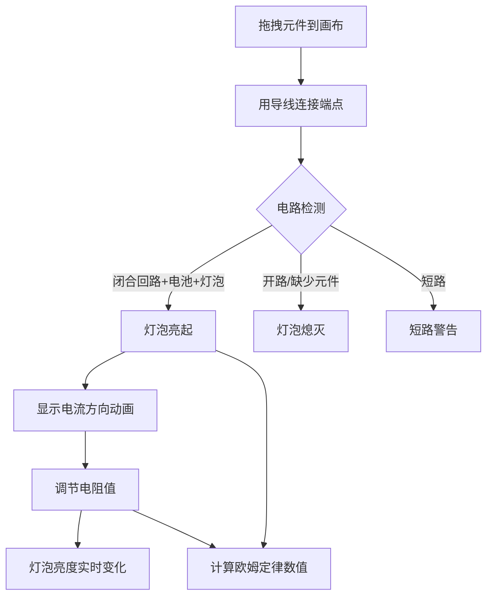

## 1. 产品概述

简易电路搭建模拟游戏是一款面向电路学习者和爱好者的交互式教育工具。用户可以在网格画布上拖拽电路元件（电池、灯泡、开关、电阻、导线），自由搭建电路并通过视觉反馈验证电路是否正确闭合。
- 目标用户：中学物理学生、电路初学者、教育工作者
- 核心价值：通过直观的拖拽操作和实时视觉反馈（灯泡亮灭、电流动画、欧姆定律计算），帮助用户理解基本电路原理

## 2. 核心功能

### 2.1 用户角色
| 角色 | 使用方式 | 核心权限 |
|------|----------|----------|
| 普通用户 | 无需注册 | 搭建电路、保存/加载、查看预设示例 |

### 2.2 功能模块
1. **主页面**：元件库面板、网格画布、工具栏、欧姆定律面板、提示区域

### 2.3 页面详情
| 页面名称 | 模块名称 | 功能描述 |
|----------|----------|----------|
| 主页面 | 元件库面板 | 提供电池、灯泡、开关、电阻、导线五种元件，用户可拖拽至画布 |
| 主页面 | 网格画布 | 右侧大区域网格，放置元件并用导线连接端点 |
| 主页面 | 工具栏 | 保存/加载电路、加载预设示例（简单回路/串联/并联）、重置画布 |
| 主页面 | 欧姆定律面板 | 实时显示电路的电压(V)、电流(I)、电阻(Ω)值及欧姆定律验证 |
| 主页面 | 提示区域 | 短路警告、电路状态提示（开路/闭合） |
| 主页面 | 电阻值调节 | 点击电阻元件后弹出滑块，实时调节电阻值并影响灯泡亮度 |
| 主页面 | 电流方向动画 | 闭合回路中动画小点沿导线移动，展示电流方向 |

## 3. 核心流程

用户从左侧元件库拖拽元件到右侧网格画布，通过导线连接元件端点形成电路。系统实时检测电路状态：
- 闭合回路含电池+灯泡 → 灯泡亮起，显示电流动画，计算欧姆定律
- 开关断开 → 灯泡熄灭，电流中断
- 电阻增大 → 灯泡变暗，电流减小
- 短路（电池无负载直连） → 弹出警告提示

## 4. 用户界面设计

### 4.1 设计风格
- 主色调：深蓝/墨蓝色背景（#0a1628），搭配电路板绿色（#00ff88）作为强调色
- 辅助色：琥珀色（#ffaa00）用于灯泡亮起状态，红色（#ff4444）用于警告
- 按钮：圆角微3D效果，悬停发光
- 字体：标题使用等宽字体体现科技感，正文使用清晰无衬线字体
- 布局：左侧固定元件库面板 + 右侧自适应网格画布
- 图标：电路元件使用SVG矢量图标，风格简洁线性

### 4.2 页面设计概览
| 页面名称 | 模块名称 | UI元素 |
|----------|----------|--------|
| 主页面 | 元件库面板 | 暗色侧边栏，元件卡片带图标和名称，拖拽手柄效果 |
| 主页面 | 网格画布 | 网格线背景，元件SVG渲染，导线为绿色线条，端点为圆形节点 |
| 主页面 | 工具栏 | 顶部水平工具条，图标按钮+文字标签 |
| 主页面 | 欧姆定律面板 | 右下角浮动面板，显示V=IR公式及实时数值 |
| 主页面 | 电流动画 | 小圆点沿导线路径移动，颜色为亮绿色 |
| 主页面 | 短路警告 | 红色弹窗提示，带闪烁效果 |

### 4.3 响应式设计
- 桌面优先设计，支持触屏拖拽
- 移动端：长按元件进入拖拽模式，画布支持双指缩放
- 元件库在小屏幕下收起为底部抽屉

### 4.4 交互细节
- 拖拽元件时显示半透明预览跟随鼠标/手指
- 元件端点高亮提示可连接区域
- 灯泡亮起时有发光动画（CSS box-shadow/filter）
- 导线连接成功时有轻微弹跳动画
- 短路时画布边框闪红
