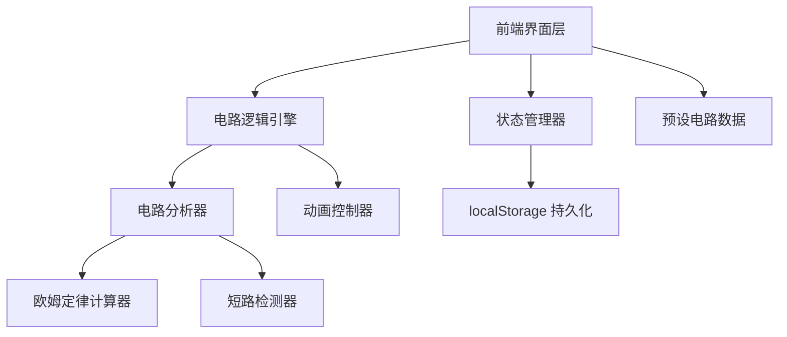

## 1. 架构设计



## 2. 技术说明

- 前端：纯 HTML5 + CSS3 + 原生 JavaScript（ES2020），无框架依赖
- 构建工具：无需构建，直接浏览器运行
- 数据持久化：localStorage
- 动画：Canvas API 绘制电流动画 + CSS 动画实现灯泡发光
- 渲染：SVG 渲染电路元件 + Canvas 渲染导线和电流动画
- 触控：Touch Events API 实现移动端长按拖拽

## 3. 文件结构

| 文件 | 用途 |
|------|------|
| index.html | 主页面结构 |
| css/style.css | 全局样式、布局、动画 |
| js/app.js | 应用入口、初始化 |
| js/circuit-engine.js | 电路逻辑引擎（连通性检测、欧姆定律计算、短路检测） |
| js/grid-canvas.js | 网格画布渲染（SVG元件+Canvas导线） |
| js/component-library.js | 元件库面板、拖拽逻辑 |
| js/animation.js | 电流方向动画控制 |
| js/presets.js | 预设电路数据（简单回路/串联/并联） |
| js/storage.js | localStorage 保存/加载 |
| js/ui.js | 工具栏、欧姆定律面板、提示区域UI交互 |

## 4. 数据模型

### 4.1 元件数据模型
```javascript
{
  id: "comp_1",           // 唯一标识
  type: "battery",        // battery | bulb | switch | resistor | wire
  gridX: 3,               // 网格X坐标
  gridY: 2,               // 网格Y坐标
  rotation: 0,            // 旋转角度 0|90|180|270
  properties: {           // 类型特定属性
    voltage: 9,           // 电池电压(V)
    resistance: 100,      // 电阻值(Ω)
    isOn: true            // 开关状态
  },
  ports: [                // 连接端点
    { id: "port_a", offsetX: -1, offsetY: 0, connectedTo: null },
    { id: "port_b", offsetX: 1, offsetY: 0, connectedTo: null }
  ]
}
```

### 4.2 导线数据模型
```javascript
{
  id: "wire_1",
  from: { componentId: "comp_1", portId: "port_a" },
  to: { componentId: "comp_2", portId: "port_b" },
  path: [{x: 3, y: 2}, {x: 4, y: 2}]  // 路径点
}
```

### 4.3 电路状态模型
```javascript
{
  isClosed: false,        // 是否闭合回路
  hasBattery: false,      // 是否包含电池
  hasBulb: false,         // 是否包含灯泡
  isShortCircuit: false,  // 是否短路
  totalVoltage: 0,        // 总电压(V)
  totalResistance: 0,     // 总电阻(Ω)
  current: 0,             // 电流(A)
  switchOpen: false       // 开关是否断开
}
```

## 5. 电路分析算法

1. **连通性检测**：从电池正极出发，使用图遍历（BFS）沿导线和元件端点搜索，检查是否能回到电池负极形成闭合回路
2. **串联计算**：总电阻 = 所有电阻之和，电流 = 电压 / 总电阻
3. **并联计算**：1/总电阻 = 1/R1 + 1/R2 + ...，各支路电流 = 电压 / 支路电阻
4. **短路检测**：若闭合路径中仅含电池和导线（无灯泡/电阻），判定为短路
5. **灯泡亮度**：亮度百分比 = 基准电流 / 实际电流（受电阻影响）

## 6. 保存/加载数据格式
```javascript
{
  version: "1.0",
  components: [...],      // 元件数组
  wires: [...],           // 导线数组
  timestamp: 1717000000   // 保存时间
}
```
