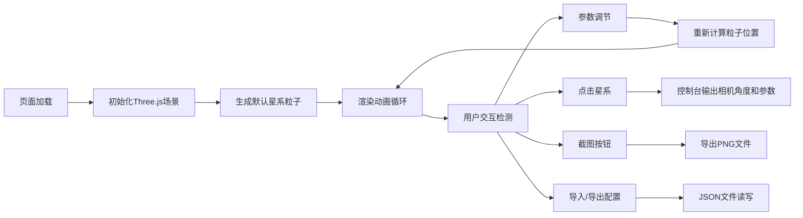

## 1. 产品概述

一个基于Three.js的交互式3D星系可视化应用，展示由粒子组成的旋转风车状星系。用户可以通过控制面板实时调节星系形态参数，支持截图保存、配置导入导出等功能，为天文爱好者和设计师提供沉浸式的宇宙探索体验。

## 2. 核心特性

### 2.1 用户角色
| 角色 | 注册方式 | 核心权限 |
|------|----------|----------|
| 普通用户 | 无需注册 | 完整使用所有功能，调节参数、截图、导入导出 |

### 2.2 功能模块
1. **3D星系主场景**：粒子星系渲染、旋臂动画、相机交互
2. **控制面板**：参数调节滑块、功能开关、操作按钮
3. **数据管理**：配置导入导出、截图保存、状态显示

### 2.3 页面详情
| 页面名称 | 模块名称 | 功能描述 |
|----------|----------|----------|
| 主页面 | 3D渲染区域 | 全屏3D星系场景，支持鼠标拖拽旋转视角、滚轮缩放 |
| 主页面 | 参数控制面板 | 调节旋臂数量(2/3/4)、旋转速度、粒子总数、旋臂缠绕紧密程度 |
| 主页面 | 功能开关区 | 背景星空、粒子大小随机化、雾化效果、相机自动环绕 |
| 主页面 | 操作按钮区 | 一键截图PNG、导出JSON配置、导入JSON配置 |
| 主页面 | 状态显示区 | 实时显示当前粒子总数 |

## 3. 核心流程

## 4. 用户界面设计

### 4.1 设计风格
- **主色调**：深空黑色背景(#0a0a1a)，粒子橙黄(#ffaa33)到蓝色(#3388ff)渐变
- **强调色**：控制面板使用半透明深紫色(#1a1a3a)背景，霓虹蓝(#00ccff)边框
- **按钮风格**：圆角8px，半透明玻璃态，hover时有发光效果
- **字体**：使用Orbitron（科幻显示字体）作为标题，Roboto Mono作为参数数值显示
- **布局风格**：控制面板右侧悬浮，3D场景全屏，毛玻璃效果控制面板

### 4.2 页面设计概述
| 页面名称 | 模块名称 | UI元素 |
|----------|----------|--------|
| 主页面 | 3D渲染区 | 全屏黑色背景，旋转星系粒子，支持拖拽缩放，点击交互 |
| 主页面 | 控制面板 | 右侧固定宽度320px，半透明背景，分组参数滑块，状态信息底部显示 |
| 主页面 | 粒子效果 | 中心核球明亮，旋臂弯曲，粒子由内向外稀疏，橙黄到蓝色渐变 |

### 4.3 响应性
- 桌面端优先设计，控制面板固定右侧
- 移动端控制面板自动调整为底部弹出式
- 触摸操作支持双指缩放和单指旋转

### 4.4 3D场景设计
- **环境**：纯黑深空背景，可选背景星空粒子层
- **光照**：无外部光源，粒子自发光材质，中心粒子亮度更高
- **相机设置**：PerspectiveCamera，初始距离150，角度45°俯视
- **动画**：星系整体缓慢旋转，粒子有微小随机运动
- **后期效果**：可选雾化效果，外缘粒子渐隐淡出
- **性能**：使用BufferGeometry优化粒子渲染，支持1000-50000粒子实时渲染
