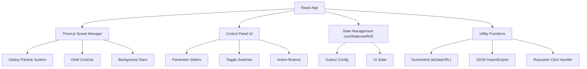

## 1. 架构设计



## 2. 技术描述

- **前端框架**: React@18 + Vite@5
- **3D渲染**: Three@0.160 + @react-three/fiber@8 + @react-three/drei@9
- **样式**: TailwindCSS@3 + CSS Variables
- **UI组件**: 自定义React组件，无额外UI库
- **状态管理**: React Hooks (useState, useRef, useEffect)
- **性能优化**: 
  - BufferGeometry + PointsMaterial实现高性能粒子渲染
  - useMemo缓存粒子计算结果
  - requestAnimationFrame动画循环
  - 参数变化时增量更新而非全量重建

## 3. 核心数据结构

### GalaxyConfig 类型定义
```typescript
interface GalaxyConfig {
  particleCount: number;      // 粒子总数 1000-50000
  armCount: 2 | 3 | 4;        // 旋臂数量
  rotationSpeed: number;      // 旋转速度 0-2
  armTightness: number;       // 旋臂缠绕紧密程度 0.1-2
  randomSize: boolean;        // 粒子大小随机化开关
  showBackground: boolean;    // 背景星空开关
  fogEnabled: boolean;        // 雾化效果开关
  autoRotate: boolean;        // 相机自动环绕开关
}
```

## 4. 核心算法

### 旋臂粒子生成算法
```
对于每个粒子 i in [0, particleCount):
  1. 计算半径 r = sqrt(random) * maxRadius
  2. 计算旋臂角度 spinAngle = r * armTightness
  3. 分配旋臂 armIndex = i % armCount
  4. 基础角度 baseAngle = armIndex * (2π / armCount)
  5. 最终角度 angle = baseAngle + spinAngle
  6. 添加随机偏移 randomOffset = randn * (1 - r/maxRadius) * spread
  7. 位置 x = cos(angle) * r + randomOffset.x
     位置 y = randomOffset.y * flattenFactor
     位置 z = sin(angle) * r + randomOffset.z
  8. 颜色插值：color = lerp(orange, blue, r/maxRadius)
  9. 大小衰减：size = baseSize * (1 - r/maxRadius * 0.7)
```

## 5. 组件结构

```
src/
├── App.jsx                 # 主应用组件
├── components/
│   ├── Galaxy.jsx          # 星系粒子系统
│   ├── BackgroundStars.jsx # 背景星空
│   ├── ControlPanel.jsx    # 控制面板
│   ├── Slider.jsx          # 滑块组件
│   ├── Toggle.jsx          # 开关组件
│   └── Button.jsx          # 按钮组件
├── hooks/
│   └── useGalaxyConfig.js  # 星系配置管理Hook
├── utils/
│   ├── galaxyMath.js       # 星系数学计算
│   ├── screenshot.js       # 截图功能
│   └── jsonIO.js           # JSON导入导出
├── styles/
│   └── globals.css         # 全局样式
└── main.jsx                # 入口文件
```

## 6. 关键技术点

1. **粒子渲染优化**: 使用`BufferGeometry`存储所有粒子位置、颜色、大小数据，通过`PointsMaterial`渲染，单次Draw Call。

2. **参数实时更新**: 使用`useFrame`钩子在每帧更新星系旋转，参数变化时调用`generateGalaxyPositions`重新计算粒子数据。

3. **射线检测点击**: 使用`THREE.Raycaster`检测用户点击，当射线与星系粒子相交时，输出相机角度和当前参数。

4. **截图功能**: 使用`renderer.domElement.toDataURL('image/png')`获取画布数据，创建下载链接。

5. **雾化效果**: 通过`THREE.Fog`实现，雾颜色与背景一致，密度随距离增加，使外缘粒子自然淡出。

6. **相机自动环绕**: 通过在`useFrame`中更新相机位置，使其围绕星系中心做圆周运动。
