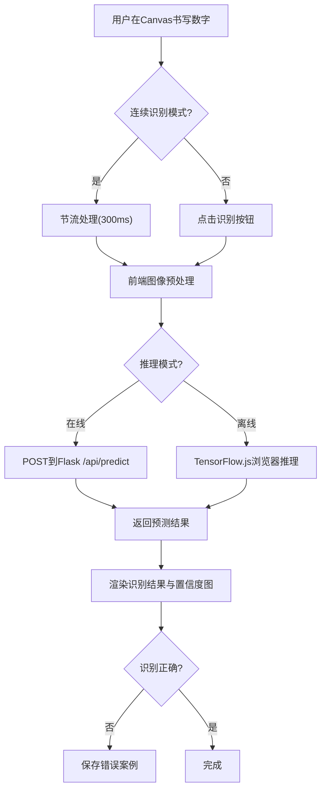

## 1. 产品概述

AI手写数字识别互动应用——用户在Canvas画板上书写数字（0-9），系统实时或按需识别并展示预测结果与置信度分布。结合Flask后端推理与TensorFlow.js离线推理双模式，为学习者和开发者提供直观的AI模型交互体验。

- 目标用户：AI/ML学习者、教育场景、模型开发者
- 核心价值：零门槛体验神经网络推理过程，支持自定义模型与数据集训练

## 2. 核心功能

### 2.1 用户角色

| 角色 | 说明 |
|------|------|
| 普通用户 | 使用画板书写、识别数字、查看结果 |
| 开发者用户 | 上传自定义模型、训练模型、查看错误案例 |

### 2.2 功能模块

1. **画板页面**：Canvas手写画板、工具栏、识别结果面板、置信度图表、设置面板
2. **模型管理面板**：模型切换、模型上传、当前模型信息展示
3. **错误案例面板**：识别错误案例列表、导出功能

### 2.3 页面详情

| 页面名称 | 模块名称 | 功能描述 |
|----------|----------|----------|
| 画板页面 | Canvas画板 | 支持鼠标和触摸绘制，可调笔触粗细，支持清除 |
| 画板页面 | 识别结果面板 | 显示预测数字、置信度百分比、10类置信度条形图 |
| 画板页面 | 工具栏 | 清除画板、识别按钮、随机示例、连续识别开关、保存错误案例 |
| 画板页面 | 设置面板 | 推理模式切换（在线/离线）、模型选择、模型上传 |
| 画板页面 | 错误案例管理 | 查看已保存错误案例、标注正确标签、导出为JSON |
| 模型管理 | 模型切换 | 下拉选择已加载模型或上传新模型 |
| 模型管理 | 模型上传 | 上传.h5/.onnx模型文件，自动加载并切换 |

## 3. 核心流程

**手写数字识别主流程**：
1. 用户在Canvas画板上书写数字
2. 前端对Canvas图像进行预处理（缩放至28x28、灰度化、二值化、归一化）
3. 根据当前模式（在线/离线）选择推理后端
4. 在线模式：将预处理数据POST到Flask后端 `/api/predict`
5. 离线模式：使用TensorFlow.js在浏览器中推理
6. 接收预测结果，渲染数字和置信度条形图
7. 用户可标记错误案例并保存

**模型切换流程**：
1. 用户从下拉列表选择已有模型 或 上传新模型文件
2. 后端加载模型并切换活跃模型
3. 返回模型信息（名称、精度、大小）
4. 前端更新当前模型状态显示

## 4. 用户界面设计

### 4.1 设计风格

- **主色调**：深靛蓝(#0f172a)为底，电光青(#22d3ee)为强调色，搭配暖橙(#f97316)作为次要强调
- **风格**：赛博朋克/科技感——暗色主题、发光边框、扫描线效果
- **按钮**：圆角8px，发光边框效果，hover时亮度增强
- **字体**：JetBrains Mono（代码/数据展示）+ Noto Sans SC（中文UI）
- **布局**：左侧画板区域 + 右侧结果面板，响应式适配移动端
- **图标**：线性科技感图标风格

### 4.2 页面设计概览

| 页面名称 | 模块名称 | UI元素 |
|----------|----------|--------|
| 画板页面 | Canvas画板 | 深色画板背景、发光笔触、网格辅助线、尺寸280x280 |
| 画板页面 | 工具栏 | 图标按钮横排、清除/识别/随机示例/连续模式开关 |
| 画板页面 | 结果面板 | 大号预测数字(发光效果)、置信度条形图(横向渐变条) |
| 画板页面 | 设置抽屉 | 侧边滑出面板、推理模式切换、模型选择下拉框 |
| 画板页面 | 错误案例 | 底部可展开面板、缩略图列表、标注输入框 |

### 4.3 响应式设计

- 桌面优先（1200px+）：左右双栏布局
- 平板（768-1199px）：上下布局，画板在上结果在下
- 移动端（<768px）：单列布局，底部工具栏固定

### 4.4 动效设计

- 画板笔触：轻微发光拖尾效果
- 识别过程：扫描线动画从上到下扫过画板
- 结果出现：数字从小到大弹出+发光
- 置信度条：从左到右动画填充
- 错误案例保存：淡红色闪烁提示
