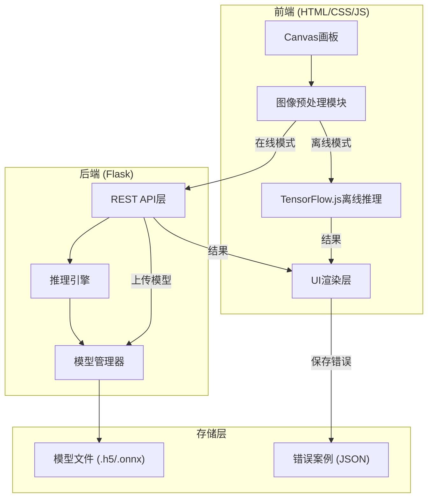
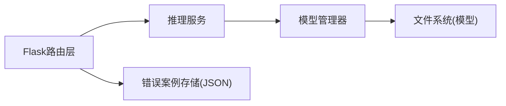

## 1. 架构设计



## 2. 技术说明

- **前端**：原生 HTML5 + CSS3 + JavaScript (ES2020)，无框架依赖
- **后端**：Flask (Python 3.9+)
- **AI推理后端**：TensorFlow 2.x / ONNX Runtime（服务端）+ TensorFlow.js（浏览器端）
- **图像预处理**：Canvas API（前端完成）
- **数据格式**：JSON REST API
- **模型格式**：Keras .h5 / ONNX .onnx
- **开发工具**：Python venv + pip

## 3. 项目目录结构

```
digit-recognizer/
├── index.html              # 主页面
├── css/
│   └── style.css           # 样式
├── js/
│   ├── app.js              # 主应用入口
│   ├── canvas.js           # 画板逻辑
│   ├── preprocess.js       # 图像预处理
│   ├── api.js              # API通信
│   ├── chart.js            # 置信度图表
│   ├── offline.js          # TF.js离线推理
│   └── errors.js           # 错误案例管理
├── server/
│   ├── app.py              # Flask主应用
│   ├── inference.py        # 推理逻辑
│   ├── model_manager.py    # 模型管理
│   └── requirements.txt    # Python依赖
├── models/
│   └── mnist_cnn.h5        # 预训练模型(需用户下载或训练)
├── training/
│   └── train_mnist.py      # 训练脚本示例
├── error_cases/
│   └── cases.json          # 保存的错误案例
└── .trae/
    └── documents/
```

## 4. API定义

### 4.1 预测接口

```
POST /api/predict
Content-Type: application/json

Request:
{
  "image": [float x 784],   // 28x28灰度归一化像素值
  "model": "mnist_cnn"      // 可选，指定模型
}

Response:
{
  "digit": 7,
  "confidence": 0.9832,
  "probabilities": [0.001, 0.002, ..., 0.983, ...],
  "model": "mnist_cnn",
  "processing_time_ms": 12
}
```

### 4.2 模型列表接口

```
GET /api/models

Response:
{
  "models": [
    {
      "name": "mnist_cnn",
      "filename": "mnist_cnn.h5",
      "size_kb": 1024,
      "type": "keras"
    }
  ],
  "active_model": "mnist_cnn"
}
```

### 4.3 模型切换接口

```
POST /api/models/switch
Content-Type: application/json

Request:
{
  "model_name": "mnist_cnn"
}

Response:
{
  "success": true,
  "active_model": "mnist_cnn"
}
```

### 4.4 模型上传接口

```
POST /api/models/upload
Content-Type: multipart/form-data

Request:
  file: <model_file>

Response:
{
  "success": true,
  "model_name": "uploaded_model",
  "filename": "uploaded_model.h5"
}
```

### 4.5 保存错误案例接口

```
POST /api/error-cases
Content-Type: application/json

Request:
{
  "image": [float x 784],
  "predicted": 7,
  "actual": 1,
  "probabilities": [...]
}

Response:
{
  "success": true,
  "case_id": "case_001"
}
```

### 4.6 获取错误案例接口

```
GET /api/error-cases

Response:
{
  "cases": [
    {
      "id": "case_001",
      "predicted": 7,
      "actual": 1,
      "timestamp": "2026-05-30T10:00:00Z",
      "image": [float x 784]
    }
  ]
}
```

## 5. 后端架构



- **Flask路由层**：处理HTTP请求、参数校验
- **推理服务**：加载模型、执行前向推理、返回结果
- **模型管理器**：模型加载/卸载/切换、支持Keras和ONNX格式
- **错误案例存储**：JSON文件存储，按时间排序

## 6. 数据模型

### 6.1 错误案例数据结构

```json
{
  "id": "case_20260530_001",
  "image": [0.0, 0.1, ..., 0.9],
  "predicted": 7,
  "actual": 1,
  "probabilities": [0.01, 0.02, ..., 0.85, ...],
  "model": "mnist_cnn",
  "timestamp": "2026-05-30T10:00:00Z"
}
```

### 6.2 模型信息数据结构

```json
{
  "name": "mnist_cnn",
  "filename": "mnist_cnn.h5",
  "type": "keras",
  "size_kb": 1024,
  "input_shape": [28, 28, 1],
  "output_classes": 10,
  "loaded": true
}
```

## 7. 图像预处理流水线

1. **获取Canvas数据**：从280x280 Canvas获取ImageData
2. **灰度化**：RGBA → 单通道灰度 (0.299R + 0.587G + 0.114B)
3. **缩放**：280x280 → 28x28 (双线性插值)
4. **二值化**：可选，阈值128，增强对比度
5. **归一化**：像素值 / 255.0 → [0, 1]范围
6. **展平**：28x28 → 784长度一维数组
7. **格式化**：封装为JSON发送

## 8. 离线模式 (TensorFlow.js)

- 加载预转换的TF.js模型文件（model.json + 权重bin）
- 推理完全在浏览器中执行，无需后端
- 模型文件通过fetch从本地静态目录加载
- 用户可在设置中切换在线/离线模式
