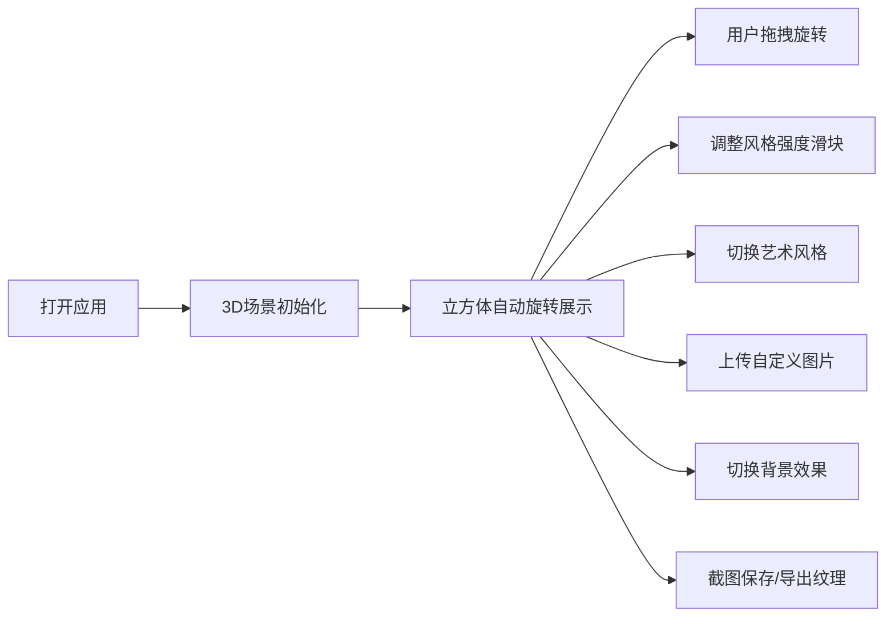

## 1. 产品概述

基于Three.js的3D神经风格迁移立方体可视化应用，将艺术风格迁移技术与3D交互相结合，为用户提供沉浸式的艺术体验。
- 主要目的：展示AI艺术风格迁移的魅力，支持用户自定义内容和风格的3D可视化展示
- 目标用户：艺术爱好者、设计师、教育工作者、AI技术兴趣者

## 2. 核心功能

### 2.1 用户角色
| 角色 | 注册方式 | 核心权限 |
|------|----------|----------|
| 普通用户 | 无需注册 | 使用所有功能，上传图片，导出截图和纹理 |

### 2.2 功能模块
1. **3D立方体展示区**：六面立方体展示不同艺术风格，支持旋转交互
2. **控制面板**：风格强度滑块、风格切换、内容图片选择
3. **图片上传模块**：用户自定义内容图片上传
4. **背景切换模块**：纯色背景/星空背景切换
5. **导出功能**：截图保存PNG、导出各面纹理图片
6. **风格信息展示**：显示当前风格名称和作者信息

### 2.3 页面详情
| 页面名称 | 模块名称 | 功能描述 |
|---------|----------|----------|
| 主页面 | 3D立方体展示 | 实时渲染3D立方体，六面展示不同艺术风格纹理，鼠标拖拽旋转 |
| 主页面 | 风格控制面板 | 滑块控制风格混合强度，下拉菜单切换预设艺术风格 |
| 主页面 | 图片上传区 | 拖拽或点击上传用户自定义内容图片 |
| 主页面 | 背景切换 | 按钮切换纯色背景与星空粒子背景 |
| 主页面 | 导出工具栏 | 一键截图保存，导出各面纹理图片 |
| 主页面 | 风格信息卡 | 展示当前选中风格的名称、作者、年代等信息 |

## 3. 核心流程

用户打开应用 → 3D立方体自动旋转展示预设风格 → 用户拖拽立方体从不同角度观看 → 用户通过滑块调整风格混合强度 → 用户切换不同艺术风格 → 用户上传自定义内容图片 → 用户切换背景效果 → 用户截图保存或导出纹理图片

## 4. 用户界面设计

### 4.1 设计风格
- **主色调**：深空蓝 (#0a0a1a) 作为主背景，霓虹紫 (#8b5cf6) 和青色 (#06b6d4) 作为强调色
- **按钮风格**：半透明玻璃拟态效果，圆角设计，悬浮时发光效果
- **字体**：展示字体使用 Orbitron（科技感），正文字体使用 Noto Sans SC
- **布局风格**：左侧控制面板，中央3D场景，右侧风格信息卡的三栏式布局
- **视觉风格**：赛博朋克艺术风格，霓虹光晕效果，科技感粒子背景

### 4.2 页面设计概述
| 页面名称 | 模块名称 | UI元素 |
|---------|----------|--------|
| 主页面 | 3D场景区 | 全屏Three.js画布，居中立方体，动态光照，可选星空粒子 |
| 主页面 | 控制面板 | 玻璃拟态侧边栏，滑块组件，下拉选择器，文件上传按钮 |
| 主页面 | 风格信息卡 | 浮动卡片，艺术画缩略图，风格名称，作者介绍 |
| 主页面 | 工具栏 | 底部浮动工具栏，截图、导出、背景切换按钮 |

### 4.3 响应式
- Desktop-first 设计，主要针对桌面端优化
- 平板端：控制面板转为顶部或底部浮动
- 移动端：简化控制，触控优化旋转操作

### 4.4 3D场景指导
- **环境**：深空背景，可选星空粒子系统，环境光+点光源组合
- **光照设置**：两盏暖色点光源+环境光，立方体边缘发光效果
- **相机设置**：透视相机，轨道控制器，自动旋转模式
- **交互**：鼠标拖拽旋转，滚轮缩放，双击重置视角
- **动画**：立方体缓慢自转，纹理过渡动画，粒子流动效果
- **后处理**：辉光效果，轻微泛光，色彩增强
- **性能优化**：纹理压缩，LOD控制，合理的粒子数量
