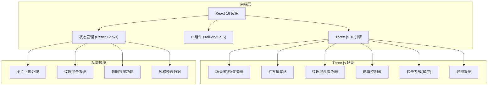

## 1. 架构设计



## 2. 技术描述

- **前端框架**: React@18 + TypeScript
- **构建工具**: Vite@5
- **样式方案**: TailwindCSS@3
- **3D引擎**: three@0.160 + @react-three/fiber@8 + @react-three/drei@9
- **后处理**: @react-three/postprocessing@2
- **状态管理**: React useState/useRef Hooks (简单场景无需额外状态库)

## 3. 路由定义

| 路由 | 用途 |
|------|------|
| / | 主页面 - 3D立方体展示与交互控制面板 |

## 4. 核心数据结构

### 4.1 风格预设数据类型
```typescript
interface ArtStyle {
  id: string;
  name: string;
  nameCn: string;
  author: string;
  year: string;
  description: string;
  thumbnail: string;
  baseColor: string;
}
```

### 4.2 应用状态类型
```typescript
interface AppState {
  styleIntensity: number;
  currentStyle: ArtStyle;
  contentImage: string | null;
  backgroundType: 'solid' | 'stars';
  autoRotate: boolean;
}
```

### 4.3 立方体面对应风格映射
```typescript
type CubeFaces = 'front' | 'back' | 'left' | 'right' | 'top' | 'bottom';

interface FaceStyleMap {
  [key: CubeFaces]: ArtStyle;
}
```

## 5. 核心技术实现方案

### 5.1 纹理混合实现
- 使用 Three.js ShaderMaterial 实现实时纹理混合
- 片元着色器中使用 mix() 函数进行线性插值 (lerp)
- 支持动态调整混合强度 uniform 变量

### 5.2 图片上传处理
- 使用 FileReader API 读取本地图片
- Canvas 进行图片预处理和尺寸标准化
- Three.js TextureLoader 加载为 WebGL 纹理

### 5.3 截图导出功能
- WebGLRenderer 配置 preserveDrawingBuffer: true
- 使用 canvas.toDataURL() 获取画面数据
- 创建下载链接触发浏览器下载

### 5.4 星空背景实现
- BufferGeometry 创建大量粒子点
- 自定义着色器实现闪烁和流动效果
- 与立方体场景分层渲染

## 6. 项目目录结构

```
src/
├── components/
│   ├── Scene3D.tsx        # 3D场景主组件
│   ├── ControlPanel.tsx   # 左侧控制面板
│   ├── StyleInfoCard.tsx  # 风格信息卡片
│   ├── Toolbar.tsx        # 底部工具栏
│   └── ImageUploader.tsx  # 图片上传组件
├── three/
│   ├── Cube.tsx           # 立方体组件
│   ├── Stars.tsx          # 星空粒子组件
│   └── shaders/           # 自定义着色器
├── data/
│   └── styles.ts          # 艺术风格预设数据
├── hooks/
│   └── useTextureBlend.ts # 纹理混合hook
├── utils/
│   ├── export.ts          # 导出工具函数
│   └── image.ts           # 图片处理工具
├── App.tsx
├── main.tsx
└── index.css
```
