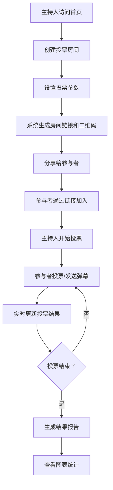

## 1. 产品概述

实时多人投票系统是一个基于Web的互动投票平台，支持创建投票房间、实时投票、结果展示和弹幕互动。系统解决了传统投票缺乏实时性、互动性不足的问题，适用于会议决策、活动投票、问卷调查等多种场景。目标用户包括企业团队、活动组织者、教育机构等需要快速收集群体意见的群体。

产品的核心价值在于：实时性（投票结果秒级更新）、互动性（弹幕评论增强参与感）、便捷性（扫码即可参与）、安全性（防刷票机制保障公平）。

## 2. 核心功能

### 2.1 用户角色

| 角色 | 参与方式 | 核心权限 |
|------|----------|----------|
| 主持人（房间创建者） | 创建房间进入 | 设置投票参数、控制投票状态（开始/暂停/结束）、查看详细投票数据 |
| 投票用户 | 通过链接/二维码加入 | 参与投票、发送弹幕评论、查看实时结果 |
| 观众用户 | 通过链接/二维码加入 | 查看实时投票结果和弹幕、不能投票 |

### 2.2 功能模块

1. **首页**：创建投票入口、加入投票入口、使用说明
2. **创建房间页**：设置投票主题、选项、截止时间、投票模式（匿名/实名）、是否多选
3. **投票页面**：实时投票界面、票数动画展示、弹幕评论区、房间信息与二维码
4. **结果报告页**：投票结果图表（饼图/柱状图切换）、详细统计数据、导出功能

### 2.3 页面详情

| 页面名称 | 模块名称 | 功能描述 |
|---------|----------|----------|
| 首页 | 创建投票卡片 | 输入投票主题快速创建、高级设置展开 |
| 首页 | 加入投票卡片 | 输入房间号加入、扫码加入提示 |
| 创建房间页 | 基本信息表单 | 主题、选项管理（增删）、截止时间选择 |
| 创建房间页 | 高级设置 | 投票模式（匿名/实名）、是否允许多选、防刷票开关 |
| 投票页面 | 投票选项区 | 选项卡片、进度条动画、实时票数与百分比 |
| 投票页面 | 实时数据面板 | 总票数、参与人数、剩余时间倒计时 |
| 投票页面 | 弹幕评论区 | 弹幕发送、实时飘屏展示 |
| 投票页面 | 房间信息栏 | 房间号、分享链接、二维码、主持人控制按钮 |
| 结果报告页 | 图表展示区 | 饼图/柱状图切换、动画过渡效果 |
| 结果报告页 | 统计详情 | 投票明细、时间分布、实名投票记录（仅主持人可见） |

## 3. 核心流程

主持人创建投票房间，系统生成唯一房间号和分享链接/二维码。主持人分享链接给参与者，参与者通过链接加入房间。主持人开始投票后，参与者可以选择选项进行投票，投票结果实时更新并以动画效果展示。用户可以发送弹幕评论增强互动。主持人可以随时暂停、恢复或结束投票。投票结束后系统自动生成结果报告，支持图表切换查看。

## 4. 用户界面设计

### 4.1 设计风格

- **主色调**：采用深邃的靛蓝色（#1e3a5f）作为主色，搭配霓虹青色（#00d4ff）和霓虹粉色（#ff00ff）作为强调色，营造科技感和未来感
- **按钮风格**：圆角玻璃拟态按钮，带有霓虹光效边框，悬停时有发光效果
- **字体**：标题使用 Orbitron（科技感字体），正文使用 Inter，确保可读性和现代感
- **布局风格**：卡片式布局配合玻璃拟态效果（backdrop-filter），深色背景配合渐变和光效
- **图标风格**：使用 Lucide 图标，配合霓虹色调

### 4.2 页面设计概述

| 页面名称 | 模块名称 | UI元素 |
|---------|----------|--------|
| 首页 | Hero区域 | 渐变背景、霓虹光效、大标题动画入场 |
| 首页 | 功能卡片 | 玻璃拟态卡片、悬停上浮效果、图标动画 |
| 创建房间页 | 表单区域 | 动态表单、选项增删动画、时间选择器 |
| 投票页面 | 选项卡片 | 进度条填充动画、数字滚动效果、选中态光效 |
| 投票页面 | 弹幕区 | 半透明弹幕、随机颜色、从右向左飘移动画 |
| 投票页面 | 控制面板 | 倒计时动画、状态指示灯、控制按钮组 |
| 结果报告页 | 图表区 | 图表绘制动画、类型切换过渡、数据标签 |

### 4.3 响应式设计

采用桌面优先设计，移动端自适应：
- 桌面端：三栏布局（投票区 + 弹幕区 + 信息面板）
- 平板端：两栏布局（投票区在上，弹幕区在下，信息面板悬浮）
- 移动端：单栏流式布局，折叠面板管理不同功能区
- 触摸优化：增大按钮点击区域，支持滑动切换图表类型

