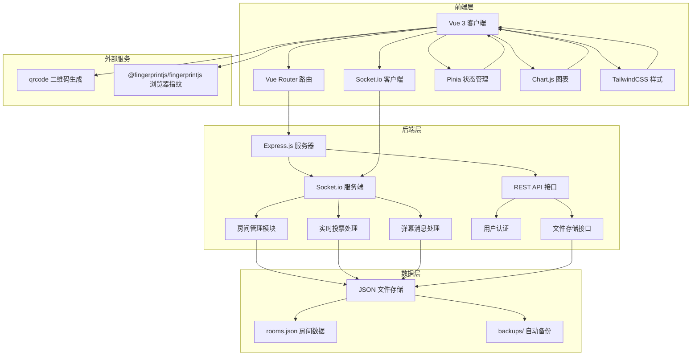
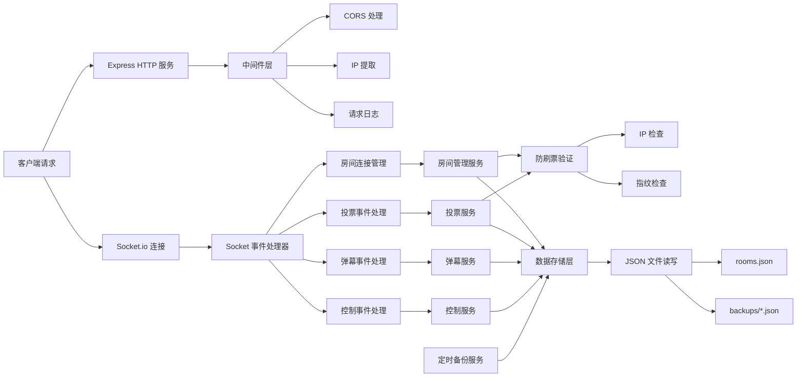
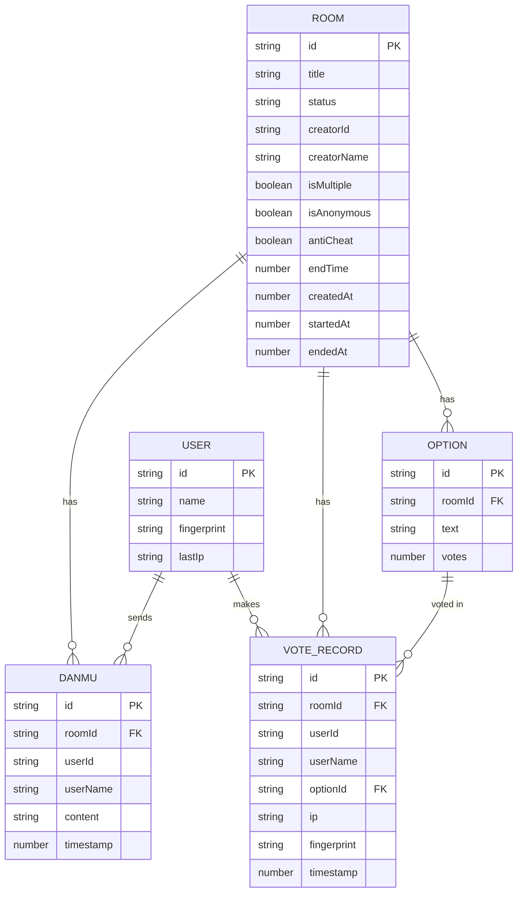

## 1. 架构设计



## 2. 技术描述

- **前端**：Vue 3 + TypeScript + Vite + Pinia + Vue Router + TailwindCSS 3 + Chart.js + Socket.io-client + @fingerprintjs/fingerprintjs + qrcode
- **后端**：Node.js + Express 4 + TypeScript + Socket.io + cors
- **数据存储**：本地JSON文件，每分钟自动备份到 backups 目录
- **初始化工具**：vite-init，使用 vue-express-ts 模板

## 3. 路由定义

| 路由 | 页面 | 功能 |
|------|------|------|
| / | 首页 | 创建投票、加入投票入口 |
| /create | 创建房间页 | 设置投票参数，生成房间 |
| /room/:id | 投票页面 | 实时投票、弹幕、结果展示 |
| /room/:id/results | 结果报告页 | 图表展示、统计详情 |

## 4. API 定义

### 4.1 REST API

```typescript
// 创建投票房间
POST /api/rooms
Request: {
  title: string;
  options: string[];
  endTime: number;
  isMultiple: boolean;
  isAnonymous: boolean;
  antiCheat: boolean;
  creatorName: string;
}
Response: {
  roomId: string;
  shareUrl: string;
  qrCodeUrl: string;
}

// 获取房间信息
GET /api/rooms/:id
Response: Room

// 验证投票权限
POST /api/rooms/:id/verify
Request: {
  fingerprint: string;
  ip: string;
}
Response: {
  allowed: boolean;
  hasVoted: boolean;
  role: 'host' | 'voter' | 'viewer';
}
```

### 4.2 Socket.io 事件

```typescript
// 客户端发送事件
socket.emit('join-room', { roomId, userId, userName, fingerprint })
socket.emit('vote', { roomId, optionIds, userId, fingerprint })
socket.emit('danmu', { roomId, userId, userName, content })
socket.emit('control-vote', { roomId, action: 'start' | 'pause' | 'resume' | 'end' })

// 服务端广播事件
socket.on('user-joined', (data) => { user, onlineCount })
socket.on('vote-updated', (data) => { options, totalVotes })
socket.on('danmu-received', (data) => { id, userId, userName, content, timestamp })
socket.on('vote-status-changed', (data) => { status, endTime })
socket.on('vote-ended', (data) => { finalResults })
```

## 5. 服务器架构图



## 6. 数据模型

### 6.1 数据模型定义



### 6.2 TypeScript 类型定义

```typescript
// shared/types.ts

export interface Room {
  id: string;
  title: string;
  status: 'waiting' | 'voting' | 'paused' | 'ended';
  creatorId: string;
  creatorName: string;
  options: Option[];
  isMultiple: boolean;
  isAnonymous: boolean;
  antiCheat: boolean;
  endTime: number;
  createdAt: number;
  startedAt?: number;
  endedAt?: number;
  voteRecords: VoteRecord[];
  danmus: Danmu[];
  onlineUsers: User[];
}

export interface Option {
  id: string;
  text: string;
  votes: number;
}

export interface VoteRecord {
  id: string;
  roomId: string;
  userId: string;
  userName: string;
  optionIds: string[];
  ip: string;
  fingerprint: string;
  timestamp: number;
}

export interface Danmu {
  id: string;
  roomId: string;
  userId: string;
  userName: string;
  content: string;
  timestamp: number;
}

export interface User {
  id: string;
  name: string;
  fingerprint: string;
  lastIp: string;
  hasVoted: boolean;
  role: 'host' | 'voter' | 'viewer';
}

export interface VoteUpdate {
  roomId: string;
  options: Option[];
  totalVotes: number;
}
```

### 6.3 JSON 存储结构

```json
{
  "rooms": {
    "roomId1": {
      "id": "roomId1",
      "title": "投票主题",
      "status": "voting",
      "creatorId": "userId1",
      "creatorName": "主持人",
      "options": [
        { "id": "opt1", "text": "选项A", "votes": 10 },
        { "id": "opt2", "text": "选项B", "votes": 15 }
      ],
      "isMultiple": false,
      "isAnonymous": true,
      "antiCheat": true,
      "endTime": 1717234567890,
      "createdAt": 1717234500000,
      "startedAt": 1717234510000,
      "voteRecords": [],
      "danmus": []
    }
  },
  "lastBackup": 1717234560000
}
```

