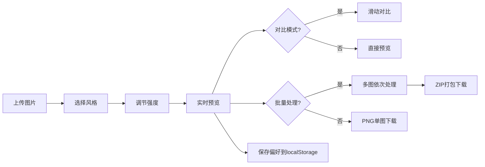

## 1. 产品概述

AI艺术风格迁移交互页面 - 基于纯前端技术实现的图像风格化工具，让用户可以将普通照片转化为艺术大师的风格作品。

- 主要用途：图像艺术风格化处理、创意图片生成、批量图片处理
- 解决问题：无需后端AI模型，纯前端实现实时风格迁移效果
- 目标用户：设计师、摄影爱好者、艺术创作者

## 2. 核心功能

### 2.1 用户角色
| 角色 | 注册方式 | 核心权限 |
|------|----------|----------|
| 普通用户 | 无需注册 | 上传图片、应用风格、下载结果 |

### 2.2 功能模块
1. **主页面**：图片上传区、风格选择面板、预览画布区
2. **控制面板**：风格强度调节、对比模式、随机混合
3. **批量处理**：多图上传、批量处理、ZIP打包下载
4. **设置存储**：偏好保存、自动加载

### 2.3 页面详情
| 页面名称 | 模块名称 | 功能描述 |
|---------|----------|----------|
| 主页面 | 图片上传区 | 拖拽/点击上传单张或多张图片，支持预览 |
| 主页面 | 风格选择面板 | 梵高、莫奈、毕加索等预设风格，点击切换 |
| 主页面 | 预览画布 | Canvas实时渲染风格化效果 |
| 主页面 | 强度滑块 | 0-100%调节风格化强度，0显示原图 |
| 主页面 | 对比模式 | 左右滑动滑块对比原图与效果图 |
| 主页面 | 随机混合 | 随机组合两种风格参数生成独特效果 |
| 主页面 | 批量处理 | 多图依次处理，进度条显示 |
| 主页面 | 下载功能 | PNG单图下载 / ZIP批量下载 |
| 主页面 | 进度显示 | 处理进度条 + 耗时统计 |
| 主页面 | 偏好存储 | localStorage保存用户常用风格 |

## 3. 核心流程

用户上传图片 → 选择艺术风格 → 调节风格强度 → 实时预览效果 → 可选对比模式 → 保存/下载结果

## 4. 用户界面设计

### 4.1 设计风格
- 主色调：深紫色渐变 (#6366f1 → #8b5cf6) 代表艺术创意
- 辅助色：亮橙色 (#f97316) 作为交互强调色
- 背景：深色主题 + 微妙噪点纹理，营造艺术工作室氛围
- 按钮风格：圆角胶囊形，带有微渐变和悬停发光效果
- 字体：展示字体用 Playfair Display（艺术感），正文字体用 Inter（现代清晰）
- 布局：卡片式布局，毛玻璃效果（backdrop-filter）
- 动效：平滑过渡动画，处理过程显示分块扫描效果

### 4.2 页面设计概述
| 页面名称 | 模块名称 | UI元素 |
|---------|----------|--------|
| 主页面 | 头部标题 | 艺术字体标题、副标题说明 |
| 主页面 | 上传区域 | 虚线边框、拖拽高亮、图标提示 |
| 主页面 | 风格卡片 | 圆形风格缩略图、名称标签、选中状态边框 |
| 主页面 | 画布区域 | 双图层（原图/效果图）、可滑动分隔线 |
| 主页面 | 控制条 | 滑块组件、数值显示、开关按钮 |
| 主页面 | 进度条 | 分段动画、百分比显示、时间统计 |
| 主页面 | 底部按钮 | 下载按钮、随机按钮、重置按钮 |

### 4.3 响应式
- Desktop-first 设计
- 平板端：风格选择改为两行布局
- 移动端：单列布局，上传区域全屏宽度
- 触摸优化：增大按钮点击区域，支持触摸滑动对比
