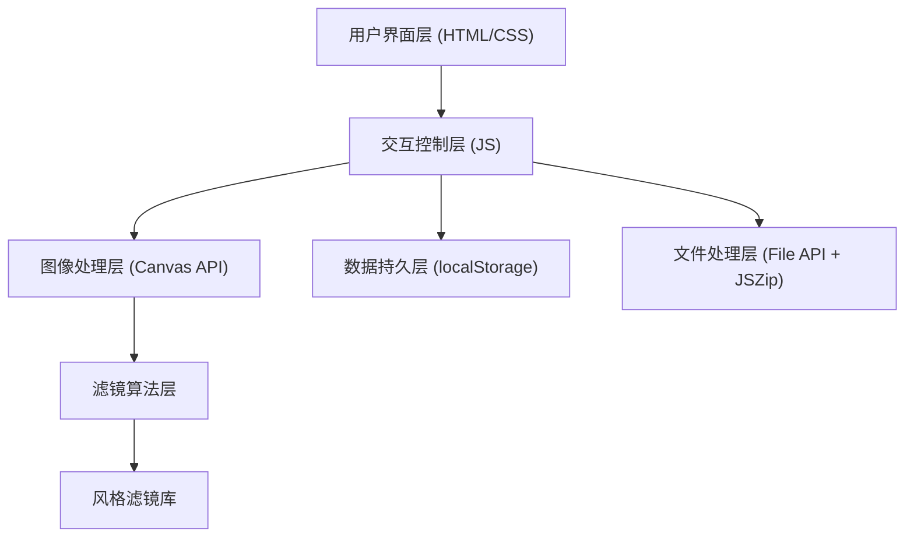

## 1. 架构设计

纯前端单页应用，无需后端服务，所有功能在浏览器端实现。



## 2. 技术描述

- **前端技术栈**: 原生 HTML5 + CSS3 + JavaScript ES6+
- **图像渲染**: HTML5 Canvas API
- **样式方案**: CSS Variables + Flexbox + Grid
- **动画方案**: CSS Transitions + requestAnimationFrame
- **第三方库**: 
  - JSZip (用于ZIP打包下载) - 通过CDN引入
- **部署方案**: 纯静态文件，可直接在浏览器打开

## 3. 项目结构

| 文件/目录 | 用途 |
|-----------|------|
| index.html | 主页面入口，包含所有UI结构 |
| css/style.css | 样式文件，包含主题变量和组件样式 |
| js/app.js | 主应用逻辑，协调各模块 |
| js/filters.js | 风格滤镜算法库 |
| js/utils.js | 工具函数（文件处理、进度条等） |

## 4. 核心数据结构

### 4.1 风格滤镜配置
```javascript
const artStyles = {
  vanGogh: {
    name: '梵高',
    filters: {
      contrast: 1.2,
      saturation: 1.4,
      brightness: 1.1,
      hueRotate: -10,
      sepia: 0.2
    },
    pixelate: 2,
    colorPalette: [...],
    brushStroke: true
  },
  monet: { /* ... */ },
  picasso: { /* ... */ },
  ukiyo: { /* ... */ },
  kandinsky: { /* ... */ }
};
```

### 4.2 用户偏好存储
```javascript
{
  lastStyle: 'vanGogh',
  lastIntensity: 70,
  favoriteStyles: ['vanGogh', 'monet'],
  useCompareMode: false
}
```

## 5. 核心算法

### 5.1 分块处理算法
- 将画布分为 16x16 像素块
- 使用 setTimeout 分帧处理，避免UI阻塞
- 每帧处理4-8个区块，保持60fps响应

### 5.2 风格混合算法
- 随机选择两种风格
- 按随机权重 (0.3-0.7) 线性插值所有滤镜参数
- 应用抖动算法 (Floyd-Steinberg) 增加艺术感

### 5.3 对比模式实现
- 双Canvas层叠布局
- 上层裁剪显示部分区域
- 鼠标/触摸拖动实时更新裁剪区域

## 6. API 设计 (内部模块)

### 6.1 ImageProcessor 类
```javascript
class ImageProcessor {
  loadImage(file): Promise<HTMLImageElement>
  applyStyle(image, style, intensity): ImageData
  processInChunks(image, style, intensity, onProgress): Promise
  blendStyles(style1, style2, ratio): StyleConfig
  floydSteinbergDither(imageData, palette): ImageData
}
```

### 6.2 StorageManager 类
```javascript
class StorageManager {
  savePreferences(prefs): void
  loadPreferences(): Prefs
  saveFavoriteStyle(styleId): void
  getFavoriteStyles(): string[]
}
```

### 6.3 DownloadManager 类
```javascript
class DownloadManager {
  downloadPNG(canvas, filename): void
  batchDownload(images, style): Promise<Blob> // returns ZIP blob
}
```
