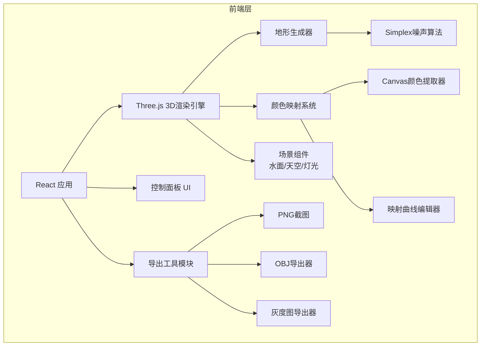

## 1. 架构设计



## 2. 技术说明

- **前端框架**: React@18 + TypeScript + Vite
- **样式方案**: Tailwind CSS@3
- **3D引擎**: Three.js + @react-three/fiber + @react-three/drei
- **噪声算法**: simplex-noise npm包
- **颜色提取**: Canvas 2D API 像素采样 + 量化聚类
- **OBJ导出**: Three.js OBJExporter
- **初始化工具**: Vite
- **后端**: 无（纯前端应用）
- **数据库**: 无

## 3. 路由定义

| 路由 | 用途 |
|------|------|
| / | 主场景页，包含3D地形渲染与全部控制功能 |

## 4. 核心模块设计

### 4.1 地形生成器 (TerrainGenerator)

```
输入: seed, segments(精细度), amplitude(起伏强度)
输出: PlaneGeometry + 顶点高度数据
算法: Simplex噪声多层叠加（分形布朗运动 FBM）
```

- 基于PlaneGeometry创建平面网格
- 使用simplex-noise生成高度值，4层FBM叠加
- 顶点颜色根据高度和颜色映射表计算
- 每次参数变化时重新生成geometry

### 4.2 颜色提取器 (ColorExtractor)

```
输入: ImageFile
输出: ColorPalette（5~8个主色 + 分布权重）
算法: Canvas像素采样 + 中位切分法(Median Cut)
```

- 将图片绘制到隐藏Canvas
- 随机采样像素点（采样密度根据图片大小调整）
- 使用中位切分法量化为5~8个主色
- 返回颜色数组及每个颜色的分布比例

### 4.3 颜色映射系统 (ColorMapper)

```
输入: ColorPalette, CurveData（映射曲线控制点）
输出: 顶点颜色数组
算法: 线性插值 + 曲线重映射
```

- 将提取的颜色按亮度排序，映射到高度0~1
- 映射曲线允许用户手动调整（默认为对角线）
- 曲线横轴为原始高度，纵轴为重映射后的高度
- 重映射后的高度值用于插值获取颜色

### 4.4 映射曲线编辑器 (CurveEditor)

```
类型: Canvas 2D组件
交互: 点击添加控制点，拖拽移动控制点，右键删除控制点
输出: 归一化控制点数组 [{x, y}]
```

- 小型Canvas绘制贝塞尔曲线
- 默认4个控制点形成S曲线
- 实时更新地形颜色

### 4.5 导出模块

| 导出类型 | 实现方式 | 文件格式 |
|----------|----------|----------|
| 截图 | renderer.domElement.toDataURL() | PNG |
| OBJ | Three.js OBJExporter.parse() | OBJ |
| 灰度图 | Canvas 2D绘制高度值 | PNG |

### 4.6 场景组件

| 组件 | 实现方式 |
|------|----------|
| 水面 | 半透明平面 MeshStandardMaterial + 微波动动画 |
| 天空 | 大球体内部贴图 / drei Sky组件 |
| 灯光 | directionalLight + ambientLight + hemisphereLight |
| 雾化 | FogExp2 指数雾 |

## 5. 状态管理

使用 React useState + useRef 管理状态，无需外部状态库：

```
terrainParams: { seed, segments, amplitude }
colorPalette: Color[] | null
curvePoints: {x, y}[]
showWater: boolean
showSky: boolean
autoRotate: boolean
uploadedImage: string | null
```

## 6. 性能优化策略

- 地形重新生成使用 useMemo 缓存，仅在参数变化时重算
- 颜色提取在Web Worker中执行（如性能需要）
- 高细分度（>256）时使用 BufferGeometry 直接操作
- 水面使用简单正弦波顶点动画
- OrbitControls启用阻尼提升交互流畅度

## 7. 项目目录结构

```
src/
├── components/
│   ├── TerrainScene.tsx       # 3D场景主组件
│   ├── Terrain.tsx            # 地形网格组件
│   ├── WaterPlane.tsx         # 水面组件
│   ├── SkySphere.tsx          # 天空组件
│   ├── ControlPanel.tsx       # 控制面板
│   ├── CurveEditor.tsx        # 颜色映射曲线编辑器
│   ├── ColorLegend.tsx        # 颜色图例
│   ├── ImageUploader.tsx      # 图片上传组件
│   └── Toolbar.tsx            # 底部工具栏
├── utils/
│   ├── terrainGenerator.ts    # 噪声地形生成
│   ├── colorExtractor.ts      # 颜色提取算法
│   ├── colorMapper.ts         # 颜色映射逻辑
│   └── exporters.ts           # 导出工具函数
├── App.tsx
├── main.tsx
└── index.css
```
