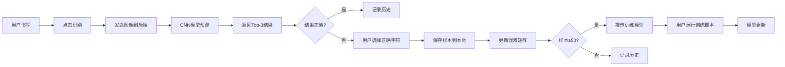

## 1. 产品概述

AI手写文字识别与学习系统是一个集手写识别、临摹学习、数据分析于一体的智能交互平台。用户可在Canvas上手写汉字或英文，系统通过CNN模型实时识别并给出Top-3候选结果，同时支持用户纠正和增量学习，不断提升模型准确率。

- 主要用途：手写文字识别、书法练习、模型训练数据收集
- 目标用户：学生、书法爱好者、AI研究者
- 核心价值：通过人机协同，实现识别模型的持续优化和用户书写能力的提升

## 2. 核心功能

### 2.1 用户角色

| 角色 | 注册方式 | 核心权限 |
|------|---------|---------|
| 普通用户 | 无需注册 | 手写识别、临摹练习、查看历史、导出数据 |

### 2.2 功能模块

1. **手写识别页面**：Canvas画板、识别结果展示、纠正功能
2. **临摹练习页面**：标准字库选择、临摹评分、实时反馈
3. **批量识别页面**：图片上传、自动分割、批量识别结果表格
4. **数据分析页面**：混淆矩阵、常见错误统计、模型状态
5. **历史记录页面**：识别历史回顾、纠正记录查看
6. **数据导出页面**：训练数据CSV导出、模型更新提示

### 2.3 页面详情

| 页面名称 | 模块名称 | 功能描述 |
|---------|---------|---------|
| 手写识别 | Canvas画板 | 支持鼠标/触摸书写，可调节画笔粗细和颜色 |
| 手写识别 | 候选字展示 | 显示Top-3识别结果及置信度进度条 |
| 手写识别 | 纠正功能 | 用户可选择正确字符，样本自动保存用于训练 |
| 临摹练习 | 字库选择 | 分类展示汉字、英文、数字，支持搜索过滤 |
| 临摹练习 | 标准字展示 | 显示标准字体作为临摹参考 |
| 临摹练习 | 相似度评分 | 实时计算用户书写与标准字体的相似度 |
| 批量识别 | 图片上传 | 支持拖拽上传包含多个手写字的图片 |
| 批量识别 | 自动分割 | 使用OpenCV自动检测并分割单个字符 |
| 批量识别 | 结果表格 | 展示每个字符的识别结果和边界框 |
| 数据分析 | 混淆矩阵 | 可视化展示识别错误的分布情况 |
| 数据分析 | 错误统计 | 列出最常见的识别错误对 |
| 历史记录 | 历史列表 | 分页展示所有识别记录，支持类型筛选 |
| 数据导出 | CSV导出 | 将收集的样本导出为CSV格式训练数据 |
| 数据导出 | 模型更新 | 当样本达到阈值时，提示用户运行训练脚本 |

## 3. 核心流程

用户在Canvas上书写字符后点击识别按钮，前端将图像数据发送到后端Flask服务，后端使用CNN模型预测并返回Top-3候选结果。用户可选择正确字符进行纠正，纠正样本保存到本地文件夹。当累积样本达到50个时，系统提示用户运行训练脚本进行模型增量学习。

## 4. 用户界面设计

### 4.1 设计风格

- 主色调：深靛蓝 (#1e3a5f) 搭配暖橙色 (#ff7043) 强调色
- 辅助色：薄荷绿 (#4db6ac) 表示成功，珊瑚红 (#ef5350) 表示警告
- 按钮风格：圆角矩形，微渐变背景，悬停时轻微上浮和阴影加深
- 字体：标题使用 "Noto Serif SC" 衬线体，正文使用 "Noto Sans SC" 无衬线体
- 布局：左侧导航栏 + 右侧内容区的经典布局，卡片式内容组织
- 图标：使用手绘风格的线性图标，增强书写主题氛围
- 背景：微妙的网格纹理，模拟方格纸效果

### 4.2 页面设计概述

| 页面名称 | 模块名称 | UI元素 |
|---------|---------|---------|
| 手写识别 | Canvas画板 | 白色背景，淡灰色网格线，深色画笔 |
| 手写识别 | 候选字卡片 | 悬浮卡片，置信度用彩色进度条展示 |
| 临摹练习 | 标准字展示 | 大号字体，田字格背景辅助定位 |
| 临摹练习 | 评分展示 | 环形进度条，分数变化带动画效果 |
| 批量识别 | 上传区域 | 虚线边框，拖拽时高亮，支持预览 |
| 批量识别 | 结果表格 | 斑马纹行，识别结果用不同颜色标记置信度 |
| 数据分析 | 混淆矩阵 | 热力图，颜色深浅表示错误频率 |
| 历史记录 | 列表项 | 时间线样式，缩略图预览，纠正标记 |

### 4.3 响应性

- 采用桌面优先设计，1200px断点适配平板，768px断点适配手机
- 移动端切换为顶部导航栏，Canvas画板自适应屏幕宽度
- 触摸设备优化书写体验，增加笔尖识别精度

### 4.4 交互动效

- 页面切换时内容区淡入淡出，导航项高亮滑动
- 按钮点击有微缩放反馈
- 识别结果出现时逐个弹跳显示
- 评分更新时数字滚动动画
- 模态框从底部滑入，背景模糊处理
