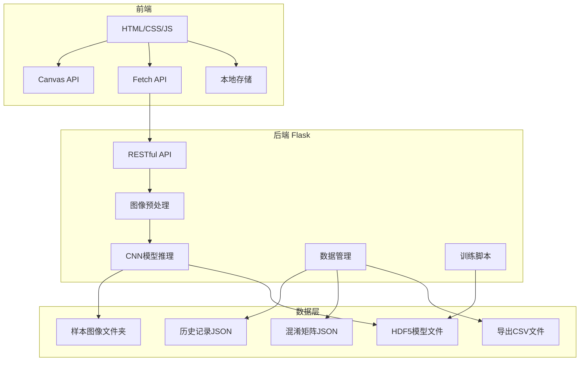
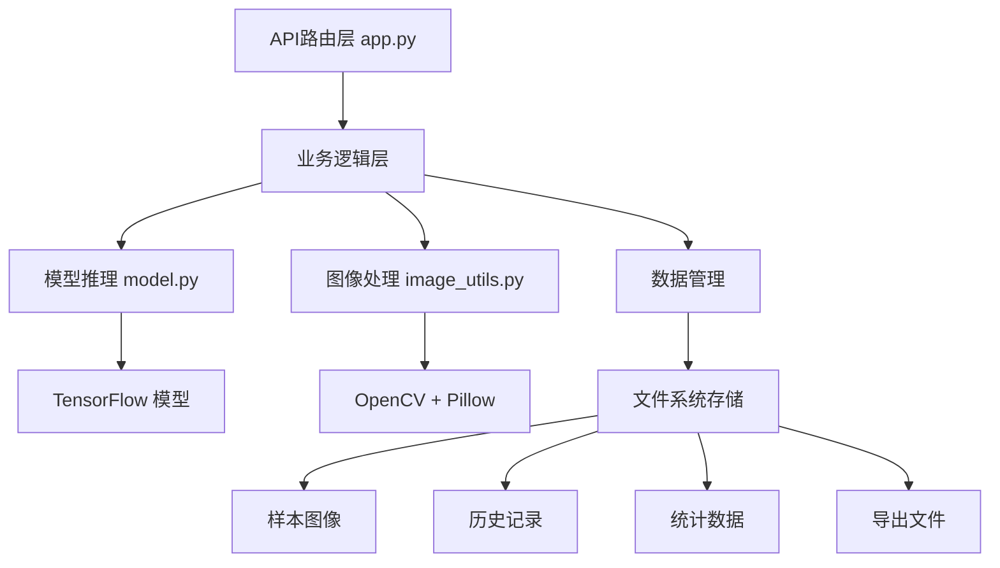
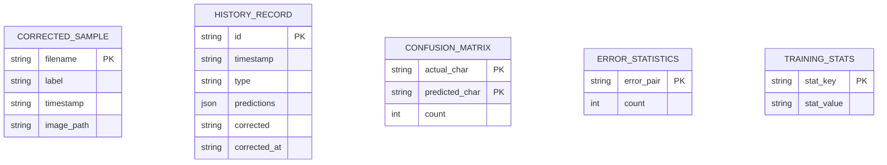

## 1. 架构设计



## 2. 技术描述

- 前端：原生 HTML5 + CSS3 + JavaScript (ES6+)，无框架依赖
- 样式：CSS变量 + Flexbox + Grid，响应式设计
- 绘图：HTML5 Canvas API，支持鼠标和触摸事件
- 后端：Flask 3.0 + Flask-CORS，RESTful API设计
- 深度学习：TensorFlow 2.x + Keras，CNN模型
- 图像处理：OpenCV + Pillow，字符分割和预处理
- 数据可视化：Matplotlib + Seaborn，混淆矩阵热力图
- 数据格式：JSON用于API通信，CSV用于训练数据导出

## 3. 路由定义

| 页面路由 | 用途 |
|---------|------|
| /index.html | 主页面，包含所有功能模块的单页应用 |

## 4. API 定义

### 4.1 类型定义

```typescript
interface Prediction {
  character: string;
  confidence: number;
  index: number;
}

interface HistoryRecord {
  id: string;
  timestamp: string;
  type: 'single' | 'batch';
  predictions: Prediction[];
  corrected?: string;
  corrected_at?: string;
}

interface BatchResult {
  index: number;
  bbox: [number, number, number, number];
  predictions: Prediction[];
  image_path: string;
}

interface ErrorStat {
  error_pair: string;
  count: number;
}
```

### 4.2 API 接口

| 方法 | 路径 | 描述 | 请求参数 | 返回格式 |
|------|------|------|---------|---------|
| POST | /api/recognize | 单个字符识别 | { image: string } | { success, predictions, record_id, timestamp } |
| POST | /api/correct | 提交纠正结果 | { record_id, correct_char, image } | { success, saved_path, sample_count, needs_retrain } |
| POST | /api/batch_recognize | 批量图片识别 | multipart/form-data image | { success, batch_id, segmented_count, results } |
| POST | /api/practice/compare | 临摹相似度比较 | { target_char, user_image } | { success, similarity, score, feedback } |
| GET | /api/practice/characters | 获取练习字库 | category?: string | { success, characters, total } |
| GET | /api/practice/standard_image | 获取标准字图片 | char: string | image/png |
| GET | /api/analytics/confusion_matrix | 获取混淆矩阵数据 | limit?: number | { success, characters, matrix, common_errors } |
| GET | /api/analytics/confusion_matrix_image | 获取混淆矩阵图片 | limit?: number | image/png |
| GET | /api/analytics/error_stats | 获取错误统计 | - | { success, errors, total_errors } |
| GET | /api/export/csv | 导出训练数据CSV | - | { success, export_path, sample_count, filename } |
| GET | /api/export/download | 下载CSV文件 | filename: string | attachment |
| GET | /api/history | 获取历史记录 | page?, per_page?, type? | { success, history, total, page, per_page } |
| GET | /api/status | 获取系统状态 | - | { success, sample_count, needs_retrain, ... } |
| POST | /api/retrain | 触发模型重训练 | - | { success, message, trained_samples } |

## 5. 服务器架构图



## 6. 数据模型

### 6.1 数据模型定义



### 6.2 目录结构

```
/backend/
├── app.py              # Flask主应用
├── model.py            # CNN模型定义和训练
├── image_utils.py      # 图像处理工具
├── config.py           # 配置文件
├── train.py            # 训练脚本
├── requirements.txt    # 依赖包
├── models/             # 已训练模型
└── data/
    ├── corrected_samples/  # 用户纠正的样本
    ├── trained_samples/    # 已用于训练的样本
    ├── history/            # 识别历史记录
    ├── exports/            # 导出的CSV文件
    ├── batch_uploads/      # 批量上传的图片
    ├── confusion_matrix.json
    ├── error_statistics.json
    └── training_stats.json

/frontend/
├── index.html
├── css/
│   └── style.css
└── js/
    └── app.js
```
