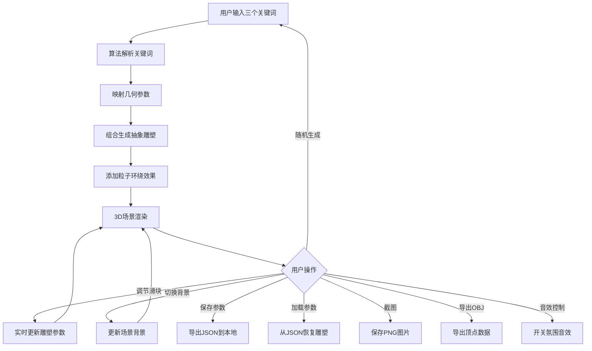

## 1. 产品概述

AI抽象艺术雕塑生成器——一个基于Three.js的交互式3D创意工具。用户通过输入三个关键词，系统根据算法生成独特的抽象几何雕塑，配合动态粒子效果和音效，营造沉浸式的艺术体验。

- 目标用户：数字艺术爱好者、创意设计师、3D艺术探索者
- 核心价值：将文字概念转化为可交互的3D视觉艺术，支持保存、分享和再创作

## 2. 核心功能

### 2.1 功能模块

1. **主场景页**：3D雕塑展示区 + 控制面板

### 2.2 页面详情

| 页面名称 | 模块名称 | 功能描述 |
|----------|----------|----------|
| 主场景页 | 3D视口 | 展示AI生成的抽象雕塑，支持相机自动环绕和拖拽交互 |
| 主场景页 | 关键词输入 | 三个关键词输入框，每个关键词对应不同的几何变换规则 |
| 主场景页 | 参数滑块 | 扭曲程度、颜色饱和度、粒子运动速度三个调节滑块 |
| 主场景页 | 背景切换 | 星空/黑色/渐变三种背景模式切换 |
| 主场景页 | 操作按钮组 | 保存参数JSON、加载参数、截图PNG、导出OBJ、随机生成 |
| 主场景页 | 灵感来源 | 根据关键词生成设计理念说明文本 |
| 主场景页 | 音效控制 | 神秘氛围音效开关 |

## 3. 核心流程

用户输入三个关键词 → 算法解析关键词映射几何参数 → 组合生成立方体/球体/锥体变换体 → 添加粒子环绕效果 → 用户可调节参数/保存/截图/导出

## 4. 用户界面设计

### 4.1 设计风格

- **主色调**：深紫黑(#0a0a1a)为底，青色(#00ffd5)和品红(#ff00aa)为强调色，营造赛博朋克神秘感
- **按钮风格**：半透明玻璃拟态，悬停时发光边框效果
- **字体**：展示字体使用 Orbitron（科技未来感），UI字体使用 Noto Sans SC（中文友好）
- **布局**：左侧3D视口占主体，右侧控制面板为半透明浮动面板
- **图标风格**：线性极简图标，搭配发光效果

### 4.2 页面设计概览

| 页面名称 | 模块名称 | UI元素 |
|----------|----------|--------|
| 主场景页 | 3D视口 | 全屏沉浸式，深色背景，雕塑居中，粒子环绕 |
| 主场景页 | 控制面板 | 右侧半透明玻璃面板，关键词输入框、滑块、按钮组 |
| 主场景页 | 灵感文本 | 底部半透明卡片，渐显动画展示设计理念 |
| 主场景页 | 顶部工具栏 | 保存/加载/截图/导出按钮，音效开关 |

### 4.3 响应式

- 桌面端优先：3D视口为主，控制面板侧边浮动
- 移动端适配：控制面板底部抽屉式弹出，触控优化

### 4.4 3D场景指引

- **环境**：深色太空感场景，三种背景模式（星空粒子/纯黑/渐变）切换
- **灯光**：主方向光+环境光+点光源，动态跟随雕塑颜色变化
- **相机**：默认自动环绕（可暂停），支持OrbitControls拖拽/缩放
- **构图**：雕塑居中，粒子系统环绕，相机距离自适应雕塑大小
- **交互**：鼠标悬停雕塑发光，拖拽旋转，滚轮缩放
- **后处理**：Bloom发光效果增强粒子视觉
- **性能**：粒子数量控制在2000以内，使用InstancedMesh优化

## 5. 关键词映射规则

| 关键词类别 | 示例 | 对应几何 | 变换规则 |
|-----------|------|----------|----------|
| 动态类 | 飞翔、流动、旋转 | 螺旋/环形 | 扭曲+旋转+缩放渐变 |
| 力量类 | 力量、冲击、爆发 | 尖锐多面体 | 拉伸+尖锐化+随机扰动 |
| 柔和类 | 柔软、水波、梦境 | 球体/椭球 | 平滑变形+波纹+渐变 |
| 几何类 | 秩序、对称、精确 | 立方体组合 | 重复+旋转+错位 |
| 神秘类 | 神秘、混沌、虚空 | 锥体组合 | 不规则组合+扭曲+嵌套 |
