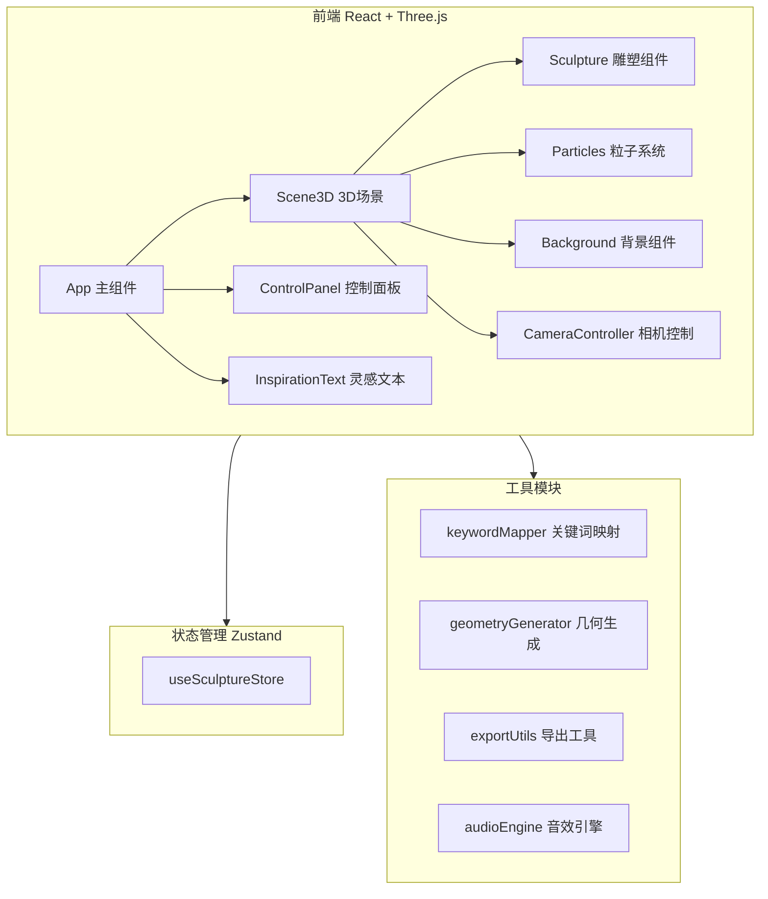

## 1. 架构设计



## 2. 技术说明

- **前端框架**：React@18 + TypeScript + Vite
- **3D渲染**：three + @react-three/fiber + @react-three/drei + @react-three/postprocessing
- **状态管理**：Zustand
- **样式**：Tailwind CSS 3
- **后端**：无（纯前端应用）
- **数据存储**：浏览器本地（JSON文件下载/上传）

## 3. 路由定义

本项目为单页应用，无需路由：

| 路由 | 用途 |
|------|------|
| / | 主场景页，3D雕塑展示与交互 |

## 4. 核心模块设计

### 4.1 关键词映射模块 (keywordMapper)

```
输入：三个关键词字符串
输出：SculptureParams（几何类型、变换参数、颜色种子）

映射策略：
- 关键词1 → 主几何体类型 + 基础变换
- 关键词2 → 次几何体类型 + 组合方式
- 关键词3 → 装饰几何 + 粒子参数
- 关键词哈希 → 颜色种子值
```

### 4.2 几何生成模块 (geometryGenerator)

```
输入：SculptureParams
输出：Three.js BufferGeometry 组

生成策略：
- 基础几何：BoxGeometry, SphereGeometry, ConeGeometry
- 变换操作：缩放、旋转、扭曲（顶点位移）
- 组合方式：布尔合并、嵌套、排列
- 动态变形：使用ShaderMaterial实现实时扭曲
```

### 4.3 粒子系统 (Particles)

```
实现方式：Points + BufferGeometry
粒子数量：1500-2000
运动模式：环绕雕塑的螺旋轨迹
颜色：跟随雕塑主色调
速度：由滑块控制
```

### 4.4 导出工具 (exportUtils)

```
- JSON导出：序列化关键词 + 参数 + 滑块值
- PNG截图：renderer.domElement.toDataURL()
- OBJ导出：遍历场景mesh顶点数据，生成OBJ格式字符串
```

### 4.5 音效引擎 (audioEngine)

```
使用 Web Audio API
- OscillatorNode 生成低频环境音
- GainNode 控制音量淡入淡出
- 滤波器营造空灵效果
- 不依赖外部音频文件
```

## 5. 数据模型

### 5.1 雕塑参数模型

```typescript
interface SculptureParams {
  keywords: [string, string, string]
  twist: number
  saturation: number
  particleSpeed: number
  background: 'starfield' | 'black' | 'gradient'
  geometryTypes: [GeoType, GeoType, GeoType]
  transforms: TransformParams[]
  colorSeed: number
  timestamp: number
}

type GeoType = 'spiral' | 'polyhedron' | 'sphere' | 'cube' | 'cone'
interface TransformParams {
  scale: [number, number, number]
  rotation: [number, number, number]
  position: [number, number, number]
  twistAmount: number
}
```

## 6. 组件结构

```
src/
├── components/
│   ├── Scene3D.tsx          # 3D场景容器
│   ├── Sculpture.tsx        # 雕塑几何体组件
│   ├── Particles.tsx        # 粒子系统组件
│   ├── Background3D.tsx     # 背景组件
│   ├── CameraController.tsx # 相机控制
│   ├── ControlPanel.tsx     # 控制面板
│   ├── KeywordInput.tsx     # 关键词输入
│   ├── SliderControl.tsx    # 滑块控制
│   ├── ActionBar.tsx        # 操作按钮栏
│   ├── InspirationText.tsx  # 灵感文本
│   └── AudioToggle.tsx      # 音效开关
├── store/
│   └── useSculptureStore.ts # Zustand状态
├── utils/
│   ├── keywordMapper.ts     # 关键词映射
│   ├── geometryGenerator.ts # 几何生成
│   ├── exportUtils.ts       # 导出工具
│   └── audioEngine.ts       # 音效引擎
├── pages/
│   └── Home.tsx             # 主页
├── App.tsx
└── main.tsx
```
