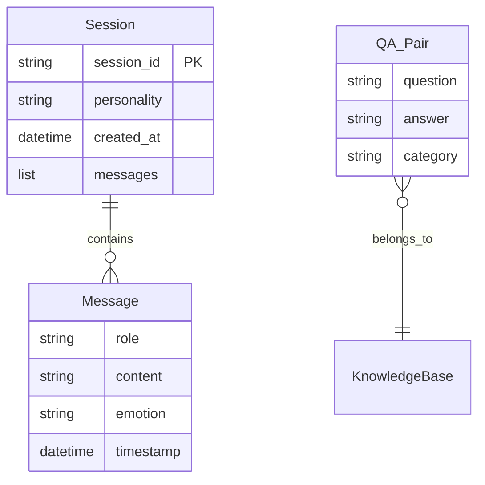

## 1. 架构设计

```mermaid
flowchart TB
    subgraph "前端层"
        "聊天页面 HTML/CSS/JS"
        "管理页面 HTML/CSS/JS"
    end
    subgraph "后端层 - Flask"
        "路由控制器"
        "对话引擎"
        "性格渲染器"
        "情感分析模块"
        "建议生成器"
        "主动话题模块"
    end
    subgraph "数据层"
        "会话存储（内存字典）"
        "问答知识库（JSON文件）"
        "日志文件（本地磁盘）"
    end
    "聊天页面 HTML/CSS/JS" -->|"WebSocket/REST API"| "路由控制器"
    "管理页面 HTML/CSS/JS" -->|"REST API"| "路由控制器"
    "路由控制器" --> "对话引擎"
    "对话引擎" --> "情感分析模块"
    "对话引擎" --> "问答知识库（JSON文件）"
    "对话引擎" --> "性格渲染器"
    "对话引擎" --> "建议生成器"
    "对话引擎" --> "主动话题模块"
    "对话引擎" --> "会话存储（内存字典）"
    "对话引擎" --> "日志文件（本地磁盘）"
```

## 2. 技术说明
- 前端：原生 HTML5 + CSS3 + JavaScript（无框架，Jinja2模板渲染）
- 后端：Python Flask
- 数据库：无外部数据库，使用服务端内存字典存储会话，JSON文件存储问答知识库
- 语音输入：Web Speech API（浏览器端，无需后端支持）
- 情感分析：基于关键词的轻量级情感分析（不依赖外部AI服务）

## 3. 路由定义
| 路由 | 用途 |
|------|------|
| / | 聊天主页面 |
| /admin | 管理页面 |
| /api/chat | 发送消息并获取回复（POST） |
| /api/personality | 设定/获取机器人性格（GET/POST） |
| /api/upload-qa | 上传自定义问答对JSON文件（POST） |
| /api/suggestions | 获取建议回复（POST） |
| /api/sessions | 获取所有会话列表（GET） |
| /api/sessions/<id> | 获取指定会话历史（GET） |
| /api/export-csv | 导出会话记录为CSV（GET） |

## 4. API 定义

### 4.1 发送消息
```
POST /api/chat
Request: {
    "session_id": "string",
    "message": "string"
}
Response: {
    "reply": "string",
    "emotion": "positive|negative|neutral",
    "suggestions": ["string", "string", "string"],
    "proactive_topic": "string|null",
    "round_count": number
}
```

### 4.2 设定性格
```
POST /api/personality
Request: {
    "session_id": "string",
    "personality": "friendly|sarcastic|professional"
}
Response: {
    "success": true,
    "personality": "string"
}
```

### 4.3 上传问答对
```
POST /api/upload-qa
Request: multipart/form-data, file字段为JSON文件
Response: {
    "success": true,
    "count": number
}
```

### 4.4 获取建议回复
```
POST /api/suggestions
Request: {
    "session_id": "string",
    "context": "string"
}
Response: {
    "suggestions": ["string", "string", "string"]
}
```

### 4.5 获取所有会话
```
GET /api/sessions
Response: {
    "sessions": [
        {
            "session_id": "string",
            "created_at": "ISO8601",
            "message_count": number,
            "personality": "string"
        }
    ]
}
```

### 4.6 获取指定会话历史
```
GET /api/sessions/<id>
Response: {
    "session_id": "string",
    "messages": [
        {
            "role": "user|bot",
            "content": "string",
            "emotion": "string|null",
            "timestamp": "ISO8601"
        }
    ]
}
```

### 4.7 导出CSV
```
GET /api/export-csv?session_id=all|<id>
Response: CSV文件下载
```

## 5. 服务器架构图

```mermaid
flowchart LR
    "Flask App" --> "ChatRouter"
    "Flask App" --> "AdminRouter"
    "ChatRouter" --> "ChatEngine"
    "ChatEngine" --> "SentimentAnalyzer"
    "ChatEngine" --> "QAMatcher"
    "ChatEngine" --> "PersonalityRenderer"
    "ChatEngine" --> "SuggestionGenerator"
    "ChatEngine" --> "ProactiveTopicModule"
    "ChatEngine" --> "SessionManager"
    "ChatEngine" --> "ChatLogger"
    "AdminRouter" --> "SessionManager"
    "AdminRouter" --> "CSVExporter"
    "SessionManager" --> "InMemoryStore"
    "QAMatcher" --> "JSONKnowledgeBase"
```

## 6. 数据模型

### 6.1 数据模型定义



### 6.2 数据定义

**会话存储结构（内存字典）**：
```python
sessions = {
    "session_id": {
        "personality": "friendly",
        "created_at": "2026-01-01T00:00:00",
        "messages": [
            {"role": "user", "content": "...", "emotion": "positive", "timestamp": "..."},
            {"role": "bot", "content": "...", "emotion": None, "timestamp": "..."}
        ],
        "history": ["最近5轮对话的摘要"],
        "round_count": 0
    }
}
```

**问答知识库JSON格式**：
```json
[
    {
        "question": "你好",
        "answer": "你好呀！很高兴见到你！",
        "category": "greeting",
        "keywords": ["你好", "嗨", "hi", "hello"]
    }
]
```
