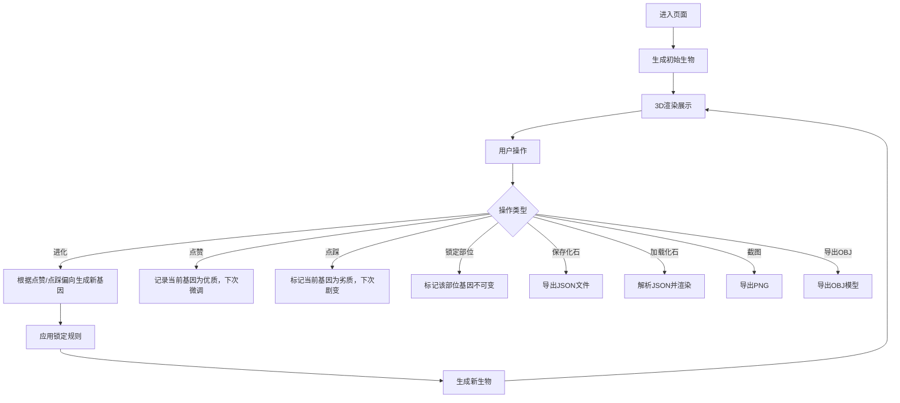

## 1. 产品概述

基于Three.js的3D生物进化模拟器，用户可以观察和干预由AI生成的"无限进化"生物的演化过程。生物由基础几何体组合而成，用户通过点赞、点踩、锁定部位等操作引导进化方向，体验自然选择与人工选择的乐趣。

### 核心价值
- 可视化展示随机进化过程，寓教于乐
- 支持用户干预进化方向，获得成就感
- 可保存和分享喜欢的生物形态

---

## 2. 核心功能

### 2.1 用户角色
本产品无复杂角色系统，所有访问用户均可使用全部功能。

### 2.2 功能模块
1. **3D场景展示区**：实时渲染进化生物，支持相机环绕和拖拽
2. **进化控制面板**：进化按钮、点赞/点踩、部位锁定
3. **信息展示区**：进化代数、适应度分数、基因序列
4. **操作工具栏**：保存/加载化石、截图、导出OBJ、动画开关

### 2.3 页面详情

| 页面名称 | 模块名称 | 功能描述 |
|---------|---------|---------|
| 主页面 | 3D场景区 | Three.js渲染场景，展示由球体、立方体、锥体组合的生物，支持自动环绕和用户拖拽旋转 |
| 主页面 | 进化控制 | 点击"进化"按钮使生物随机变异；点赞后下一代微调，点踩则剧烈变化 |
| 主页面 | 部位锁定 | 可锁定头部、躯干、四肢等部位，被锁定部位在进化中保持不变 |
| 主页面 | 信息面板 | 显示当前进化代数、适应度分数(0-100随机)、基因序列字符串 |
| 主页面 | 工具栏 | 保存生物为JSON文件、加载JSON作为化石、截图为PNG、导出OBJ模型、开关关节动画 |

---

## 3. 核心流程

**主要用户流程**：
1. 用户进入页面，系统随机生成初始生物并渲染
2. 用户点击"进化"按钮，生物根据当前偏向产生变异
3. 用户可点赞（鼓励保留特征）或点踩（鼓励大幅变异）
4. 用户可锁定满意的部位，使其在后续进化中保持
5. 用户可保存喜欢的形态为JSON，或截图、导出模型

---

## 4. 用户界面设计

### 4.1 设计风格
- **主色调**：深空蓝(#0a0e1a)背景搭配霓虹青(#00ffcc)和紫罗兰(#a855f7)强调色，营造科幻/实验室氛围
- **辅助色**：橙色(#ff6b35)用于进化按钮，绿色(#10b981)为点赞，红色(#ef4444)为点踩
- **按钮风格**：圆角(8px)、轻微发光效果、hover时缩放1.05倍
- **字体**：显示字体使用Space Grotesk，代码/基因序列使用JetBrains Mono
- **布局风格**：左侧3D场景为主区域，右侧固定控制面板，采用深色玻璃拟态(Glassmorphism)
- **图标**：使用Lucide图标库，配合霓虹发光效果

### 4.2 页面设计概览

| 页面名称 | 模块名称 | UI元素 |
|---------|---------|--------|
| 主页面 | 3D场景区 | 全屏Canvas，黑色背景，点状星空，柔和环境光+方向光，生物居中，底部投影 |
| 主页面 | 控制面板 | 右侧320px宽度面板，半透明深色背景，内部分组展示各功能区，滚动条隐藏 |
| 主页面 | 信息卡片 | 玻璃拟态卡片，展示代数、分数、基因序列，使用等宽字体显示基因 |
| 主页面 | 控制按钮 | 大尺寸进化按钮居中突出，点赞/点踩按钮左右对称，锁定开关使用toggle样式 |

### 4.3 响应式
- **桌面端(>1024px)**：左侧3D场景，右侧固定320px控制面板
- **平板端(768-1024px)**：控制面板移至底部，高度40vh，可折叠
- **移动端(<768px)**：控制面板为底部抽屉，点击展开，3D场景全屏
- 所有触控按钮最小尺寸48px，支持手势旋转场景

### 4.4 3D场景设计
- **环境**：深空背景+程序化星空，柔和环境光+两盏方向光营造立体感，地面使用圆形发光平台
- **光照**：半球光(0x4488ff, 0x002244, 0.6) + 方向光(0xffffff, 0.8) + 紫色点光源补光
- **相机**：初始距离8，俯仰角30度，自动环绕速度0.005rad/frame，支持OrbitControls拖拽
- **生物构成**：居中组合，由头部(顶部)、躯干(中心)、四肢(四周)构成，各部分使用不同几何体和颜色
- **动画**：关节使用正弦函数驱动，四肢摆动幅度±0.3rad，周期2秒，整体轻微上下浮动
- **后处理**：轻微Bloom效果，边缘泛光，增强科幻感

### 4.5 动效设计
- 页面加载：生物从缩小0.1缩放至1.0，配合透明度淡入，时长0.8s，弹性缓动
- 进化时：旧生物缩小消失→粒子爆炸效果→新生物从粒子中聚合出现，时长1.2s
- 点赞/点踩：按钮脉冲动画，生物身上发出对应颜色光环扩散
- 锁定部位：被锁定部位添加金色边框高亮，toggle开关滑动动画
- 按钮hover：轻微上浮+发光增强，点击时缩放0.95回弹
