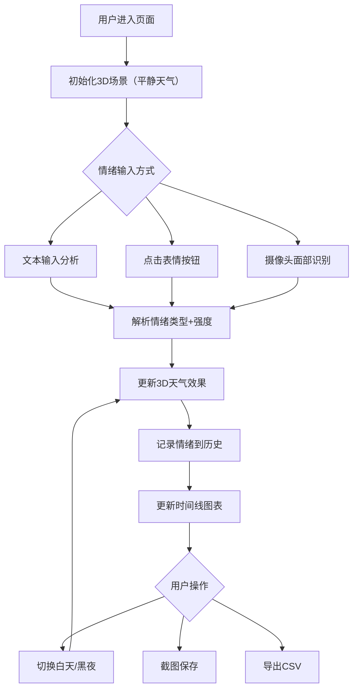

## 1. 产品概述

AI驱动的3D情绪天气可视化系统，通过分析用户输入文本或面部表情，实时将情绪转化为沉浸式3D天气场景。用户可直观感受情绪与天气的联动，记录情绪变化轨迹。

- 核心价值：将抽象情绪具象化为可感知的3D视觉体验，帮助用户理解和表达情绪
- 目标用户：对情绪可视化、艺术交互、AI技术感兴趣的普通用户和创意工作者

## 2. 核心功能

### 2.1 功能模块

1. **3D天气场景**：中央球体/地形，根据情绪动态呈现不同天气效果
2. **情绪输入系统**：文本输入分析、预设表情按钮、摄像头面部表情识别
3. **情绪强度控制**：0-100%强度显示，影响天气剧烈程度
4. **情绪历史记录**：时间线图表展示过去10次情绪切换
5. **场景控制**：白天/黑夜背景切换、一键截图保存
6. **数据导出**：情绪日志CSV导出功能

### 2.2 页面详情

| 页面名称 | 模块名称 | 功能描述 |
|----------|----------|----------|
| 主页面 | 3D场景区 | 全屏Three.js渲染的动态天气场景，中央为情绪球体 |
| 主页面 | 控制面板 | 情绪输入（文本/表情按钮）、强度显示、背景切换、截图、导出 |
| 主页面 | 历史记录 | Canvas绘制的情绪变化时间线图表 |
| 主页面 | 摄像头区 | 面部表情识别实时预览（可开启/关闭） |

## 3. 核心流程

用户进入页面 → 默认显示平静天气场景 → 通过文本输入/点击表情/开启摄像头选择情绪 → 3D场景实时切换对应天气效果 → 情绪强度动态调节 → 自动记录情绪变化 → 可随时截图或导出历史数据

## 4. 用户界面设计

### 4.1 设计风格
- **主题色调**：深色系为主，配合情绪对应的动态渐变色
  - 高兴：金黄色、橙红色渐变
  - 悲伤：深蓝色、灰蓝色渐变
  - 愤怒：暗红色、血红色渐变
  - 平静：天蓝色、淡绿色渐变
- **按钮风格**：玻璃拟态（Glassmorphism），半透明背景，柔和阴影，圆角设计
- **字体**：展示字体使用 Orbitron（科技感），正文字体使用 Noto Sans SC（清晰易读）
- **布局风格**：全屏沉浸式3D场景，控制面板悬浮于左右两侧，半透明毛玻璃效果
- **图标风格**：线性图标，简洁现代，配合Emoji增强情绪表达

### 4.2 页面设计概述

| 页面名称 | 模块名称 | UI Elements |
|----------|----------|-------------|
| 主页面 | 3D场景区 | 全屏渲染、动态光照、粒子效果、后处理泛光 |
| 主页面 | 左侧控制面板 | 文本输入框、4个情绪按钮（😊😢😠😌）、强度进度条、背景切换开关 |
| 主页面 | 右侧功能区 | 截图按钮、导出按钮、摄像头开关、实时预览小窗 |
| 主页面 | 底部时间线 | Canvas绘制的情绪时间线，显示最近10次情绪变化，带情绪图标和强度标注 |
| 主页面 | 顶部标题 | 系统名称、当前情绪状态标签 |

### 4.3 响应性
- 桌面端优先设计，布局采用固定悬浮面板
- 移动端自适应：控制面板移至底部，采用折叠式设计
- 触摸优化：按钮最小尺寸48px，支持滑动切换情绪

### 4.4 3D场景设计
- **环境**：程序化天空盒，根据情绪和昼夜模式动态调整
- **光照**：
  - 白天：方向光模拟太阳光，配合环境光
  - 黑夜：点光源模拟月光，泛光效果增强氛围
  - 情绪光：根据情绪类型添加对应颜色的点光源
- **相机**：透视相机，环绕中央球体缓慢旋转，支持用户鼠标拖拽交互
- **核心元素**：
  - 中央：变形球体（情绪星球），表面纹理和颜色随情绪变化
  - 天气粒子系统：雨、彩虹粒子、闪电、雾气
  - 背景：动态星空/云层
- **动画**：
  - 情绪切换时的平滑过渡动画
  - 球体呼吸效果（缩放脉动）
  - 粒子系统持续动画
- **后处理**：Bloom泛光、色彩分级、轻微噪点
- **性能**：粒子数量根据设备性能动态调整，目标帧率60fps

