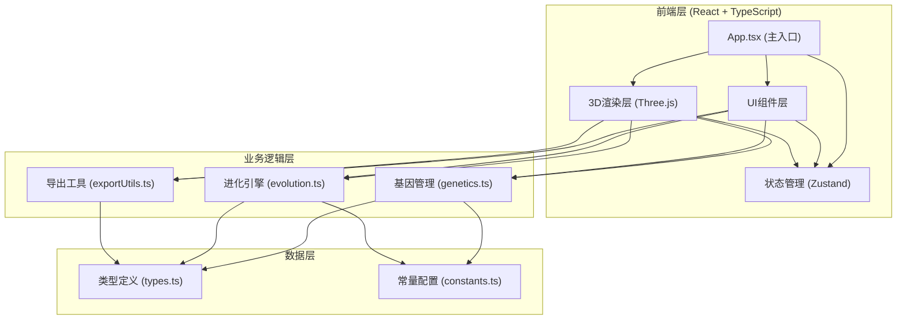

## 1. 架构设计



**架构说明**：
- 纯前端单页应用，无后端服务
- 使用Zustand管理全局状态（当前生物、进化历史、锁定状态等）
- 3D渲染层与UI层分离，通过状态管理通信
- 业务逻辑封装在独立工具模块中，可复用可测试

---

## 2. 技术栈说明

### 核心依赖
- **前端框架**：React 18 + TypeScript
- **构建工具**：Vite 5
- **样式方案**：TailwindCSS 3
- **3D渲染**：Three.js 0.160
- **3D辅助库**：@react-three/fiber 8、@react-three/drei 9、@react-three/postprocessing 2
- **状态管理**：Zustand 4
- **图标库**：Lucide React 0.294
- **字体**：@fontsource/space-grotesk、@fontsource/jetbrains-mono

### 初始化方式
使用 vite-init 初始化 React + TypeScript 项目，命令如下：
```bash
npm init vite-init@latest -y . -- --template react-ts --force
```

---

## 3. 目录结构

```
src/
├── components/
│   ├── ControlPanel/       # 右侧控制面板
│   │   ├── InfoCard.tsx    # 信息展示卡片
│   │   ├── EvolutionControls.tsx  # 进化按钮组
│   │   ├── LockControls.tsx       # 部位锁定开关
│   │   └── Toolbar.tsx     # 工具栏(保存/加载/导出)
│   ├── Scene3D/            # 3D场景组件
│   │   ├── Creature.tsx    # 生物渲染组件
│   │   ├── CreaturePart.tsx # 生物部位组件
│   │   ├── Environment.tsx # 环境/星空/地面
│   │   └── Scene.tsx       # 场景主组件
│   └── ui/                 # 通用UI组件
│       ├── Button.tsx
│       └── Toggle.tsx
├── hooks/
│   ├── useCreatureAnimation.ts  # 生物动画hook
│   └── useEvolution.ts          # 进化逻辑hook
├── store/
│   └── useCreatureStore.ts      # Zustand状态管理
├── utils/
│   ├── genetics.ts         # 基因生成/变异/序列化
│   ├── evolution.ts        # 进化算法
│   ├── exportUtils.ts      # JSON/PNG/OBJ导出
│   └── objExporter.ts      # OBJ导出实现
├── types/
│   └── creature.ts         # 类型定义
├── constants/
│   └── creatureConfig.ts   # 配置常量
├── pages/
│   └── Home.tsx            # 主页
├── App.tsx
├── main.tsx
└── index.css
```

---

## 4. 数据模型

### 4.1 核心类型定义

```typescript
// 几何体类型
type GeometryType = 'sphere' | 'cube' | 'cone' | 'cylinder' | 'torus';

// 生物部位类型
type BodyPartType = 'head' | 'torso' | 'arm_left' | 'arm_right' | 'leg_left' | 'leg_right' | 'tail';

// 单个部位定义
interface BodyPart {
  type: BodyPartType;
  geometry: GeometryType;
  position: [number, number, number];  // x, y, z
  rotation: [number, number, number];  // rx, ry, rz
  scale: [number, number, number];     // sx, sy, sz
  color: string;                       // hex color
  locked: boolean;
}

// 生物基因
interface CreatureGenome {
  id: string;
  generation: number;
  fitness: number;                     // 0-100
  parts: BodyPart[];
  geneSequence: string;                // 基因序列字符串
  createdAt: number;
}

// 应用状态
interface CreatureState {
  currentCreature: CreatureGenome | null;
  evolutionHistory: CreatureGenome[];
  lockedParts: Set<BodyPartType>;
  evolutionBias: 'neutral' | 'conservative' | 'radical';  // 中立/保守(点赞)/激进(点踩)
  autoRotate: boolean;
  animationEnabled: boolean;
  isEvolving: boolean;
}
```

### 4.2 基因序列编码规则
基因序列为32位随机字符串，由字母(A-Z, a-z)和数字(0-9)组成，编码规则：
- 第1-4位：头部形状编码
- 第5-8位：躯干形状编码
- 第9-16位：四肢形状编码
- 第17-24位：颜色编码(RGB各3位)
- 第25-32位：大小比例编码

---

## 5. 核心模块说明

### 5.1 基因管理模块 (genetics.ts)
- `generateRandomGenome(generation: number): CreatureGenome` - 生成随机基因
- `mutateGenome(genome: CreatureGenome, bias: 'neutral' | 'conservative' | 'radical', lockedParts: Set<BodyPartType>): CreatureGenome` - 基因变异
- `genomeToGeneSequence(genome: CreatureGenome): string` - 基因转序列字符串
- `geneSequenceToGenome(sequence: string): Partial<CreatureGenome>` - 序列转基因
- `serializeGenome(genome: CreatureGenome): string` - 序列化为JSON
- `deserializeGenome(json: string): CreatureGenome` - JSON反序列化

### 5.2 进化引擎模块 (evolution.ts)
- `calculateFitness(genome: CreatureGenome): number` - 计算适应度分数
- `evolveCreature(current: CreatureGenome, bias, lockedParts): CreatureGenome` - 执行进化
- `getMutationRate(bias): number` - 根据偏向获取变异率（保守0.15，中立0.4，激进0.8）

### 5.3 导出工具模块 (exportUtils.ts)
- `exportAsJSON(genome: CreatureGenome, filename: string)` - 导出JSON化石
- `importFromJSON(file: File): Promise<CreatureGenome>` - 加载JSON化石
- `captureScreenshot(gl: THREE.WebGLRenderer, scene, camera): string` - 截图并返回dataURL
- `downloadScreenshot(dataUrl: string, filename: string)` - 下载PNG
- `exportAsOBJ(creatureGroup: THREE.Group, filename: string)` - 导出OBJ模型

### 5.4 状态管理 (useCreatureStore.ts)
```typescript
const useCreatureStore = create<CreatureState & Actions>((set, get) => ({
  currentCreature: null,
  evolutionHistory: [],
  lockedParts: new Set(),
  evolutionBias: 'neutral',
  autoRotate: true,
  animationEnabled: true,
  isEvolving: false,
  
  initCreature: () => { ... },
  evolve: () => { ... },
  like: () => set({ evolutionBias: 'conservative' }),
  dislike: () => set({ evolutionBias: 'radical' }),
  toggleLock: (part) => { ... },
  loadCreature: (genome) => { ... },
  saveCreature: () => { ... },
  toggleAutoRotate: () => set(s => ({ autoRotate: !s.autoRotate })),
  toggleAnimation: () => set(s => ({ animationEnabled: !s.animationEnabled })),
}));
```

---

## 6. 关键实现要点

### 6.1 性能优化
- 生物几何体使用 `useMemo` 缓存，避免重复创建
- 材质使用 `MeshStandardMaterial` 并启用 `flatShading` 提升性能
- 动画使用 `useFrame` 仅更新必要的矩阵
- 星空使用 `Points` + `BufferGeometry` 批量渲染

### 6.2 3D交互
- 使用 `OrbitControls` 实现相机拖拽、缩放
- 自动环绕通过在 `useFrame` 中更新相机theta实现
- 点击生物部位可快速锁定（raycaster检测）

### 6.3 过渡动画
- 进化过渡使用 `GSAP` 或 framer-motion-3d 实现scale和opacity动画
- 粒子爆炸效果使用 `Points` 配合shader动画

### 6.4 响应式适配
- 使用 Tailwind 的响应式断点类 `lg:hidden`, `md:block` 等
- 控制面板在移动端使用 `framer-motion` 实现抽屉动画
