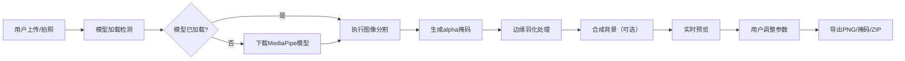

## 1. 产品概述
AI背景移除工具，基于MediaPipe Selfie Segmentation实现本地端侧AI分割，帮助用户快速分离图片前景与背景，无需上传至云端，保护隐私。支持背景替换、边缘羽化、批量处理等高级功能，适用于电商美工、设计师、内容创作者等人群。

- 核心价值：隐私保护（本地处理）、实时交互、零成本、功能全面
- 解决问题：传统抠图工具需要联网、付费、操作复杂，本工具提供一站式离线解决方案

## 2. 核心 Features

### 2.1 用户角色
| 角色 | 注册方式 | 核心权限 |
|------|----------|----------|
| 普通用户 | 无需注册，直接使用 | 所有功能完全免费，无使用限制 |

### 2.2 功能模块
1. **主编辑器页面**：图片上传/摄像头拍照、分割预览、背景替换、参数调节
2. **批量处理模块**：ZIP批量上传、多图队列处理、进度显示、结果打包下载
3. **对比查看模块**：原图与处理结果左右滑动对比、分割掩码可视化
4. **导出模块**：PNG透明图、灰度掩码图、带阴影合成图、ZIP批量导出

### 2.3 页面详情
| 页面名称 | 模块名称 | 功能描述 |
|----------|----------|----------|
| 主编辑器 | 上传区域 | 拖拽上传、点击上传、摄像头拍照、粘贴剪贴板图片 |
| 主编辑器 | 分割引擎 | MediaPipe模型加载、自动分割、处理计时、置信度显示 |
| 主编辑器 | 背景设置 | 纯色选择器、渐变预设、自定义背景图上传、透明度调节 |
| 主编辑器 | 边缘处理 | 羽化滑块、边缘平滑、收缩/扩张边缘、阴影保留开关 |
| 主编辑器 | 图层操作 | 前景拖动定位、缩放控制、重置位置 |
| 主编辑器 | 对比功能 | 左右分栏对比、滑动分割线、掩码叠加显示 |
| 主编辑器 | 导出功能 | PNG下载、掩码导出、Ctrl+S快捷键保存 |
| 批量处理 | 批量上传 | ZIP文件解析、图片提取、数量统计 |
| 批量处理 | 队列处理 | 逐张分割、进度条、单张预览、失败重试 |
| 批量处理 | 结果导出 | 全部打包ZIP下载、单张单独下载 |
| 设置面板 | 模型选择 | 通用/风景/人像模型切换、精度设置 |
| 设置面板 | 快捷键 | 快捷键说明、键盘事件监听 |

## 3. 核心流程

用户上传图片 → 加载MediaPipe模型 → 自动分割前景 → 生成透明背景 → 用户调整羽化/背景 → 实时预览效果 → 拖动前景定位 → 对比查看 → 导出结果

## 4. 用户界面设计

### 4.1 设计风格
- **主色调**：深海蓝 #0F172A 作为背景色，搭配电光紫 #6366F1 作为强调色，科技感十足
- **辅助色**：青绿色 #22D3EE 用于成功状态，珊瑚红 #F43F5E 用于警告状态
- **按钮风格**：圆角12px，微渐变填充，hover时有轻微上浮和发光效果
- **字体**：标题使用 Space Grotesk 等宽现代字体，正文使用 Inter 或系统无衬线字体
- **布局风格**：三栏布局（左侧工具栏 + 中间画布 + 右侧参数面板），深色主题
- **视觉元素**：玻璃拟态面板、微妙噪点纹理背景、柔和发光边框、流畅过渡动画

### 4.2 页面设计概览
| 页面名称 | 模块名称 | UI 元素 |
|----------|----------|----------|
| 主编辑器 | 顶部导航 | Logo、功能Tab（单图/批量）、帮助按钮 |
| 主编辑器 | 左侧工具栏 | 上传按钮、摄像头按钮、撤销/重做、对比模式切换 |
| 主编辑器 | 中央画布 | 透明棋盘格背景、可拖动前景层、缩放控制、网格对齐 |
| 主编辑器 | 右侧面板 | 背景设置（颜色/渐变/图片）、羽化滑块、边缘调整、阴影开关 |
| 主编辑器 | 底部状态栏 | 处理耗时、分辨率信息、置信度百分比、模型状态 |
| 批量处理 | 上传区 | 大尺寸拖拽区域、ZIP图标、文件列表 |
| 批量处理 | 处理队列 | 缩略图网格、进度条、状态图标、预览按钮 |

### 4.3 响应式设计
- **桌面端**：三栏固定布局，画布区域自适应，最小宽度1280px
- **平板端**：左右面板收起为可展开抽屉，画布占满主要区域
- **移动端**：单栏布局，工具栏改为底部Tab栏，支持触摸拖动和双指缩放
- **触摸优化**：所有按钮最小48x48px，触摸目标间距8px以上，支持长按操作

### 4.4 动效设计
- **页面加载**：元素按序淡入，工具栏从左滑入，参数面板从右滑入
- **按钮交互**：hover时缩放1.03倍 + 轻微发光，click时按压效果
- **分割过程**：画布显示扫描线动画，进度条平滑增长
- **参数调整**：滑块拖动时实时预览，有数值气泡跟随
- **图层拖动**：轻微阴影跟随，释放时有吸附动画
