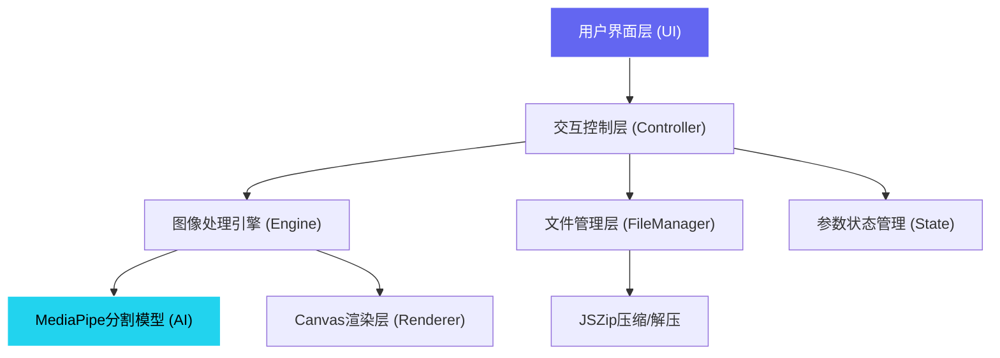

## 1. 架构设计

本项目为纯前端单页应用，无需后端服务，所有计算在浏览器端完成。



## 2. 技术栈说明

- **前端框架**：原生 HTML5 + CSS3 + JavaScript (ES6+)，无需构建工具
- **AI模型**：MediaPipe Selfie Segmentation v0.4.1646424915，通过CDN加载
- **ZIP处理**：JSZip v3.10.1，用于批量上传解压和结果打包
- **核心API**：
  - Canvas 2D API：图像合成、像素处理、羽化效果
  - MediaDevices API：摄像头拍照
  - File API / Blob API：文件读写
  - Web Workers：可选，用于后台批量处理
- **CDN依赖**：
  - MediaPipe：`https://cdn.jsdelivr.net/npm/@mediapipe/selfie_segmentation/selfie_segmentation.js`
  - JSZip：`https://cdn.jsdelivr.net/npm/jszip@3.10.1/dist/jszip.min.js`

## 3. 文件结构

```
/
├── index.html              # 主页面，包含所有HTML结构
├── css/
│   └── style.css           # 所有样式，包含响应式和动画
├── js/
│   ├── main.js             # 入口文件，初始化应用
│   ├── segmentation.js     # MediaPipe封装，分割逻辑
│   ├── imageProcessor.js   # 图像处理：羽化、边缘、阴影
│   ├── canvasRenderer.js   # Canvas渲染，图层管理
│   ├── batchProcessor.js   # 批量处理，ZIP管理
│   ├── comparisonView.js   # 对比视图，滑动分割
│   └── utils.js            # 工具函数，快捷键，事件处理
└── assets/
    └── icons/              # SVG图标（内联或外部文件）
```

## 4. 核心模块定义

### 4.1 SegmentationEngine（分割引擎）
```javascript
class SegmentationEngine {
  constructor()
  async loadModel()           // 加载MediaPipe模型
  async segmentImage(image)   // 执行分割，返回掩码数据
  getConfidence()             // 返回分割置信度(0-100%)
  getProcessingTime()         // 返回处理耗时(ms)
}
```

### 4.2 ImageProcessor（图像处理）
```javascript
class ImageProcessor {
  static featherMask(maskData, radius)    // 羽化边缘
  static erodeMask(maskData, amount)      // 收缩边缘
  static dilateMask(maskData, amount)     // 扩张边缘
  static extractShadow(original, mask)    // 提取阴影
  static composeImage(foreground, background, mask, position) // 合成图像
}
```

### 4.3 CanvasRenderer（画布渲染）
```javascript
class CanvasRenderer {
  constructor(canvasElement)
  setBackground(type, data)   // 设置背景：solid/gradient/image
  setForeground(imageData, mask)
  setPosition(x, y, scale)
  enableShadow(enabled)
  showMask(show)              // 显示置信度掩码
  render()
  exportPNG()
  exportMask()                // 导出灰度掩码
}
```

### 4.4 BatchProcessor（批量处理）
```javascript
class BatchProcessor {
  async loadZip(file)         // 解压ZIP，提取图片
  async processAll(progressCallback)
  async exportZip()           // 打包所有结果
  getResults()                // 返回处理结果数组
}
```

## 5. 状态管理

使用简单的状态对象管理应用全局状态：

```javascript
const AppState = {
  currentImage: null,         // 原始图片
  segmentationMask: null,     // 分割掩码
  originalSize: {w:0, h:0},
  settings: {
    featherRadius: 5,         // 羽化半径 0-30
    edgeShrink: 0,            // 边缘收缩 -10 to +10
    shadowEnabled: true,      // 保留阴影
    shadowOpacity: 0.6,
    background: {
      type: 'transparent',    // transparent/solid/gradient/image
      color: '#ffffff',
      gradient: ['#6366F1', '#22D3EE'],
      image: null
    }
  },
  foreground: {
    x: 0, y: 0, scale: 1      // 前景位置和缩放
  },
  batch: {
    files: [],
    results: [],
    progress: 0
  }
}
```

## 6. 性能优化策略

1. **模型缓存**：MediaPipe模型加载后缓存，避免重复下载
2. **离屏Canvas**：使用OffscreenCanvas进行像素处理，避免阻塞UI
3. **节流防抖**：参数调整时使用requestAnimationFrame合并渲染
4. **Web Worker**：批量处理时在Worker中执行，保持界面响应
5. **内存管理**：及时释放Blob URL，撤销objectURL避免内存泄漏
6. **渐进式渲染**：大图片先渲染低分辨率预览，再处理高清

## 7. 浏览器兼容性

- Chrome/Edge 90+（推荐，MediaPipe最佳支持）
- Firefox 88+
- Safari 14+
- 移动端：iOS Safari 14+，Chrome Android 90+

## 8. 安全与隐私

- 所有图像处理在本地完成，不上传任何数据到服务器
- 不使用Cookie，不收集用户数据
- 摄像头访问需用户授权，仅在拍照时临时使用
- 符合GDPR和隐私保护最佳实践
