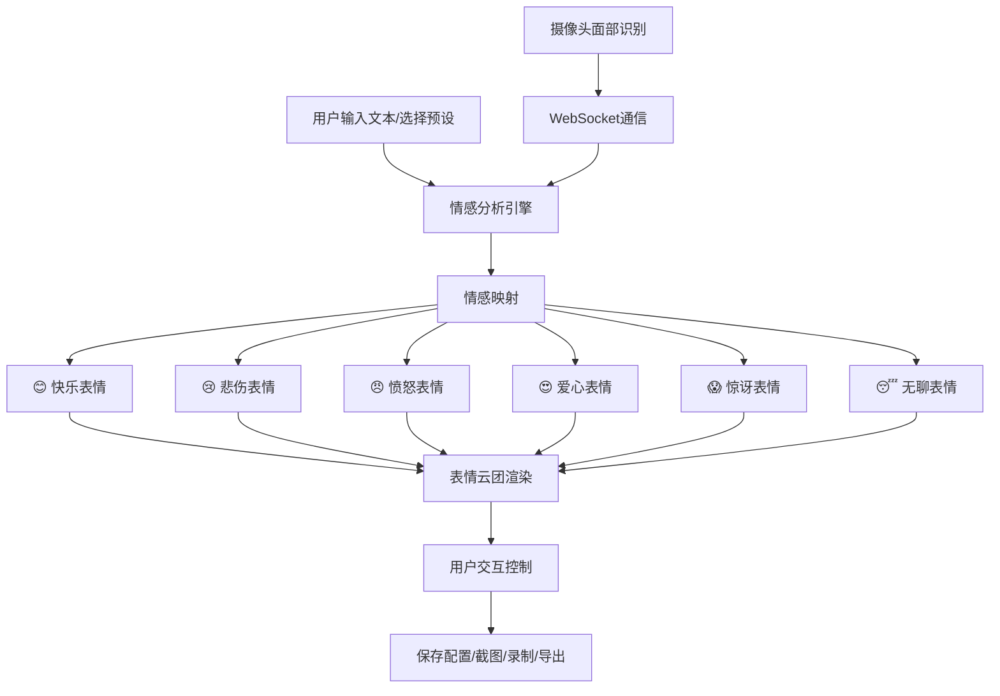

## 1. 产品概述

动态表情云（Dynamic Emoji Cloud）是一个基于Three.js的沉浸式3D交互应用，通过AI情感分析驱动3D表情符号的运动、发光和粒子效果，创造可视化的"情感云团"体验。用户可输入文本或通过摄像头表情实时驱动表情云的动态变化，支持配置保存、截图、录制和关键帧导出。

- 目标用户：创意工作者、社交媒体运营者、情感可视化爱好者
- 核心价值：将抽象情感转化为直观震撼的3D视觉体验，实现人机情感交互

## 2. 核心功能

### 2.1 用户角色

| 角色 | 使用方式 | 核心权限 |
|------|----------|----------|
| 普通用户 | 直接访问 | 使用所有交互功能 |
| 高级用户 | 开启摄像头 | 面部表情驱动的实时交互 |

### 2.2 功能模块

1. **主场景页**：3D表情云场景、文本输入面板、摄像头控制、背景切换
2. **控制面板**：粒子拖尾调节、配置保存/加载、录制/截图、导出功能

### 2.3 页面详情

| 页面名称 | 模块名称 | 功能描述 |
|----------|----------|----------|
| 主场景页 | 3D表情云场景 | 漂浮3D表情符号，情感驱动运动、放大、发光 |
| 主场景页 | 文本输入面板 | 自由输入文本或选择预设短语，AI情感分析驱动表情变化 |
| 主场景页 | 摄像头模块 | 开启摄像头识别面部表情，WebSocket通信实时更新表情活跃度 |
| 主场景页 | 背景切换 | 彩虹渐变/星空背景一键切换 |
| 控制面板 | 粒子拖尾调节 | 滑块控制粒子拖尾长度、密度、颜色 |
| 控制面板 | 配置管理 | 保存/加载表情云配置（位置、大小、活跃度）为JSON |
| 控制面板 | 录制/截图 | WebRTC屏幕录制生成短视频，Canvas截图 |
| 控制面板 | 随机生成 | 随机生成情感文本，展示AI创造力 |
| 控制面板 | 关键帧导出 | 导出表情云活动轨迹为关键帧JSON数据 |

## 3. 核心流程

用户输入文本 → 前端情感分析引擎解析每个词语情感 → 映射到对应表情符号 → 驱动3D表情放大/发光/加速运动 → 多个表情同时展示形成"表情云团" → 情感越强烈表情越突出

摄像头流程：用户开启摄像头 → 浏览器端面部关键点检测 → 识别表情类型 → WebSocket发送至本地服务 → 返回情感强度 → 实时更新表情云活跃度

## 4. 用户界面设计

### 4.1 设计风格

- 主色调：深空黑底（#0a0a1a）配合霓虹色彩（情感色彩映射：快乐=#FFD700, 悲伤=#4FC3F7, 愤怒=#FF5252, 爱心=#FF4081, 惊讶=#E040FB, 无聊=#78909C）
- 辅助色：星空白/半透明玻璃态面板
- 按钮：圆角玻璃态按钮，hover时发光边框
- 字体：标题使用Orbitron（科技感），正文使用Noto Sans SC
- 布局：全屏3D场景 + 左侧半透明悬浮控制面板 + 底部文本输入栏
- 图标：Lucide React图标体系
- 整体风格：赛博朋克 + 宇宙星空，沉浸感强

### 4.2 页面设计概述

| 页面名称 | 模块名称 | UI元素 |
|----------|----------|--------|
| 主场景页 | 3D表情云 | 深空黑背景，漂浮发光3D表情，粒子拖尾，光晕效果 |
| 主场景页 | 文本输入栏 | 底部玻璃态输入框，预设短语胶囊按钮，发送按钮 |
| 主场景页 | 摄像头窗口 | 右上角小窗口，开启/关闭按钮，表情识别指示灯 |
| 主场景页 | 背景切换 | 顶部工具栏图标按钮，彩虹/星空切换 |
| 控制面板 | 左侧面板 | 可折叠玻璃态侧边栏，滑块、按钮、下拉菜单 |
| 控制面板 | 粒子控制 | 拖尾长度滑块、密度滑块、颜色模式选择 |
| 控制面板 | 录制区 | 录制按钮（红点闪烁指示）、停止、下载；截图按钮 |
| 控制面板 | 导出区 | 保存配置、加载配置、导出关键帧按钮 |

### 4.3 响应式设计

- 桌面优先，3D场景占满全屏
- 移动端控制面板自动折叠为底部抽屉
- 触摸优化：支持手势旋转/缩放3D场景

### 4.4 3D场景指导

- 环境：深空黑色背景，微弱环境光，星点粒子点缀
- 灯光：中心点光源 + 多色情感光，环境光强度0.3
- 摄像机：透视摄像机，FOV 60°，自动缓慢环绕
- 构图：表情云团居中，粒子拖尾形成轨迹
- 交互：鼠标拖拽旋转，滚轮缩放，点击表情高亮
- 后处理：Bloom发光效果，粒子光晕
- 资源：表情符号使用3D文字几何体 + 纹理贴图，性能预算60fps
