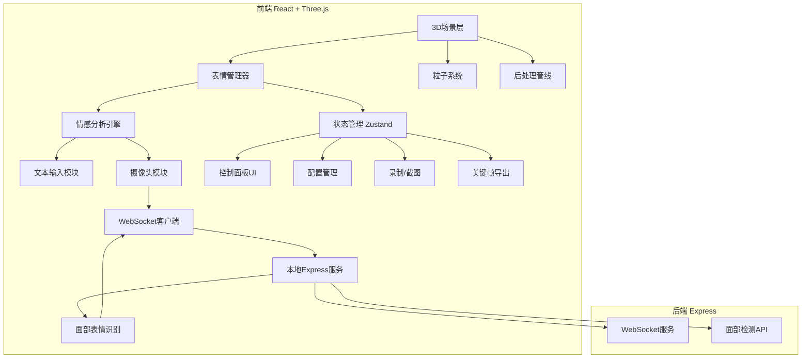
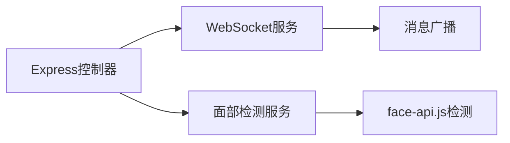

## 1. 架构设计



## 2. 技术说明

- 前端：React@18 + TypeScript + Vite + Tailwind CSS + Zustand
- 3D引擎：three + @react-three/fiber + @react-three/drei + @react-three/postprocessing
- 后端：Express@4 + ws（WebSocket）
- 初始化工具：vite-init（react-express-ts模板）
- 面部识别：face-api.js（浏览器端关键点检测）+ 后端WebSocket中转
- 录制：MediaRecorder API（WebRTC）
- 截图：Canvas toDataURL
- 状态管理：Zustand

## 3. 路由定义

| 路由 | 用途 |
|------|------|
| / | 主场景页，包含3D表情云和所有交互功能 |

## 4. API定义

### 4.1 WebSocket消息协议

```typescript
interface WSEmotionMessage {
  type: 'emotion_update'
  emotions: {
    happy: number
    sad: number
    angry: number
    love: number
    surprised: number
    bored: number
  }
  timestamp: number
}

interface WSCommandMessage {
  type: 'start_camera' | 'stop_camera' | 'get_status'
}
```

### 4.2 REST API

| 方法 | 路径 | 用途 |
|------|------|------|
| POST | /api/emotion/analyze | 文本情感分析（备用，主要前端本地分析） |
| GET | /api/health | 服务健康检查 |

## 5. 服务架构图



## 6. 数据模型

### 6.1 前端状态模型（Zustand）

```typescript
interface EmojiState {
  id: string
  emoji: string
  position: [number, number, number]
  scale: number
  activity: number
  color: string
  velocity: [number, number, number]
  trail: TrailPoint[]
}

interface TrailPoint {
  position: [number, number, number]
  alpha: number
  timestamp: number
}

interface AppConfig {
  emojis: EmojiState[]
  particleTrailLength: number
  particleDensity: number
  particleColorMode: 'emotion' | 'rainbow' | 'white'
  background: 'starfield' | 'rainbow'
  cameraAutoRotate: boolean
}

interface KeyframeData {
  timestamp: number
  emojis: {
    id: string
    position: [number, number, number]
    scale: number
    activity: number
  }[]
}
```

### 6.2 情感映射配置

```typescript
const EMOTION_MAP = {
  happy: { emoji: '😊', color: '#FFD700', keywords: ['开心','快乐','幸福','happy','joy','love'] },
  sad: { emoji: '😢', color: '#4FC3F7', keywords: ['悲伤','难过','哭','sad','cry','miss'] },
  angry: { emoji: '😠', color: '#FF5252', keywords: ['生气','愤怒','烦','angry','hate','rage'] },
  love: { emoji: '😍', color: '#FF4081', keywords: ['爱','喜欢','心动','love','like','heart'] },
  surprised: { emoji: '😱', color: '#E040FB', keywords: ['惊讶','震惊','哇','wow','surprise','omg'] },
  bored: { emoji: '😴', color: '#78909C', keywords: ['无聊','困','乏味','bored','tired','meh'] },
}
```
