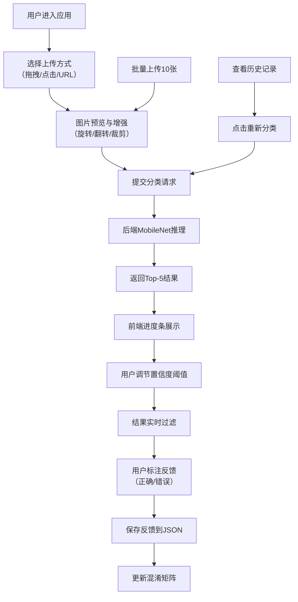

## 1. 产品概述

AI图像分类演示系统是一个基于Web的交互式图像分类应用，使用MobileNet预训练模型提供实时图像识别服务。用户可通过多种方式上传图片，获得Top-5分类结果，并可进行批量处理、结果反馈和模型性能分析。

- 核心价值：展示深度学习图像分类能力，提供直观的AI模型交互体验
- 目标用户：AI学习者、开发者、对计算机视觉感兴趣的用户
- 产品定位：教育演示类应用，兼具实用性和互动性

## 2. 核心功能

### 2.1 用户角色
| 角色 | 注册方式 | 核心权限 |
|------|---------|---------|
| 普通用户 | 无需注册 | 图片上传分类、历史查看、标注反馈、阈值调节 |

### 2.2 功能模块
1. **首页/分类页**：图片上传区、预览区、分类结果展示、批量报告
2. **历史记录页**：最近20次分类记录、缩略图展示、重新分类
3. **模型分析页**：混淆矩阵、标注统计、模型性能展示
4. **图片增强**：旋转、翻转、裁剪操作面板

### 2.3 页面详情
| 页面名称 | 模块名称 | 功能描述 |
|---------|---------|----------|
| 分类主页 | 上传模块 | 拖拽上传、点击选择、URL加载，最多10张批量 |
| 分类主页 | 图片增强 | 旋转90°/180°/270°、水平/垂直翻转、自由裁剪 |
| 分类主页 | 结果展示 | 进度条显示Top-5置信度，卡片式并列展示，阈值过滤 |
| 分类主页 | 批量报告 | 类别频率统计、标签云可视化、分类汇总 |
| 分类主页 | 标注反馈 | 纠正标注正确/错误，数据持久化到JSON |
| 历史记录页 | 历史列表 | 最近20次记录缩略图网格，点击查看详情 |
| 历史记录页 | 重新分类 | 选择历史图片重新进行分类 |
| 模型分析页 | 混淆矩阵 | 基于标注数据生成混淆矩阵热力图 |
| 模型分析页 | 阈值调节 | 滑动条调节置信度阈值，实时过滤结果 |

## 3. 核心流程

## 4. 用户界面设计

### 4.1 设计风格
- **主色调**：深海蓝 (#0EA5E9) 作为科技感主色，搭配深紫 (#8B5CF6) 作为强调色
- **背景**：深色主题 (#0F172A)，带渐变网格纹理和微妙噪点
- **按钮风格**：圆角胶囊按钮，带发光悬停效果，点击有微缩放动画
- **字体**：显示字体使用 Space Grotesk，正文字体使用 JetBrains Mono
- **布局风格**：卡片式网格布局，毛玻璃效果 (backdrop-blur)，分层阴影
- **图标风格**：Lucide 线性图标，统一线条粗细 2px

### 4.2 页面设计概述
| 页面名称 | 模块名称 | UI元素 |
|---------|---------|--------|
| 分类主页 | 上传区 | 虚线边框拖放区，悬浮高亮动画，多上传源标签页切换 |
| 分类主页 | 图片卡片 | 圆角卡片，图片居中裁剪，操作按钮悬浮出现，结果进度条渐变色 |
| 分类主页 | 标签云 | 词频映射字号，彩色渐变标签，悬浮放大效果 |
| 分类主页 | 阈值滑块 | 自定义轨道样式，滑块带数值标签，渐变填充 |
| 历史记录页 | 缩略图网格 | 响应式网格，悬停显示分类结果，点击展开详情 |
| 模型分析页 | 混淆矩阵 | 热力图颜色映射，对角线高亮，单元格显示数值和百分比 |

### 4.3 响应式
- 桌面端 (1200px+)：三栏布局，上传区 + 图片网格 + 结果面板
- 平板 (768px-1199px)：两栏布局，上传区在上，图片网格在下
- 移动端 (<768px)：单列流式布局，优化触摸操作区域
- 所有交互元素最小尺寸 44x44px，适配触摸操作

### 4.4 视觉动效
- 页面加载：元素错峰入场动画 (staggered reveal)，延迟 50ms 递增
- 图片上传：平滑缩放入场，进度条动画
- 分类结果：进度条从0到目标值的缓动动画 (ease-out)
- 卡片悬浮：上移 4px + 阴影增强 + 边框发光
- 标签云：随机轻微浮动动画，营造呼吸感
