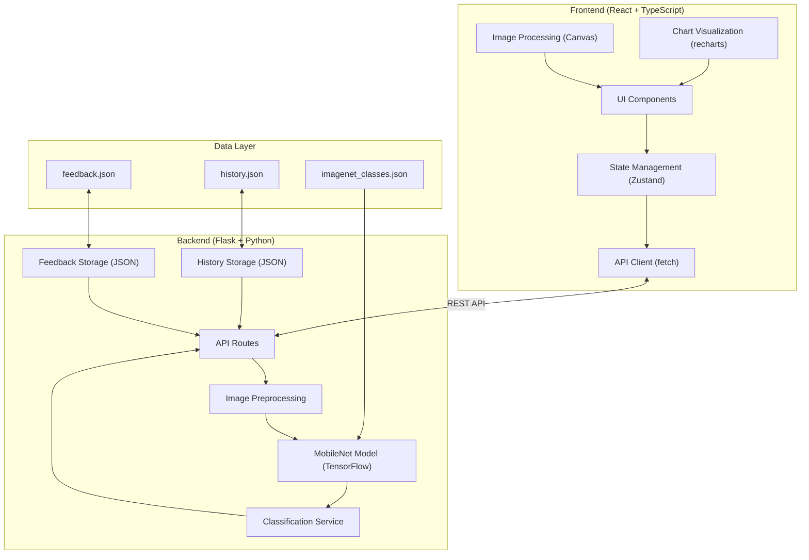
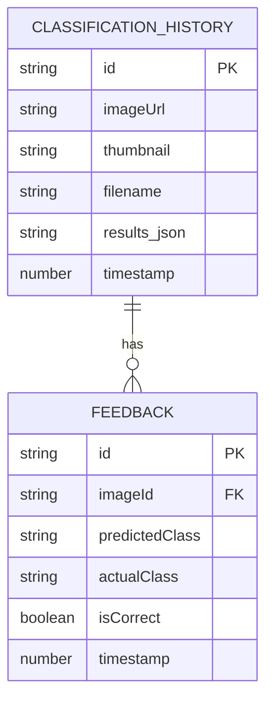
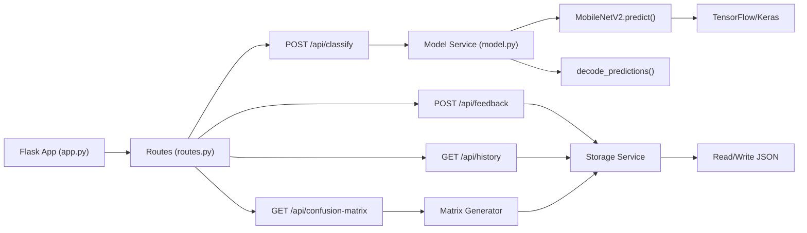

## 1. 架构设计



## 2. 技术描述

### 2.1 前端技术栈
- **框架**: React 18 + TypeScript
- **构建工具**: Vite 5
- **样式**: Tailwind CSS 3
- **状态管理**: Zustand
- **路由**: React Router DOM 6
- **图表**: Recharts
- **图标**: Lucide React
- **图片处理**: HTML5 Canvas API

### 2.2 后端技术栈
- **Web框架**: Flask 3
- **深度学习**: TensorFlow 2.15 + Keras
- **预训练模型**: MobileNetV2 (ImageNet权重)
- **图像处理**: Pillow (PIL)
- **数据存储**: JSON文件 (无需数据库)
- **CORS**: flask-cors

### 2.3 项目初始化
- 前端: `npm init vite-init@latest . -- --template react-ts --force`
- 后端: 手动创建 Flask 项目结构，`requirements.txt` 管理依赖

## 3. 目录结构

```
project-root/
├── src/                          # 前端源码
│   ├── components/               # 可复用组件
│   │   ├── ImageUploader.tsx     # 图片上传组件
│   │   ├── ImageEditor.tsx       # 图片增强编辑器
│   │   ├── ImageCard.tsx         # 图片结果卡片
│   │   ├── ProgressBar.tsx       # 置信度进度条
│   │   ├── TagCloud.tsx          # 标签云
│   │   ├── ConfusionMatrix.tsx   # 混淆矩阵
│   │   ├── ThresholdSlider.tsx   # 阈值滑块
│   │   └── FeedbackButtons.tsx   # 标注反馈按钮
│   ├── pages/                    # 页面组件
│   │   ├── ClassifyPage.tsx      # 分类主页
│   │   ├── HistoryPage.tsx       # 历史记录页
│   │   └── AnalysisPage.tsx      # 模型分析页
│   ├── hooks/                    # 自定义Hooks
│   │   ├── useImageProcessing.ts # 图片处理Hook
│   │   └── useClassification.ts  # 分类API Hook
│   ├── store/                    # 状态管理
│   │   └── useAppStore.ts        # 全局Store
│   ├── types/                    # 类型定义
│   │   └── index.ts              # 共享类型
│   ├── utils/                    # 工具函数
│   │   └── api.ts                # API请求封装
│   ├── App.tsx
│   └── main.tsx
├── api/                          # 后端源码
│   ├── app.py                    # Flask应用入口
│   ├── model.py                  # MobileNet模型封装
│   ├── routes.py                 # API路由定义
│   ├── utils.py                  # 工具函数
│   ├── data/                     # 数据存储
│   │   ├── feedback.json         # 标注反馈数据
│   │   ├── history.json          # 分类历史数据
│   │   └── imagenet_classes.json # ImageNet类别映射
│   └── requirements.txt          # Python依赖
├── shared/                       # 前后端共享类型
│   └── types.ts
├── package.json
├── tsconfig.json
├── vite.config.ts
└── tailwind.config.js
```

## 4. 路由定义

| 前端路由 | 页面 | 说明 |
|---------|------|------|
| `/` | ClassifyPage | 图片分类主页 |
| `/history` | HistoryPage | 分类历史记录 |
| `/analysis` | AnalysisPage | 模型分析与混淆矩阵 |

| 后端API路由 | 方法 | 说明 |
|-----------|------|------|
| `/api/classify` | POST | 单张/批量图片分类 |
| `/api/classify/url` | POST | 通过URL分类图片 |
| `/api/feedback` | POST | 提交标注反馈 |
| `/api/feedback` | GET | 获取所有反馈数据 |
| `/api/history` | GET | 获取最近20条历史 |
| `/api/history/:id` | GET | 获取单条历史详情 |
| `/api/history/:id/reclassify` | POST | 重新分类历史图片 |
| `/api/confusion-matrix` | GET | 获取混淆矩阵数据 |

## 5. API 定义

### 5.1 类型定义 (TypeScript)

```typescript
// 分类结果
interface ClassificationResult {
  classId: number;
  className: string;
  confidence: number;
}

interface ImageClassification {
  id: string;
  imageUrl: string;
  thumbnail: string;
  filename: string;
  results: ClassificationResult[];
  timestamp: number;
  feedback?: FeedbackData;
}

// 标注反馈
interface FeedbackData {
  isCorrect: boolean;
  correctClass?: string;
  timestamp: number;
}

// 批量分类报告
interface BatchReport {
  totalImages: number;
  classFrequency: Record<string, number>;
  averageConfidence: number;
  timestamp: number;
}

// 混淆矩阵
interface ConfusionMatrixData {
  classes: string[];
  matrix: number[][];
  totalSamples: number;
  accuracy: number;
}
```

### 5.2 请求/响应格式

**POST /api/classify**
- Request: `multipart/form-data`
  - `images`: File[] (最多10个)
- Response:
```json
{
  "success": true,
  "data": [
    {
      "id": "uuid-1",
      "filename": "cat.jpg",
      "thumbnail": "data:image/jpeg;base64,...",
      "results": [
        {"classId": 281, "className": "tabby, tabby cat", "confidence": 0.85},
        {"classId": 282, "className": "tiger cat", "confidence": 0.08}
      ],
      "timestamp": 1716547200000
    }
  ]
}
```

**POST /api/feedback**
- Request:
```json
{
  "imageId": "uuid-1",
  "predictedClass": "tabby, tabby cat",
  "isCorrect": true,
  "correctClass": null
}
```
- Response: `{"success": true, "message": "Feedback saved"}`

**GET /api/confusion-matrix**
- Response:
```json
{
  "success": true,
  "data": {
    "classes": ["tabby cat", "tiger cat", "golden retriever"],
    "matrix": [[12, 3, 0], [2, 8, 1], [0, 1, 15]],
    "totalSamples": 42,
    "accuracy": 0.833
  }
}
```

## 6. 数据模型

### 6.1 ER 图



### 6.2 JSON 数据格式

**feedback.json**
```json
[
  {
    "id": "fb-001",
    "imageId": "img-001",
    "predictedClass": "tabby, tabby cat",
    "actualClass": "tabby, tabby cat",
    "isCorrect": true,
    "timestamp": 1716547200000
  }
]
```

**history.json** (最多保存最近100条)
```json
[
  {
    "id": "img-001",
    "filename": "cat.jpg",
    "thumbnail": "data:image/jpeg;base64,...",
    "results": [
      {"classId": 281, "className": "tabby, tabby cat", "confidence": 0.85}
    ],
    "timestamp": 1716547200000
  }
]
```

## 7. 后端服务架构



## 8. 关键技术点

### 8.1 图片处理流程
1. 前端上传 → Canvas 预处理 (调整尺寸) → Base64 预览
2. 图片增强操作 (旋转/翻转/裁剪) → Canvas 实时渲染 → 导出 Blob
3. 提交分类 → FormData 发送到后端

### 8.2 MobileNet 推理
1. 后端接收图片 → Pillow 打开 → 转换为 RGB
2. 调整尺寸为 224x224 → 归一化到 [0, 1]
3. 批量输入 MobileNetV2 → 预测概率分布
4. 提取 Top-5 → 映射到 ImageNet 类别名称

### 8.3 混淆矩阵生成
1. 读取 feedback.json 中所有标注数据
2. 过滤出 `isCorrect=false` 且有 `actualClass` 的样本
3. 构建类别集合 → 初始化 N×N 零矩阵
4. 遍历反馈数据，填充矩阵元素
5. 计算总体准确率 = 对角线和 / 总和

### 8.4 性能优化
- 模型在 Flask 启动时预加载，避免重复加载
- 图片在前端压缩到最大 800px 后再上传
- 批量分类使用多线程处理 (ThreadPoolExecutor)
- 历史记录分页加载，缩略图使用 WebP 格式
