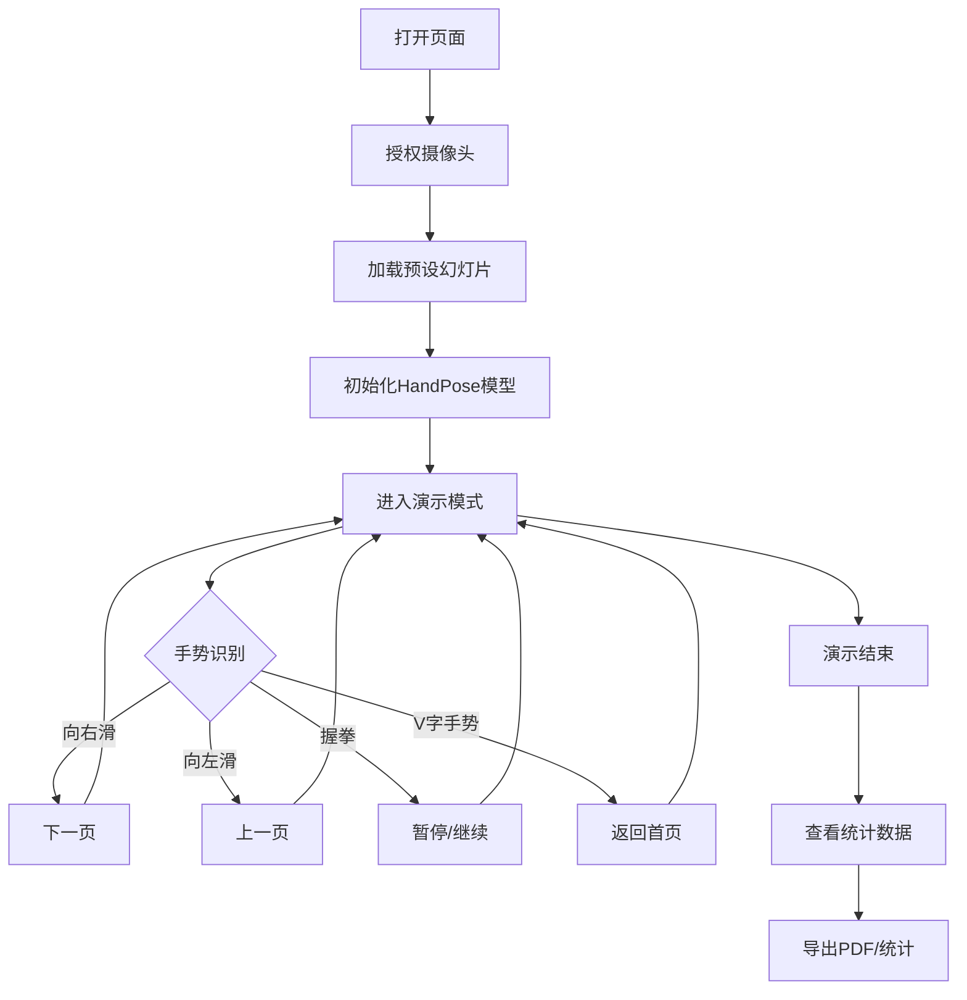

## 1. 产品概述

基于HTML、CSS和原生JavaScript的AI手势控制幻灯片演示系统，通过摄像头实现无接触式PPT演示控制。
- 解决传统演示需要手持设备翻页的痛点，提供更自然、沉浸的演讲体验
- 面向教育工作者、演讲者、培训师等需要频繁进行演示的用户群体

## 2. 核心功能

### 2.1 用户角色
| 角色 | 注册方式 | 核心权限 |
|------|----------|----------|
| 演示者 | 无需注册，直接使用 | 使用手势控制幻灯片、上传自定义幻灯片、导出演示统计 |

### 2.2 功能模块
1. **演示主界面**：幻灯片展示、页码显示、手势识别状态
2. **手势控制模块**：HandPose模型加载、手势识别、动作映射
3. **设置面板**：手势映射方案、音效开关、校准功能
4. **上传模块**：自定义幻灯片图片上传
5. **统计导出**：观看时长、翻页次数统计导出
6. **PDF导出**：演示内容导出为PDF

### 2.3 页面详情
| 页面名称 | 模块名称 | 功能描述 |
|----------|----------|----------|
| 演示主界面 | 幻灯片展示区 | 全屏显示当前幻灯片内容，支持图片和文本 |
| 演示主界面 | 控制工具栏 | 显示页码、手势状态、设置按钮、手动翻页按钮 |
| 演示主界面 | 手势调试层 | 叠加显示识别到的手势图标和置信度 |
| 设置面板 | 手势映射选择 | 支持多种手势映射方案切换 |
| 设置面板 | 手势校准 | 用户做标准姿势适配摄像头角度 |
| 设置面板 | 音效控制 | 背景音乐和翻页音效开关 |
| 设置面板 | 语音播报 | 语音播报当前页码开关 |
| 上传界面 | 文件上传 | 按顺序命名上传幻灯片图片 |
| 统计面板 | 数据展示 | 显示观看时长和翻页次数 |

## 3. 核心流程

用户打开页面→授权摄像头→加载预设幻灯片→等待HandPose模型初始化→开始演示
→手势识别→匹配动作映射→执行对应操作（翻页/暂停/返回首页）
→演示结束→查看统计→导出PDF/统计数据

## 4. 用户界面设计

### 4.1 设计风格
- **主色调**：深蓝渐变(#1a1a2e → #16213e) 科技感背景
- **强调色**：青色(#00fff5) 用于手势识别状态、按钮高亮
- **辅助色**：淡紫(#e94560) 用于警告和暂停状态
- **按钮风格**：圆角玻璃拟态按钮，带微发光效果
- **字体**：标题使用'Poppins'，正文使用'Noto Sans SC'
- **布局风格**：全屏沉浸式布局，工具栏采用悬浮玻璃效果
- **图标风格**：线性图标，带发光动画效果

### 4.2 页面设计概述
| 页面名称 | 模块名称 | UI元素 |
|----------|----------|---------|
| 演示主界面 | 幻灯片区 | 全屏切换动画、平滑过渡、背景模糊效果 |
| 演示主界面 | 工具栏 | 半透明玻璃效果、固定在底部、淡入淡出动画 |
| 演示主界面 | 手势状态层 | 右上角悬浮、圆形图标、置信度进度条、实时动画 |
| 设置面板 | 侧边抽屉 | 从右侧滑出、毛玻璃背景、表单分组 |
| 上传界面 | 拖拽区域 | 虚线边框、hover变色、文件预览缩略图 |
| 统计面板 | 数据卡片 | 数字动画、渐变背景、导出按钮 |

### 4.3 响应式
- 桌面端优先设计，适配1920×1080及以上分辨率
- 移动端适配：工具栏自动调整位置，支持触摸滑动翻页
- 触摸屏优化：增大点击区域，支持左右滑动手势翻页

### 4.4 动效设计
- 幻灯片切换：3D翻页效果或淡入淡出切换
- 手势识别成功：图标放大+发光脉冲动画
- 工具栏：鼠标移近时显示，移开时半透明隐藏
- 按钮hover：轻微上浮+阴影加深
