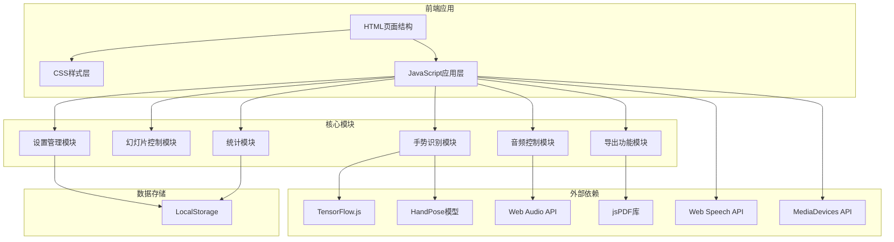

## 1. 架构设计



## 2. 技术描述

- **前端技术栈**: 原生HTML5 + CSS3 + Vanilla JavaScript (ES6+)
- **AI模型**: TensorFlow.js + MediaPipe Hands (替代HandPose，性能更优)
- **PDF导出**: jsPDF + html2canvas
- **音频**: Web Audio API + 内置Audio对象
- **语音合成**: Web Speech API (SpeechSynthesis)
- **摄像头**: MediaDevices API (getUserMedia)
- **本地存储**: localStorage 存储用户设置和统计数据
- **响应式**: CSS Media Queries + Flexbox/Grid

## 3. 文件结构

| 文件路径 | 用途 |
|---------|------|
| /index.html | 主页面，包含所有UI结构 |
| /css/style.css | 所有样式，包含动画和响应式设计 |
| /js/app.js | 主应用逻辑，初始化和协调各模块 |
| /js/gesture.js | 手势识别和动作映射 |
| /js/slides.js | 幻灯片数据和控制逻辑 |
| /js/audio.js | 音频控制（背景音乐、翻页音效） |
| /js/export.js | PDF导出和统计导出功能 |
| /js/stats.js | 演示统计数据收集 |
| /assets/sounds/ | 音效文件目录 |
| /assets/slides/ | 预设幻灯片图片 |
| /assets/icons/ | 手势图标和UI图标 |

## 4. 核心API设计

### 4.1 手势识别模块 (GestureRecognition)
```javascript
class GestureRecognition {
  async init() // 初始化TensorFlow.js和Hand模型
  async detect(video) // 检测手部关键点
  classifyGesture(landmarks) // 分类手势类型
  trackSwipe(landmarks) // 跟踪滑动手势
  calibrate(landmarks) // 手势校准
  setMappingScheme(scheme) // 设置手势映射方案
}
```

### 4.2 幻灯片控制模块 (SlideController)
```javascript
class SlideController {
  loadSlides(slides) // 加载幻灯片数据
  next() // 下一页
  prev() // 上一页
  goTo(index) // 跳转到指定页
  togglePause() // 暂停/继续
  getCurrentPage() // 获取当前页码
  getTotalPages() // 获取总页数
}
```

### 4.3 手势映射方案
```javascript
const gestureSchemes = {
  default: {
    swipeRight: 'next',
    swipeLeft: 'prev',
    fist: 'togglePause',
    victory: 'goToFirst'
  },
  alternative: {
    swipeRight: 'prev',
    swipeLeft: 'next',
    openPalm: 'togglePause',
    thumbUp: 'goToFirst'
  }
}
```

## 5. 数据模型

### 5.1 用户设置
```javascript
{
  gestureScheme: 'default',
  soundEnabled: true,
  bgmEnabled: false,
  voiceEnabled: true,
  debugMode: true,
  sensitivity: 0.7,
  calibrated: false,
  calibrationData: {}
}
```

### 5.2 演示统计
```javascript
{
  startTime: timestamp,
  endTime: timestamp,
  totalDuration: seconds,
  pageViews: { [pageIndex]: viewDuration },
  swipeCount: { left: number, right: number },
  gestureDetected: { [gestureType]: count }
}
```

### 5.3 幻灯片数据
```javascript
[
  {
    id: 1,
    type: 'image' | 'text',
    content: 'url' | 'html',
    title: '幻灯片标题'
  }
]
```

## 6. 性能优化

1. **手势识别节流**: 使用requestAnimationFrame控制检测频率
2. **Web Worker**: 模型推理在Web Worker中执行，不阻塞主线程
3. **图片懒加载**: 幻灯片图片按需加载
4. **GPU加速**: 使用CSS transform和opacity动画
5. **防抖处理**: 手势动作防抖，防止误触发
6. **内存管理**: 及时清理TensorFlow张量，防止内存泄漏
