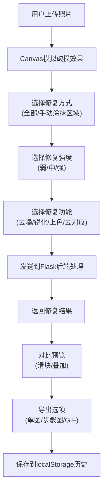

## 1. 产品概述

AI老照片修复模拟器是一款基于Web的图像处理工具，通过前端Canvas技术和后端Flask服务，帮助用户修复破损、模糊的老照片，提升照片质量并实现智能上色。支持手动选择修复区域、对比预览、批量处理等高级功能。

- 解决问题：老照片数字化修复，帮助用户保存珍贵回忆
- 目标用户：普通家庭用户、摄影爱好者、历史研究者
- 市场价值：降低专业照片修复门槛，提供便捷的在线修复体验

## 2. 核心功能

### 2.1 用户角色
| 角色 | 注册方式 | 核心权限 |
|------|----------|----------|
| 普通用户 | 无需注册 | 使用所有修复功能、本地保存历史记录 |

### 2.2 功能模块
1. **主修复页面**：照片上传、Canvas编辑、区域选择、修复控制
2. **对比预览**：修复前后滑块对比、叠加查看差异
3. **批量处理**：文件夹批量上传、ZIP打包下载
4. **历史记录**：localStorage存储修复历史、追溯查看
5. **导出功能**：中间步骤导出、GIF动图生成分享

### 2.3 页面详情
| 页面名称 | 模块名称 | 功能描述 |
|---------|----------|----------|
| 主修复页面 | 上传区域 | 拖拽上传、点击上传、破损效果模拟 |
| 主修复页面 | 画笔工具 | 手动涂抹选择修复区域、调整画笔大小 |
| 主修复页面 | 修复控制 | 强度选择（弱/中/强）、修复类型选择 |
| 主修复页面 | 功能按钮 | 去噪、锐化、对比度增强、上色、划痕去除 |
| 对比预览 | 滑块分割 | 拖拽滑块对比修复前后效果 |
| 对比预览 | 叠加模式 | 半透明叠加查看差异 |
| 批量处理 | 批量上传 | 文件夹选择、多文件上传 |
| 批量处理 | 进度显示 | 处理进度条、单文件状态 |
| 历史记录 | 历史列表 | 显示最近修复记录、时间戳 |
| 历史记录 | 重新加载 | 一键加载历史照片重新编辑 |

## 3. 核心流程

## 4. 用户界面设计

### 4.1 设计风格
- **主色调**：深胡桃木色 (#5D4037) + 暖金色 (#FFB74D) - 营造怀旧复古氛围
- **辅助色**：米白色背景 (#FAF5EF)、深棕色文字 (#3E2723)
- **按钮风格**：圆角矩形、微立体效果、hover时金色光晕
- **字体**：标题使用 'Playfair Display' 衬线字体，正文使用 'Noto Sans SC'
- **布局风格**：左右分栏布局，左侧工具面板 + 右侧Canvas区域
- **图标风格**：线性图标配合暖金色填充

### 4.2 页面设计概述
| 页面名称 | 模块名称 | UI元素 |
|---------|----------|--------|
| 主修复页面 | 上传区域 | 虚线边框、拖放动画、复古纸张纹理背景 |
| 主修复页面 | 工具面板 | 木质纹理侧边栏、分组折叠控件 |
| 主修复页面 | Canvas区域 | 暗角效果、阴影、类似相框的边框设计 |
| 对比预览 | 滑块组件 | 金色滑块把手、左右分区标签、平滑过渡动画 |
| 历史记录 | 卡片列表 | 缩略图卡片、悬停放大效果、时间戳标签 |

### 4.3 响应式
- 桌面端（≥1200px）：左右分栏布局，工具面板固定宽度320px
- 平板端（768-1199px）：工具面板可折叠，Canvas自适应
- 移动端（<768px）：上下布局，工具面板移到底部，支持触摸操作

### 4.4 动效设计
- 页面加载：木质纹理渐显、相框元素淡入
- 上传交互：拖入时边框发光、照片放入动画
- 修复过程：Canvas加载动画、进度条流动效果
- 按钮交互：点击时微缩反馈、金色波纹扩散
