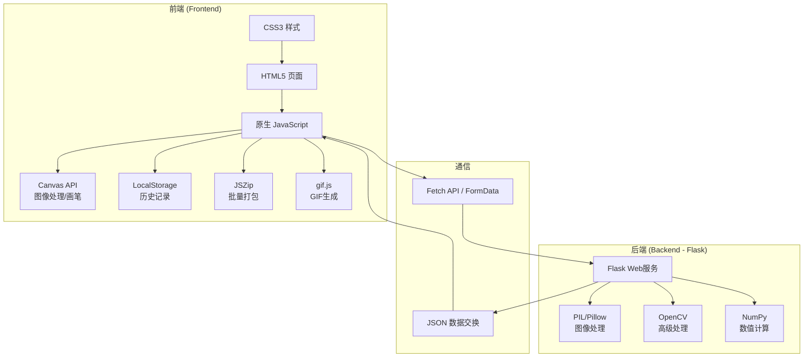

## 1. 架构设计



## 2. 技术描述

- **前端技术栈**：
  - HTML5：语义化结构、Canvas元素、文件API
  - CSS3：Flexbox/Grid布局、CSS变量、动画过渡、自定义属性
  - 原生 JavaScript (ES6+)：模块化、异步/等待、事件委托
  - Canvas API：像素操作、路径绘制、区域选择
  - LocalStorage：本地历史记录持久化
  - JSZip (v3.10.1)：批量文件ZIP打包
  - gif.js (v0.2.0)：客户端GIF动图生成

- **后端技术栈**：
  - Flask (v2.3.3)：轻量级Web框架
  - Pillow (v10.0.0)：Python图像处理库
  - OpenCV-Python (v4.8.0)：计算机视觉算法
  - NumPy (v1.24.3)：数值计算和数组操作
  - Werkzeug：文件上传处理

- **开发工具**：
  - 纯前端无需构建工具，直接浏览器运行
  - Python venv：后端虚拟环境

## 3. 目录结构

```
project/
├── frontend/
│   ├── index.html              # 主页面
│   ├── css/
│   │   └── style.css           # 样式文件
│   ├── js/
│   │   ├── main.js             # 主逻辑
│   │   ├── canvas.js           # Canvas操作
│   │   ├── tools.js            # 工具函数
│   │   └── history.js          # 历史记录
│   └── lib/
│       ├── jszip.min.js        # JSZip库
│       └── gif.js              # GIF库
├── backend/
│   ├── app.py                  # Flask主程序
│   ├── image_processing.py     # 图像处理算法
│   ├── requirements.txt        # Python依赖
│   └── venv/                   # 虚拟环境
└── uploads/                    # 临时上传目录
```

## 4. API 定义

### 4.1 单张照片修复
**请求**：
```typescript
POST /api/repair
Content-Type: multipart/form-data

interface RepairRequest {
  image: File;                    // 原始图片文件
  mask?: string;                  // Base64编码的选区蒙版（可选）
  intensity: 'weak' | 'medium' | 'strong';  // 修复强度
  operations: {
    denoise: boolean;             // 去噪
    sharpen: boolean;             // 锐化
    contrast: boolean;            // 对比度增强
    colorize: boolean;            // 上色
    removeScratches: boolean;     // 划痕去除
  };
}
```

**响应**：
```typescript
interface RepairResponse {
  success: boolean;
  original: string;               // 原图Base64
  repaired: string;               // 修复后Base64
  steps: {
    denoised?: string;            // 去噪后
    sharpened?: string;           // 锐化后
    contrast?: string;            // 对比度增强后
    colorized?: string;           // 上色后
  };
  time: number;                   // 处理耗时(ms)
}
```

### 4.2 批量修复
**请求**：
```typescript
POST /api/batch-repair
Content-Type: multipart/form-data

interface BatchRepairRequest {
  images: File[];
  intensity: string;
  operations: object;
}
```

**响应**：
```typescript
interface BatchRepairResponse {
  success: boolean;
  results: Array<{
    filename: string;
    original: string;
    repaired: string;
  }>;
}
```

### 4.3 破损效果模拟（前端调用后端）
**请求**：
```typescript
POST /api/simulate-damage
Content-Type: multipart/form-data

interface SimulateDamageRequest {
  image: File;
  damageLevel: number;  // 0-100
  scratchCount: number;
  fadeAmount: number;
}
```

## 5. 前端模块说明

### 5.1 Canvas 模块 (canvas.js)
- `PhotoCanvas` 类：管理照片画布
- `BrushTool` 类：画笔工具实现区域选择
- `DamageSimulator` 类：前端破损效果模拟
- `CompareSlider` 类：修复前后对比滑块

### 5.2 主逻辑模块 (main.js)
- 文件上传处理
- 工具面板交互
- 修复流程控制
- 导出功能实现

### 5.3 历史记录模块 (history.js)
- `HistoryManager` 类：localStorage CRUD操作
- 记录结构：{id, timestamp, thumbnail, originalData, repairedData}

### 5.4 工具模块 (tools.js)
- 文件处理工具函数
- Base64转换
- 下载功能

## 6. 后端图像处理算法

### 6.1 去噪算法
- 高斯模糊（轻度去噪）
- 中值滤波（椒盐噪声去除）
- 双边滤波（保留边缘的去噪）

### 6.2 锐化算法
- USM (Unsharp Mask) 锐化
- 拉普拉斯算子增强

### 6.3 对比度增强
- CLAHE (限制对比度自适应直方图均衡化)
- 线性对比度拉伸

### 6.4 智能上色（规则-based）
- 天空检测 + 蓝色调
- 草地检测 + 绿色调
- 皮肤检测 + 肤色调整
- 灰度图分层着色

### 6.5 划痕去除
- 形态学操作检测线状缺陷
- 邻域像素插值修复

## 7. 数据存储

### 7.1 LocalStorage 历史记录结构
```javascript
{
  photoHistory: [
    {
      id: "uuid_string",
      timestamp: 1699999999999,
      originalThumb: "data:image/jpeg;base64,...",
      repairedThumb: "data:image/jpeg;base64,...",
      settings: { intensity, operations }
    }
  ]
}
```

### 7.2 存储限制
- 最多保存50条记录
- 缩略图压缩到最大200x200像素
- 超出限制时自动删除最旧记录
