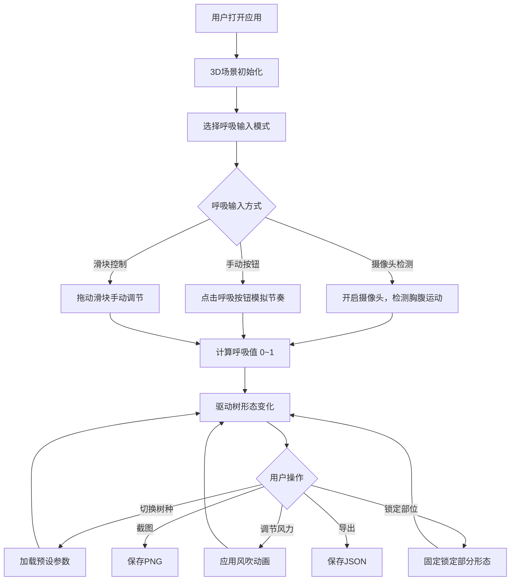

## 1. 产品概述

基于Three.js的交互式3D"呼吸之树"应用——一棵由AI实时生成的抽象树，其形态（分支角度、树叶颜色、树干扭曲）随用户呼吸频率动态变化。吸气时树枝向外伸展、树叶变亮；呼气时收缩、变暗。支持多种树种预设、风吹效果、落叶粒子、截图导出等丰富功能，打造沉浸式的呼吸冥想体验。

- 目标用户：冥想爱好者、数字艺术爱好者、交互体验探索者
- 核心价值：将呼吸这一生理行为转化为可视化的3D艺术体验，帮助用户通过视觉反馈调节呼吸节奏

## 2. 核心功能

### 2.1 用户角色
无需角色区分，所有用户享有完整功能。

### 2.2 功能模块
1. **主场景页**：3D抽象树场景、呼吸交互、控制面板、环境效果

### 2.3 页面详情

| 页面名称 | 模块名称 | 功能描述 |
|---------|---------|---------|
| 主场景页 | 3D抽象树 | 基于递归L-System算法生成的抽象树，形态随呼吸值实时变化：分支角度0°~60°、树叶亮度/颜色渐变、树干扭曲度0~2π |
| 主场景页 | 呼吸检测 | 支持两种模式：(1)摄像头检测胸腹部运动估算呼吸频率；(2)手动点击"呼吸"按钮模拟呼吸节奏 |
| 主场景页 | 呼吸滑块 | 手动调节呼吸节奏（0~1连续值），实时预览树形态变化效果 |
| 主场景页 | 树种预设 | 三种预设：橡树（粗壮短分支）、柳树（细长下垂枝）、樱花树（细密粉色枝），影响整体形态参数 |
| 主场景页 | 风吹效果 | 可调节风力滑块（0~1），使树叶轻微飘动/偏移 |
| 主场景页 | 环境场景 | 地面草地纹理平面 + 天空球背景，营造自然氛围 |
| 主场景页 | 落叶粒子 | 树下阴影粒子系统，模拟落叶飘落效果 |
| 主场景页 | 呼吸进度条 | 圆形进度条显示当前"呼吸值"（0~1），吸气上升、呼气下降 |
| 主场景页 | 相机控制 | 自动环绕旋转 + 用户可手动拖拽暂停自动旋转 |
| 主场景页 | 部位锁定 | 锁定树的某个部分（如树干），只变异未锁定的分支 |
| 主场景页 | 截图保存 | 一键截图保存当前树形态为PNG图片 |
| 主场景页 | 骨架导出 | 导出树的骨架数据（分支坐标）为JSON文件 |

## 3. 核心流程

用户打开应用后进入3D场景，选择呼吸输入模式（摄像头/手动/滑块），呼吸信号驱动树形态实时变化。用户可切换树种预设、调节风力、锁定部位、截图或导出数据。

## 4. 用户界面设计

### 4.1 设计风格
- **主色调**：深墨绿（#0a1f0d）为背景基调，翠绿（#4ade80）与暖金色（#fbbf24）为点缀色
- **辅助色**：呼吸吸气用明亮的翠绿渐变，呼气用深绿暗色调
- **按钮风格**：圆角半透明玻璃态按钮，带模糊背景效果
- **字体**：标题使用"Playfair Display"衬线体营造自然诗意感，正文使用"DM Sans"无衬线体保证可读性
- **布局风格**：全屏3D场景 + 左下角浮动控制面板 + 右下角呼吸进度环
- **图标风格**：线性图标，与自然主题统一

### 4.2 页面设计概览

| 页面名称 | 模块名称 | UI元素 |
|---------|---------|--------|
| 主场景页 | 3D场景区 | 全屏Canvas，天空球+地面草地+抽象树+落叶粒子 |
| 主场景页 | 控制面板 | 左侧浮动玻璃态面板，包含：树种选择按钮组、风力滑块、呼吸模式切换、部位锁定开关、截图/导出按钮 |
| 主场景页 | 呼吸进度环 | 右下角圆形进度环，显示当前呼吸值，吸气时翠绿填充上升，呼气时下降 |
| 主场景页 | 呼吸按钮 | 屏幕下方居中大圆形按钮，按住吸气、松开呼气 |
| 主场景页 | 顶部标题 | 半透明标题栏"呼吸之树"，淡入淡出 |

### 4.3 响应式设计
- 桌面优先设计，全屏3D场景自适应
- 控制面板在小屏幕上折叠为底部抽屉
- 呼吸按钮始终居中可点击

### 4.4 3D场景指导
- **环境/HDRI**：黄昏渐变天空球，从深蓝到暖橙，营造冥想氛围
- **灯光设置**：柔和的环境光 + 方向光模拟日落侧光，强度随呼吸值微调
- **相机设置**：透视相机，45°俯角，距离12单位，自动环绕旋转速度0.1rad/s
- **构图与焦点**：树居中偏上，地面占据下方1/4，天空占据上方2/3
- **交互与动画**：树形态呼吸动画过渡时间0.8s ease-in-out，风吹摆动频率0.5Hz
- **后处理效果**：轻微辉光（bloom）效果增强树叶发光感，呼吸峰值时增强
- **性能预算**：树分支≤5层递归，粒子数≤200，目标60fps
