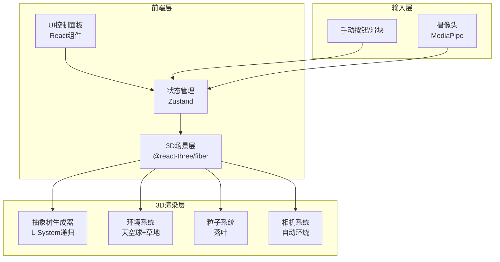

## 1. 架构设计



## 2. 技术说明
- **前端**：React@18 + TypeScript + Tailwind CSS@3 + Vite
- **3D渲染**：Three.js + @react-three/fiber + @react-three/drei + @react-three/postprocessing
- **状态管理**：Zustand
- **摄像头**：MediaPipe Pose（检测胸腹部关键点运动幅度）
- **初始化工具**：vite-init（react-ts模板）
- **后端**：无（纯前端应用）
- **数据库**：无

## 3. 路由定义

| 路由 | 用途 |
|------|------|
| / | 主场景页，包含3D场景与所有交互控件 |

## 4. 数据模型

### 4.1 核心状态模型（Zustand Store）

```typescript
interface TreeState {
  breathValue: number
  breathMode: 'camera' | 'manual' | 'slider'
  treePreset: 'oak' | 'willow' | 'cherry'
  windStrength: number
  lockedParts: Set<'trunk' | 'branches' | 'leaves'>
  autoRotate: boolean
  cameraOrbitSpeed: number
}

interface TreePresetConfig {
  name: string
  branchAngle: [number, number]
  branchLength: [number, number]
  trunkThickness: number
  trunkTwist: number
  leafColor: string
  leafSize: number
  branchDensity: number
  droopFactor: number
}

interface BranchData {
  id: string
  startPoint: [number, number, number]
  endPoint: [number, number, number]
  thickness: number
  children: BranchData[]
  depth: number
  locked: boolean
}
```

### 4.2 树种预设参数

| 参数 | 橡树 | 柳树 | 樱花树 |
|------|------|------|--------|
| 分支角度范围 | 25°~45° | 15°~35° | 30°~55° |
| 分支长度范围 | 1.5~3.0 | 2.0~4.0 | 1.0~2.5 |
| 树干粗细 | 0.5 | 0.3 | 0.25 |
| 树干扭曲 | 0.3 | 0.5 | 0.2 |
| 树叶颜色 | #4ade80 | #86efac | #f9a8d4 |
| 树叶大小 | 0.3 | 0.15 | 0.2 |
| 分支密度 | 3 | 4 | 5 |
| 下垂因子 | 0.0 | 0.6 | 0.1 |

## 5. 组件架构

```
App
├── Canvas (R3F)
│   ├── SkySphere          // 天空球背景
│   ├── GroundGrass        // 地面草地
│   ├── AbstractTree       // 抽象树主体
│   │   ├── TrunkMesh      // 树干网格
│   │   ├── BranchMesh     // 分支网格（递归）
│   │   └── LeafParticles  // 树叶粒子
│   ├── FallingLeaves      // 落叶粒子系统
│   ├── Lighting           // 灯光系统
│   ├── CameraController   // 相机环绕控制
│   └── PostProcessing     // 后处理（bloom）
├── ControlPanel           // 左侧控制面板
│   ├── PresetSelector     // 树种预设选择
│   ├── BreathModeToggle   // 呼吸模式切换
│   ├── BreathSlider       // 呼吸节奏滑块
│   ├── WindSlider         // 风力滑块
│   ├── LockControls       // 部位锁定控件
│   ├── ScreenshotBtn      // 截图按钮
│   └── ExportBtn          // 导出JSON按钮
├── BreathButton           // 手动呼吸按钮
└── BreathProgressRing     // 呼吸进度环
```

## 6. 关键算法

### 6.1 抽象树生成算法
基于递归L-System的参数化树生成：
- 递归深度：5层
- 每层分支数：由预设的branchDensity决定
- 分支角度：基础角度 + breathValue * 偏移量（吸气展开、呼气收缩）
- 树干扭曲：使用sin函数沿Y轴旋转，幅度由breathValue控制

### 6.2 呼吸值驱动
- breathValue范围0~1，0=完全呼气，1=完全吸气
- 吸气（值↑）：分支角度增大、树叶亮度提升、树叶颜色偏暖
- 呼气（值↓）：分支角度减小、树叶亮度降低、树叶颜色偏冷暗

### 6.3 摄像头呼吸检测
- 使用MediaPipe Pose检测胸腹部关键点
- 计算关键点间距离变化率估算呼吸频率
- 映射为0~1的breathValue

### 6.4 风吹效果
- 使用Perlin噪声生成风力向量
- 风力影响树叶位置偏移和轻微摆动
- windStrength控制影响幅度
