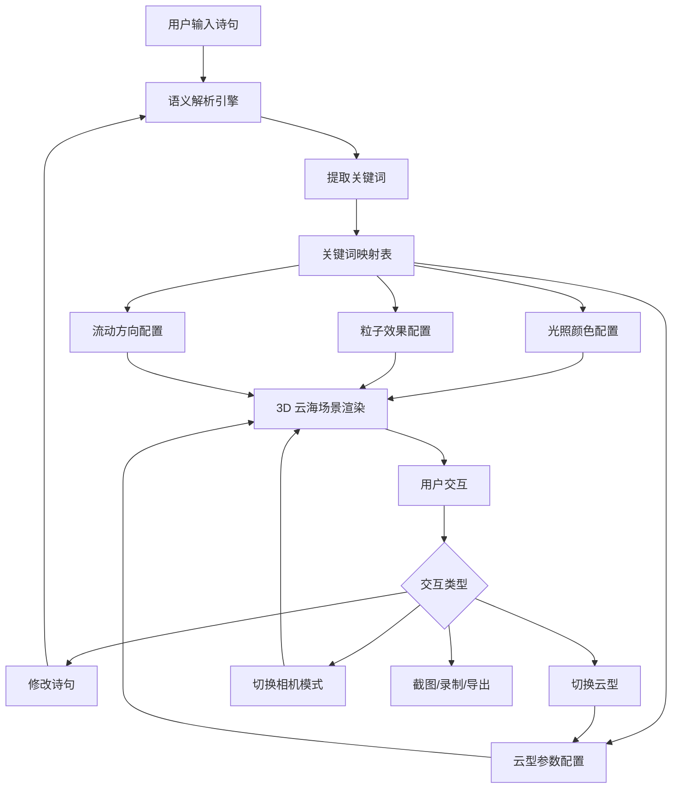

## 1. 产品概述

梦幻云海是一个基于 Three.js 的交互式 3D 诗意云海生成器。用户输入一句古诗词，系统通过语义解析将诗句中的意象转化为 3D 云海的色彩、光照、云型和粒子效果，创造沉浸式的东方美学体验。

- 面向诗词爱好者、数字艺术创作者和沉浸式体验爱好者
- 将中国古典诗词意象与实时 3D 渲染结合，实现"诗中有画，画中有诗"的数字艺术表达

## 2. 核心功能

### 2.1 用户角色

无需角色区分，所有访客均可使用全部功能。

### 2.2 功能模块

1. **主场景页**: 3D 云海渲染、诗句输入、云型选择、粒子效果、相机控制、工具栏（截图/GIF/导出）

### 2.3 页面详情

| 页面名称 | 模块名称 | 功能描述 |
|----------|----------|----------|
| 主场景页 | 诗句输入面板 | 输入框实时接收诗句，解析关键词并驱动云海变化 |
| 主场景页 | 关键词展示区 | 显示当前诗句及解析出的关键词标签（如"落霞→橙红光照"） |
| 主场景页 | 3D 云海场景 | 粒子簇/半透明球体组合云朵，三种云型（积云/卷云/层云），缓慢飘移动画 |
| 主场景页 | 光照与色彩系统 | 基于诗句关键词的环境光、方向光颜色与强度动态变化 |
| 主场景页 | 飞鸟/蝴蝶粒子 | 关键词触发的飞鸟或蝴蝶粒子系统，沿特定路径飞行 |
| 主场景页 | 相机控制 | WASD 自由漫游 + 自动环绕模式切换 |
| 主场景页 | 云型预设选择 | 积云（蓬松圆润）、卷云（丝状飘逸）、层云（平坦延展）三种预设 |
| 主场景页 | 截图工具 | 一键捕获当前画面保存为 PNG |
| 主场景页 | GIF 录制 | 录制云海动画保存为 GIF |
| 主场景页 | JSON 导出 | 导出当前云海参数配置（颜色/云型/粒子/相机位置等）为 JSON 文件 |
| 主场景页 | 背景音乐 | 古琴/自然音效切换，支持静音和音量调节 |

## 3. 核心流程

用户在输入框键入诗句 → 语义解析引擎提取关键词 → 关键词映射到颜色/光照/云型/粒子配置 → 3D 场景平滑过渡到新状态 → 用户可随时修改诗句或切换云型 → 云海实时响应变化。

## 4. 用户界面设计

### 4.1 设计风格

- **主色调**: 深墨蓝 (#0a0e1a) 为底色，配合诗句意象的动态渐变色
- **辅助色**: 半透明乳白 (#ffffffcc) 用于 UI 面板，金色 (#d4a853) 作为点缀
- **按钮风格**: 圆角玻璃拟态 (Glassmorphism)，半透明背景 + 模糊效果
- **字体**: 标题使用"霞鹜文楷"或"LXGW WenKai"，正文使用"Noto Serif SC"
- **布局风格**: 全屏 3D 场景，左侧浮动控制面板，底部诗句展示条
- **图标风格**: 线性图标 (Lucide)，纤细典雅

### 4.2 页面设计概述

| 页面名称 | 模块名称 | UI 元素 |
|----------|----------|----------|
| 主场景页 | 3D 云海 | 全屏 Canvas，深色天幕渐变，云朵粒子，环境光雾 |
| 主场景页 | 左侧控制面板 | 玻璃拟态面板：诗句输入框、云型选择按钮组、飞鸟/蝴蝶开关、相机模式切换 |
| 主场景页 | 底部诗句展示 | 居中浮动条：诗句原文 + 关键词标签（彩色胶囊标签） |
| 主场景页 | 右上工具栏 | 图标按钮组：截图、录制、导出、音乐开关 |
| 主场景页 | 右下相机提示 | 小字提示：WASD 漫游 / 自动环绕中 |

### 4.3 响应式设计

桌面优先设计，3D 场景始终全屏。控制面板在窄屏下可折叠为底部抽屉。

### 4.4 3D 场景指引

- **环境**: 深色天幕 + 多层雾效，营造梦幻深远感
- **光照**: 主方向光 + 环境光，颜色随诗句动态变化；底部微弱补光
- **相机**: 初始俯视 30° 观察云海，支持 WASD 漫游和自动环绕
- **构图**: 云海占据画面中下 2/3，上方留出天幕空间
- **交互**: 鼠标拖拽旋转视角，滚轮缩放，WASD 平移
- **后期处理**: 可选的辉光 (Bloom) 效果增强云的光晕感
- **性能预算**: 目标 60fps，粒子总数控制在 50000 以内
