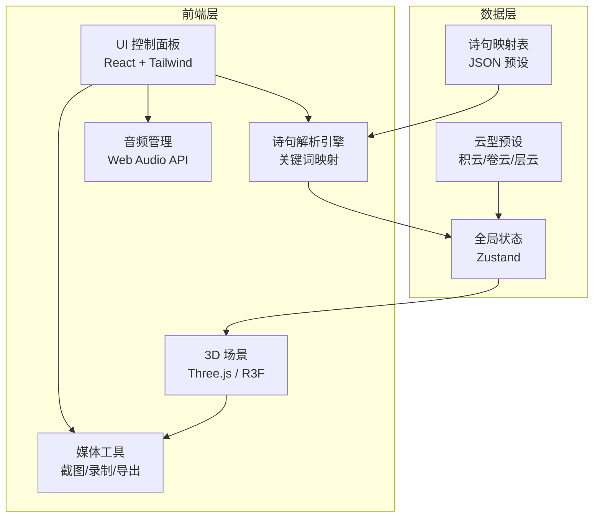
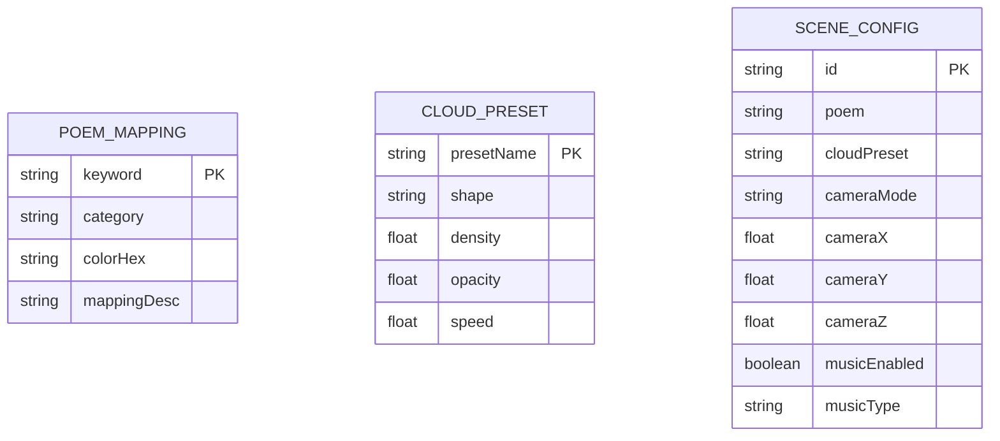

## 1. 架构设计



## 2. 技术说明

- **前端框架**: React 18 + TypeScript + Vite
- **3D 渲染**: three + @react-three/fiber + @react-three/drei + @react-three/postprocessing
- **状态管理**: zustand
- **样式方案**: tailwindcss 3
- **初始化工具**: vite-init (react-ts 模板)
- **后端**: 无（纯前端项目）
- **数据库**: 无

## 3. 路由定义

| 路由 | 用途 |
|------|------|
| / | 主场景页，包含全部功能 |

## 4. API 定义

无后端 API。诗句解析在前端完成，使用本地映射表。

### 4.1 诗句解析接口（内部 TypeScript 类型）

```typescript
interface PoemAnalysis {
  keywords: KeywordMatch[];
  lighting: LightingConfig;
  cloudType: CloudPreset;
  flowDirection: FlowDirection;
  particles: ParticleConfig;
}

interface KeywordMatch {
  word: string;
  category: 'color' | 'creature' | 'nature' | 'emotion';
  mapping: string;
}

interface LightingConfig {
  ambientColor: string;
  ambientIntensity: number;
  directionalColor: string;
  directionalIntensity: number;
  fogColor: string;
}

type CloudPreset = 'cumulus' | 'cirrus' | 'stratus';

type FlowDirection = 'left-to-right' | 'right-to-left' | 'toward-camera' | 'away-from-camera';

interface ParticleConfig {
  type: 'bird' | 'butterfly' | 'none';
  count: number;
  color: string;
  speed: number;
}

interface CloudSceneConfig {
  poem: string;
  analysis: PoemAnalysis;
  cameraPosition: [number, number, number];
  cameraMode: 'free' | 'orbit';
  musicEnabled: boolean;
  musicType: 'guqin' | 'nature';
}
```

## 5. 服务端架构图

无服务端。

## 6. 数据模型

### 6.1 数据模型定义



### 6.2 关键词映射数据定义

```json
{
  "keywords": [
    { "word": "落霞", "category": "color", "colorHex": "#FF6B35", "mappingDesc": "橙红色光照" },
    { "word": "孤鹜", "category": "creature", "particleType": "bird", "mappingDesc": "飞鸟粒子" },
    { "word": "秋水", "category": "nature", "colorHex": "#4A90D9", "mappingDesc": "蓝色水光" },
    { "word": "长天", "category": "nature", "colorHex": "#87CEEB", "mappingDesc": "天蓝环境光" },
    { "word": "明月", "category": "nature", "colorHex": "#F5E6CA", "mappingDesc": "月白光照" },
    { "word": "春风", "category": "nature", "colorHex": "#90EE90", "flowDirection": "left-to-right", "mappingDesc": "绿色暖风" },
    { "word": "残阳", "category": "color", "colorHex": "#DC3545", "mappingDesc": "暗红光照" },
    { "word": "飞雪", "category": "nature", "colorHex": "#E8E8E8", "mappingDesc": "雪白粒子" },
    { "word": "蝴蝶", "category": "creature", "particleType": "butterfly", "mappingDesc": "蝴蝶粒子" },
    { "word": "桃花", "category": "nature", "colorHex": "#FFB6C1", "mappingDesc": "粉色光照" },
    { "word": "烟雨", "category": "nature", "colorHex": "#708090", "mappingDesc": "灰蓝雾效" },
    { "word": "寒霜", "category": "color", "colorHex": "#B0C4DE", "mappingDesc": "冷蓝光照" }
  ]
}
```
