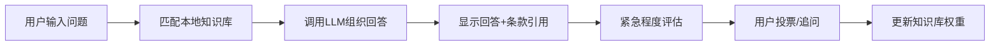
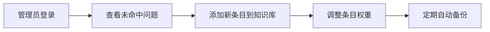

## 1. 产品概述

AI法律咨询问答模拟器是一个基于Flask后端和React前端的智能法律咨询系统，用户可以通过Web界面对劳动法律问题进行提问，系统基于预定义的法律知识库匹配并调用语言模型生成专业回答。

- 核心目标：为普通用户提供便捷、专业的劳动法律咨询服务，降低法律咨询门槛
- 目标用户：有劳动法律疑问的普通民众、企业HR、法律从业者
- 市场价值：填补AI在特定法律领域（劳动法）的应用空白，提供可追溯、可优化的智能咨询体验

## 2. 核心功能

### 2.1 用户角色

| 角色 | 登录方式 | 核心权限 |
|------|----------|----------|
| 普通用户 | 无需登录，匿名使用 | 提问、投票、追问、导出历史、切换语言风格 |
| 管理员 | 密码登录 | 查看未命中问题、管理知识库条目、查看统计数据 |

### 2.2 功能模块

1. **法律咨询首页**：问答对话界面、语言风格切换、紧急提示
2. **对话界面**：多轮对话、上下文追问、法律条款引用显示、投票功能
3. **历史记录**：对话历史查看、导出为文本文件
4. **管理员后台**：高频未命中问题统计、知识库条目管理、数据备份

### 2.3 页面详情

| 页面名称 | 模块名称 | 功能描述 |
|---------|---------|----------|
| 法律咨询首页 | 顶部导航 | 应用标题、管理员入口、语言风格切换 |
| 法律咨询首页 | 对话区域 | 消息列表、输入框、发送按钮、追问功能 |
| 法律咨询首页 | 消息卡片 | 问题展示、回答内容、法律条款引用、紧急程度提示、投票按钮 |
| 法律咨询首页 | 侧边栏 | 历史对话列表、新建对话、导出按钮 |
| 管理员登录页 | 登录表单 | 用户名、密码输入、登录验证 |
| 管理员后台 | 未命中问题 | 高频未命中问题列表、频次统计、一键添加到知识库 |
| 管理员后台 | 知识库管理 | 条目列表、新增/编辑/删除、权重调整 |
| 管理员后台 | 数据统计 | 问答量、投票率、未命中率图表展示 |

## 3. 核心流程

### 3.1 用户咨询流程

用户打开页面 → 输入法律问题 → 系统匹配知识库 → 调用LLM生成回答 → 显示回答及法律条款引用 → 判断紧急程度 → 用户可投票/追问/导出历史

### 3.2 管理员流程

管理员登录 → 查看未命中问题 → 分析高频问题 → 添加/编辑知识库条目 → 系统自动备份

## 4. 用户界面设计

### 4.1 设计风格

- **主色调**：深蓝色 (#1e3a5f) - 象征专业、可信赖
- **辅助色**：金色 (#d4af37) - 象征公正、权威
- **强调色**：红色 (#dc2626) - 用于紧急提示
- **中性色**：浅灰 (#f1f5f9)、深灰 (#334155)
- **按钮风格**：圆角矩形，微妙阴影，hover状态有轻微上浮效果
- **字体**：标题使用 Noto Serif SC（衬线，庄重），正文使用 Noto Sans SC（无衬线，易读）
- **布局风格**：卡片式布局，清晰的视觉层次，充足的留白
- **图标风格**：使用 lucide-react 线性图标，简洁专业

### 4.2 页面设计概览

| 页面名称 | 模块名称 | UI元素 |
|---------|---------|--------|
| 法律咨询首页 | 顶部导航 | 深蓝色背景，金色Logo，语言风格切换下拉，管理员入口 |
| 法律咨询首页 | 对话区域 | 左侧30%为历史会话列表，右侧70%为对话主区域，气泡式消息展示 |
| 法律咨询首页 | 回答卡片 | 白底卡片，法律条款引用用金色边框标注，紧急提示为红色徽章 |
| 法律咨询首页 | 投票区域 | 👍 有帮助 / 👎 无帮助 按钮，点击后显示感谢反馈 |
| 管理员后台 | 仪表盘 | 数据卡片网格，未命中问题排行柱状图，知识库条目统计表 |
| 管理员后台 | 知识库管理 | 表格形式展示条目，搜索框，新增/编辑弹窗 |

### 4.3 响应式设计

- 桌面端优先（1280px+）：三栏布局（导航+历史列表+对话区域）
- 平板端（768px-1279px）：两栏布局，历史列表可折叠
- 移动端（<768px）：单栏布局，底部导航，历史列表为抽屉式
- 所有交互元素最小尺寸44x44px，适配触摸操作

### 4.4 动效设计

- 页面加载：元素淡入，消息列表从下往上滑入
- 发送消息：输入框清空动画，消息气泡弹出效果
- LLM回答：打字机效果逐字显示
- 投票反馈：按钮缩放动画，显示感谢提示
- 紧急提示：红色徽章脉冲动画，吸引注意力
