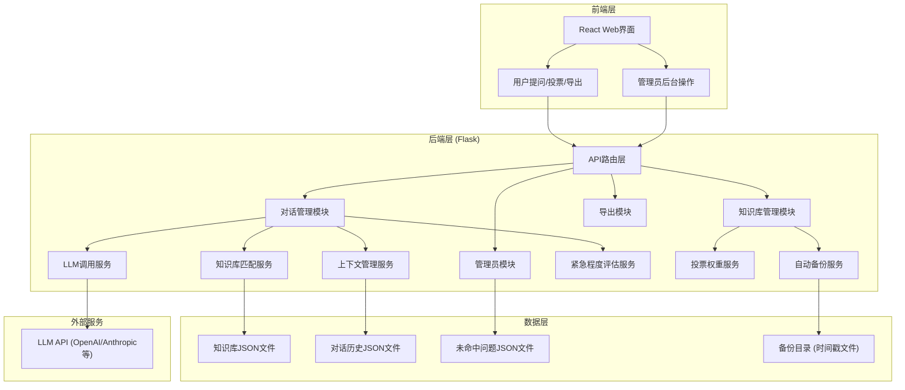
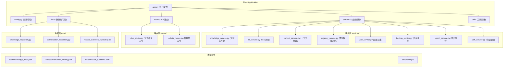
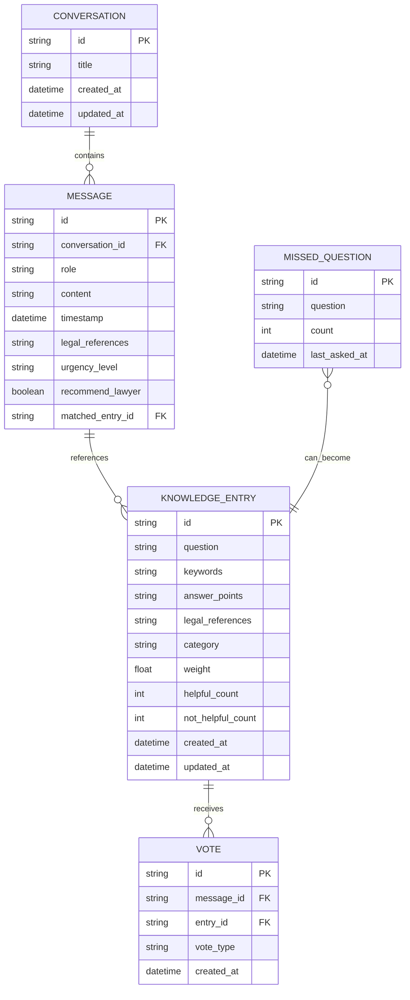

## 1. 架构设计

本项目采用前后端分离架构，Flask负责后端API服务，React负责前端界面展示。知识库以JSON文件形式存储在本地，LLM调用采用可配置的方式支持多种模型。



## 2. 技术栈说明

### 2.1 后端技术栈
- **Web框架**: Flask@3.0.0 - 轻量级Python Web框架，适合快速开发API服务
- **Python版本**: Python 3.10+
- **依赖管理**: pip + requirements.txt
- **LLM集成**: LangChain / 直接调用OpenAI API (可配置)
- **文本匹配**: scikit-learn TF-IDF + 余弦相似度
- **定时任务**: APScheduler@3.10.0 - 用于自动备份
- **认证**: Flask-JWT-Extended@4.6.0 - 管理员登录认证

### 2.2 前端技术栈
- **前端框架**: React@18 + TypeScript
- **构建工具**: Vite@5.0.0
- **样式方案**: TailwindCSS@3.4.0
- **状态管理**: Zustand@4.5.0
- **路由**: React Router@6.21.0
- **图标**: Lucide React@0.312.0
- **HTTP客户端**: Axios@1.6.0
- **Markdown渲染**: react-markdown@9.0.0

### 2.3 数据存储方案
- **知识库**: knowledge_base.json - 存储法律问答条目，包含问题、答案要点、法律条款、权重
- **对话历史**: conversation_history.json - 按会话ID存储多轮对话
- **未命中问题**: missed_questions.json - 存储未能匹配到的问题及频次
- **备份目录**: backups/ - 存储带时间戳的知识库备份文件

## 3. 路由定义

### 3.1 前端路由

| 路由路径 | 页面组件 | 功能说明 |
|---------|---------|----------|
| `/` | ChatPage | 法律咨询主页面，对话界面 |
| `/admin/login` | AdminLoginPage | 管理员登录页 |
| `/admin/dashboard` | AdminDashboardPage | 管理员仪表盘，数据统计 |
| `/admin/knowledge` | KnowledgeManagementPage | 知识库管理页 |
| `/admin/missed` | MissedQuestionsPage | 未命中问题管理页 |

### 3.2 后端API路由

| HTTP方法 | API路径 | 功能说明 | 认证要求 |
|---------|---------|----------|----------|
| POST | `/api/chat` | 发送问题，获取回答 | 否 |
| POST | `/api/chat/:sessionId/followup` | 追问问题，结合上下文 | 否 |
| POST | `/api/vote` | 提交投票（有帮助/无帮助） | 否 |
| GET | `/api/export/:sessionId` | 导出对话历史为文本文件 | 否 |
| GET | `/api/conversations` | 获取会话列表 | 否 |
| GET | `/api/conversations/:sessionId` | 获取会话详情 | 否 |
| POST | `/api/admin/login` | 管理员登录 | 否 |
| GET | `/api/admin/stats` | 获取统计数据 | 是 |
| GET | `/api/admin/missed` | 获取未命中问题列表 | 是 |
| GET | `/api/admin/knowledge` | 获取知识库条目列表 | 是 |
| POST | `/api/admin/knowledge` | 新增知识库条目 | 是 |
| PUT | `/api/admin/knowledge/:id` | 更新知识库条目 | 是 |
| DELETE | `/api/admin/knowledge/:id` | 删除知识库条目 | 是 |
| POST | `/api/admin/knowledge/from-missed` | 从未命中问题添加条目 | 是 |
| POST | `/api/admin/backup` | 手动触发备份 | 是 |
| GET | `/api/admin/backups` | 获取备份文件列表 | 是 |

## 4. API定义

### 4.1 数据类型定义

```typescript
// 知识库条目
interface KnowledgeEntry {
  id: string;
  question: string;
  keywords: string[];
  answer_points: string[];
  legal_references: string[];  // 法律条款引用，如["劳动合同法第47条"]
  category: string;
  weight: number;  // 匹配权重，默认1.0
  helpful_count: number;
  not_helpful_count: number;
  created_at: string;
  updated_at: string;
}

// 对话消息
interface Message {
  id: string;
  role: 'user' | 'assistant';
  content: string;
  timestamp: string;
  legal_references?: string[];
  urgency_level?: 'low' | 'medium' | 'high';
  urgency_reason?: string;
  recommend_lawyer?: boolean;
}

// 会话
interface Conversation {
  id: string;
  title: string;
  messages: Message[];
  created_at: string;
  updated_at: string;
}

// 未命中问题
interface MissedQuestion {
  id: string;
  question: string;
  count: number;
  last_asked_at: string;
}

// 投票请求
interface VoteRequest {
  messageId: string;
  conversationId: string;
  entryId: string;
  vote: 'helpful' | 'not_helpful';
}

// LLM配置
interface LLMConfig {
  provider: 'openai' | 'anthropic' | 'mock';
  apiKey?: string;
  model: string;
  temperature: number;
  maxTokens: number;
}
```

### 4.2 请求/响应示例

#### POST `/api/chat`
**请求体:**
```json
{
  "question": "试用期被辞退有赔偿吗？",
  "style": "simple",
  "sessionId": "optional-new-or-existing"
}
```

**响应体:**
```json
{
  "success": true,
  "data": {
    "conversationId": "conv_123",
    "messageId": "msg_456",
    "answer": "在试用期内，如果用人单位...",
    "legal_references": ["《劳动合同法》第39条", "《劳动合同法》第47条"],
    "urgency_level": "medium",
    "urgency_reason": "涉及劳动权益争议",
    "recommend_lawyer": false,
    "matched_entry_id": "entry_789",
    "matched_score": 0.92
  }
}
```

## 5. 服务器架构



## 6. 数据模型

### 6.1 实体关系图



### 6.2 JSON文件结构示例

#### knowledge_base.json
```json
{
  "entries": [
    {
      "id": "entry_001",
      "question": "试用期被辞退有赔偿吗？",
      "keywords": ["试用期", "辞退", "赔偿", "经济补偿"],
      "answer_points": [
        "试用期内，如果劳动者不符合录用条件，用人单位可以辞退且无需支付经济补偿",
        "如果用人单位违法辞退，需要支付经济赔偿金（2倍经济补偿）",
        "经济补偿按工作年限计算，不满6个月支付半个月工资"
      ],
      "legal_references": [
        "《中华人民共和国劳动合同法》第39条",
        "《中华人民共和国劳动合同法》第47条",
        "《中华人民共和国劳动合同法》第87条"
      ],
      "category": "劳动合同",
      "weight": 1.0,
      "helpful_count": 156,
      "not_helpful_count": 12,
      "created_at": "2024-01-01T00:00:00Z",
      "updated_at": "2024-01-15T10:30:00Z"
    }
  ]
}
```

#### conversation_history.json
```json
{
  "conversations": [
    {
      "id": "conv_001",
      "title": "试用期被辞退有赔偿吗？",
      "messages": [
        {
          "id": "msg_001",
          "role": "user",
          "content": "试用期被辞退有赔偿吗？",
          "timestamp": "2024-01-20T14:30:00Z"
        },
        {
          "id": "msg_002",
          "role": "assistant",
          "content": "在试用期内，...",
          "timestamp": "2024-01-20T14:30:05Z",
          "legal_references": ["《劳动合同法》第39条"],
          "urgency_level": "low",
          "recommend_lawyer": false,
          "matched_entry_id": "entry_001"
        }
      ],
      "created_at": "2024-01-20T14:30:00Z",
      "updated_at": "2024-01-20T14:30:05Z"
    }
  ]
}
```

## 7. 项目目录结构

```
/Users/mac/code/solo coder/247/
├── .trae/
│   └── documents/
│       ├── PRD.md
│       └── TECH_ARCHITECTURE.md
├── backend/                    # Flask后端
│   ├── app.py                  # 应用入口
│   ├── requirements.txt        # Python依赖
│   ├── config.py               # 配置文件
│   ├── routes/                 # API路由
│   │   ├── __init__.py
│   │   ├── chat_routes.py
│   │   └── admin_routes.py
│   ├── services/               # 业务服务
│   │   ├── __init__.py
│   │   ├── knowledge_service.py
│   │   ├── llm_service.py
│   │   ├── context_service.py
│   │   ├── urgency_service.py
│   │   ├── vote_service.py
│   │   ├── backup_service.py
│   │   ├── export_service.py
│   │   └── auth_service.py
│   ├── data/                   # 数据访问层
│   │   ├── __init__.py
│   │   ├── knowledge_repository.py
│   │   ├── conversation_repository.py
│   │   └── missed_question_repository.py
│   ├── utils/                  # 工具函数
│   │   ├── __init__.py
│   │   └── json_utils.py
│   └── data/                   # 数据文件
│       ├── knowledge_base.json
│       ├── conversation_history.json
│       ├── missed_questions.json
│       └── backups/
└── frontend/                   # React前端
    ├── package.json
    ├── vite.config.ts
    ├── tailwind.config.js
    ├── tsconfig.json
    ├── index.html
    └── src/
        ├── main.tsx
        ├── App.tsx
        ├── router.tsx
        ├── store/              # Zustand状态管理
        │   └── useChatStore.ts
        ├── pages/              # 页面组件
        │   ├── ChatPage.tsx
        │   ├── AdminLoginPage.tsx
        │   ├── AdminDashboardPage.tsx
        │   ├── KnowledgeManagementPage.tsx
        │   └── MissedQuestionsPage.tsx
        ├── components/         # 公共组件
        │   ├── ChatMessage.tsx
        │   ├── ChatInput.tsx
        │   ├── ConversationList.tsx
        │   ├── LegalReference.tsx
        │   ├── UrgencyBadge.tsx
        │   └── VoteButtons.tsx
        ├── services/           # API调用
        │   └── api.ts
        ├── types/              # TypeScript类型
        │   └── index.ts
        └── utils/              # 工具函数
            └── export.ts
```
