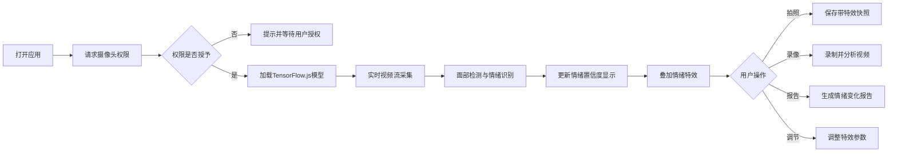

## 1. 产品概述

AI情绪识别表情镜是一款基于Web的实时情绪分析应用，通过用户摄像头捕捉面部表情，使用TensorFlow.js在浏览器端离线运行表情识别模型，实时检测7种基本情绪并提供丰富的交互体验。

- 主要用途：娱乐、情绪自我认知、教学演示
- 解决问题：无需下载应用，浏览器即可使用，保护隐私
- 目标用户：普通用户、教育工作者、技术爱好者
- 产品价值：纯前端离线运行，保护隐私，交互有趣，功能丰富

## 2. 核心功能

### 2.1 用户角色
| 角色 | 注册方式 | 核心权限 |
|------|----------|----------|
| 访客用户 | 无需注册 | 使用所有功能，数据本地存储 |

### 2.2 功能模块
1. **主界面**：摄像头预览、实时情绪检测、情绪特效叠加
2. **控制面板**：特效强度调节、功能开关、模式选择
3. **情绪报告**：情绪变化记录、折线图展示、数据导出
4. **媒体功能**：拍照保存、视频录制、情绪贴纸
5. **辅助功能**：语音反馈、低置信度提示、隐私模式

### 2.3 页面详情
| 页面名称 | 模块名称 | 功能描述 |
|---------|---------|----------|
| 主界面 | 摄像头预览 | 实时显示摄像头画面，支持镜像翻转 |
| 主界面 | 情绪显示区 | 显示7种情绪标签及置信度条，高亮当前主情绪 |
| 主界面 | 特效层 | 根据情绪叠加动态特效（花瓣、火焰等） |
| 控制面板 | 特效调节 | 滑块调节特效强度、粒子数量 |
| 控制面板 | 功能开关 | 语音反馈、隐私模式、贴纸显示等开关 |
| 情绪报告 | 折线图 | 展示一段时间内的情绪变化曲线 |
| 情绪报告 | 数据统计 | 情绪占比分析、平均置信度统计 |
| 媒体功能 | 拍照 | 保存当前情绪快照，可添加情绪贴纸 |
| 媒体功能 | 录像 | 录制视频并分析情绪变化，保存帧数据 |

## 3. 核心流程

用户打开应用 → 请求摄像头权限 → 加载TensorFlow.js表情识别模型 → 实时捕捉视频帧 → 面部检测与情绪分类 → 显示情绪置信度 → 叠加对应特效 → 用户可拍照/录像/生成报告

## 4. 用户界面设计

### 4.1 设计风格
- **主色调**：深邃紫蓝渐变背景 (#1a1a2e → #16213e)，科技感霓虹点缀
- **辅助色**：情绪对应色谱（高兴-金黄、愤怒-火红、悲伤-深蓝等）
- **按钮风格**：玻璃拟态风格，圆角8px，毛玻璃效果，悬停发光
- **字体**：标题使用 Orbitron（科技感），正文使用 Noto Sans SC
- **布局风格**：中央大摄像头预览区，右侧控制面板，底部情绪条，浮动控制面板
- **图标风格**：Emoji + 线性图标混合，与情绪主题呼应

### 4.2 页面设计概述
| 页面名称 | 模块名称 | UI元素 |
|---------|---------|--------|
| 主界面 | 摄像头预览 | 600x450px 居中，圆角16px，边框霓虹发光，镜像显示 |
| 主界面 | 情绪置信度条 | 底部横向排列，7条彩色进度条，动态更新 |
| 主界面 | 特效层 | Canvas叠加，粒子系统，透明度动画 |
| 控制面板 | 侧边栏 | 右侧抽屉式，玻璃拟态背景，滑动展开 |
| 控制面板 | 调节滑块 | 自定义样式滑块，霓虹轨道，圆形滑块按钮 |
| 情绪报告 | 折线图 | Canvas绘制，7色曲线，鼠标悬停显示详情 |
| 媒体功能 | 拍照预览 | 模态弹窗，快照预览，贴纸选择器 |

### 4.3 响应式
- 桌面端优先，侧边控制面板展开
- 平板端：控制面板改为底部抽屉
- 移动端：单列布局，触控优化，按钮放大
- 摄像头区域自适应屏幕尺寸

### 4.4 视觉特效
- **高兴**：金黄色花瓣飘落，阳光光晕
- **悲伤**：蓝色雨滴下落，冷色调滤镜
- **惊讶**：星形爆炸粒子，快速缩放动画
- **愤怒**：火焰粒子环绕，红色脉动边框
- **恐惧**：紫色烟雾，轻微抖动效果
- **厌恶**：绿色气泡，波纹扩散
- **中性**：柔和白光，平静粒子
