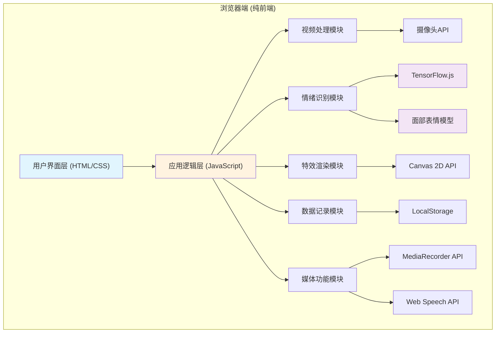

## 1. 架构设计



## 2. 技术描述

- **前端技术栈**：原生 HTML5 + CSS3 + Vanilla JavaScript
- **机器学习**：TensorFlow.js + face-api.js (面部检测与表情识别)
- **渲染引擎**：Canvas 2D API (特效粒子系统)
- **媒体处理**：MediaDevices API、MediaRecorder API、Canvas Capture
- **语音合成**：Web Speech API (SpeechSynthesis)
- **数据存储**：LocalStorage (情绪历史、设置)
- **图表绘制**：原生 Canvas 实现折线图
- **初始化工具**：无构建工具，直接浏览器运行
- **后端**：无，纯前端离线运行

## 3. 项目文件结构

| 文件路径 | 用途 |
|----------|------|
| `/index.html` | 主页面，包含所有UI结构 |
| `/css/style.css` | 全局样式、组件样式、动画效果 |
| `/js/app.js` | 主应用入口，初始化和协调各模块 |
| `/js/camera.js` | 摄像头管理、视频流处理 |
| `/js/emotion.js` | 表情识别模型加载、情绪检测 |
| `/js/effects.js` | 情绪特效粒子系统、Canvas渲染 |
| `/js/recorder.js` | 拍照、视频录制功能 |
| `/js/report.js` | 情绪数据记录、折线图绘制 |
| `/js/speech.js` | 语音反馈TTS功能 |
| `/js/utils.js` | 工具函数、辅助方法 |

## 4. 核心数据结构

### 4.1 情绪数据结构
```javascript
{
  timestamp: number,      // 时间戳
  emotions: {
    happy: number,        // 0-1 置信度
    sad: number,
    surprised: number,
    angry: number,
    fearful: number,
    disgusted: number,
    neutral: number
  },
  dominant: string,       // 主导情绪
  confidence: number      // 主导情绪置信度
}
```

### 4.2 设置配置
```javascript
{
  effectsIntensity: number,    // 特效强度 0-100
  particleCount: number,       // 粒子数量
  voiceFeedback: boolean,      // 语音反馈开关
  privacyMode: boolean,        // 隐私模式
  showStickers: boolean,       // 显示贴纸
  mirrorMode: boolean,         // 镜像模式
  voiceRate: number,           // 语速
  voicePitch: number           // 语调
}
```

## 5. 情绪识别模型说明

使用 face-api.js 提供的预训练模型：
- **面部检测**：TinyFaceDetector (轻量级，快速)
- **特征点检测**：FaceLandmark68Net
- **表情识别**：FaceExpressionNet (支持7种情绪)

模型文件通过 CDN 加载，首次加载后浏览器缓存，支持离线使用。

## 6. 性能优化策略

1. **帧采样**：情绪检测每100ms执行一次，而非每帧
2. **Web Worker**：模型推理考虑在Worker中执行（可选）
3. **粒子池**：复用粒子对象，避免频繁GC
4. **节流处理**：语音反馈、UI更新添加节流
5. **降级策略**：低性能设备自动减少粒子数量

## 7. 浏览器兼容性

- Chrome 70+ (推荐)
- Firefox 65+
- Safari 14+
- Edge 79+

需要支持的API：
- MediaDevices.getUserMedia
- Canvas 2D
- Web Speech API
- MediaRecorder
- LocalStorage
