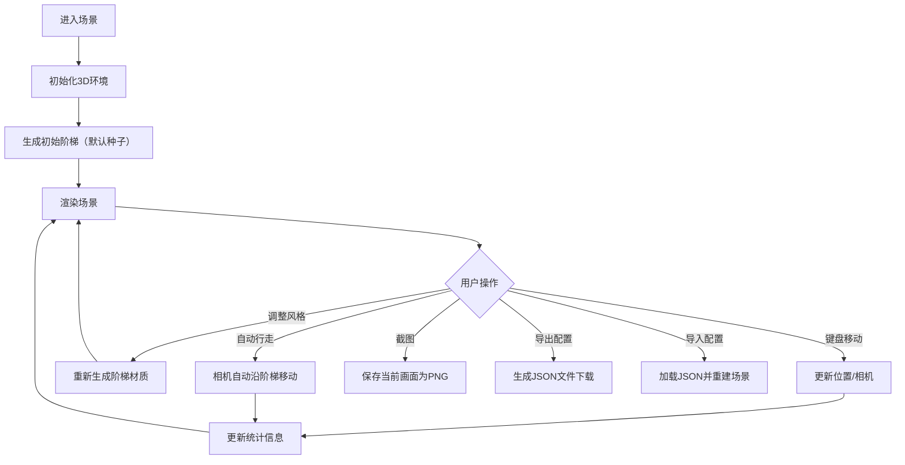

## 1. 产品概述

本项目是一个基于Three.js的交互式3D"无尽阶梯"幻觉场景，用户可以在无限延伸的阶梯上行走探索，阶梯的视觉风格由种子或音乐生成，支持多种交互模式和自定义配置。

- 主要用途：提供沉浸式的3D探索体验，可用于艺术展示、音乐可视化、休闲放松
- 目标用户：对3D艺术、生成式设计、音乐可视化感兴趣的用户
- 产品价值：创造独特的视觉体验，让用户能够生成和分享个性化的无尽阶梯场景

## 2. 核心功能

### 2.1 用户角色
| 角色 | 注册方式 | 核心权限 |
|------|---------|----------|
| 普通用户 | 无需注册 | 浏览场景、控制移动、调整参数、导出配置 |

### 2.2 功能模块
1. **3D阶梯场景**：无尽阶梯生成、基于种子的颜色纹理、多种视觉风格
2. **控制系统**：键盘行走控制、第一/第三人称切换、自动行走模式
3. **视觉系统**：背景切换（星空/深渊）、悬浮粒子路标、后处理效果
4. **交互界面**：控制面板、统计信息显示、截图保存
5. **数据管理**：配置导出/导入JSON、行走记录统计
6. **音频系统**：脚步声效、音效开关

### 2.3 页面详情
| 页面名称 | 模块名称 | 功能描述 |
|---------|---------|----------|
| 主场景页面 | 3D渲染区域 | 全屏Three.js渲染，展示无尽阶梯场景 |
| 主场景页面 | 控制面板 | 折叠式侧边栏，包含所有参数调整选项 |
| 主场景页面 | HUD信息 | 左上角显示行走距离、时间、当前风格等信息 |
| 主场景页面 | 快捷键提示 | 右下角显示键盘操作指南 |

## 3. 核心流程

## 4. 用户界面设计

### 4.1 设计风格
- **整体风格**：极简主义与赛博朋克结合，深色主题，强调3D场景的沉浸感
- **主色调**：深色背景配合高饱和色的阶梯（根据风格动态变化）
- **UI元素**：半透明毛玻璃效果的控制面板，荧光边框点缀
- **字体**：使用 JetBrains Mono 等宽字体作为显示字体，搭配 Inter 作为正文字体
- **图标**：使用简约线性图标，配合霓虹发光效果

### 4.2 页面设计概述
| 页面名称 | 模块名称 | UI元素 |
|---------|---------|--------|
| 主场景页面 | 3D渲染区域 | 全屏Canvas，沉浸式3D场景 |
| 主场景页面 | 控制面板 | 左侧可折叠面板，包含滑块、下拉选择、按钮、颜色选择器 |
| 主场景页面 | HUD信息 | 左上角半透明卡片，显示阶梯数、行走时间、当前风格 |
| 主场景页面 | 快捷键提示 | 右下角半透明卡片，显示WASD/方向键等操作说明 |

### 4.3 响应式
- 桌面端优先设计，控制面板固定在左侧
- 移动端适配：控制面板改为底部抽屉式，触摸控制支持虚拟摇杆
- 自适应不同分辨率，保持场景正确的宽高比

### 4.4 3D场景指导
- **环境氛围**：根据风格动态变化，霓虹风格使用深色背景+发光效果，石质风格使用雾效营造深度
- **灯光设置**：主方向光+环境光，阶梯材质根据风格自发光
- **相机设置**：第一人称（眼高1.6单位），第三人称（跟随在角色后上方），FOV 75度
- **构图**：阶梯呈螺旋或直线延伸向远方，使用雾效和渐隐营造无尽感
- **交互动画**：移动时有轻微的头部晃动，脚步声与步速同步
- **后处理效果**：Bloom泛光（霓虹风格）、FXAA抗锯齿、景深效果
- **性能优化**：对象池复用阶梯平台，视锥体剔除，限制最大渲染阶梯数量
