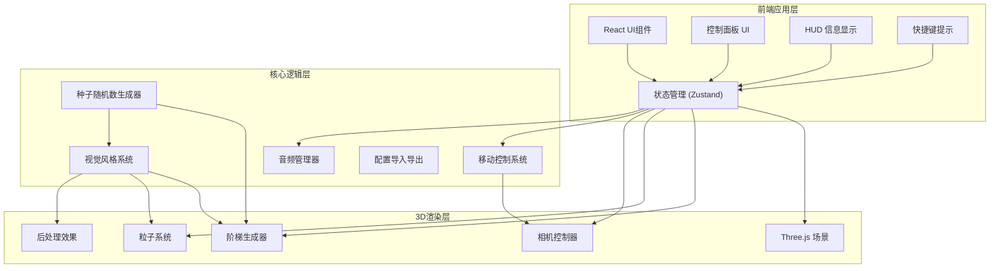

## 1. 架构设计



## 2. 技术描述

- **前端框架**: React@18 + TypeScript
- **构建工具**: Vite@5
- **3D引擎**: Three.js@0.160
- **React Three Fiber**: @react-three/fiber@8
- **3D辅助库**: @react-three/drei@9
- **后处理**: @react-three/postprocessing@2
- **状态管理**: Zustand@4
- **样式方案**: TailwindCSS@3
- **UI组件**: 自定义组件 + lucide-react图标

## 3. 目录结构

```
src/
├── components/
│   ├── ControlPanel/      # 控制面板组件
│   ├── HUD/               # HUD信息显示
│   ├── Shortcuts/         # 快捷键提示
│   └── Scene3D/           # 3D场景包装器
├── store/                  # Zustand状态管理
│   └── useSceneStore.ts   # 场景状态
├── core/                   # 核心逻辑
│   ├── StairGenerator.ts # 阶梯生成器
│   ├── SeedRandom.ts     # 种子随机数
│   ├── StyleSystem.ts    # 视觉风格系统
│   ├── ParticleSystem.ts # 粒子系统
│   ├── MovementController.ts # 移动控制器
│   └── AudioManager.ts   # 音频管理器
├── types/                  # TypeScript类型定义
│   └── index.ts
├── utils/                  # 工具函数
│   ├── screenshot.ts      # 截图功能
│   └── configIO.ts        # 配置导入导出
├── App.tsx
├── main.tsx
└── index.css
```

## 4. 核心类型定义

```typescript
// 视觉风格类型
type VisualStyle = 'neon' | 'stone' | 'glass';

// 背景类型
type BackgroundType = 'starfield' | 'abyss';

// 相机模式
type CameraMode = 'firstPerson' | 'thirdPerson';

// 阶梯配置接口
interface StairConfig {
  seed: string;
  style: VisualStyle;
  background: BackgroundType;
  stairColor: string;
  accentColor: string;
  stepWidth: number;
  stepHeight: number;
  stepDepth: number;
  spiral: boolean;
  spiralAngle: number;
  particleEnabled: boolean;
  particleCount: number;
  autoWalk: boolean;
  autoWalkSpeed: number;
  soundEnabled: boolean;
  soundVolume: number;
}

// 场景状态接口
interface SceneState {
  config: StairConfig;
  position: { x: number; y: number; z: number; stairIndex: number };
  stats: { stairCount: number; totalTime: number; walking: boolean };
  cameraMode: CameraMode;
}
```

## 5. 核心模块说明

### 5.1 阶梯生成器 (StairGenerator)
- 使用种子随机数生成可复现的阶梯布局
- 对象池复用阶梯平台，优化性能
- 支持直线和螺旋两种阶梯模式
- 根据视觉风格应用不同材质
- 动态加载/卸载远处的阶梯，营造无尽效果

### 5.2 视觉风格系统 (StyleSystem)
- 霓虹风格：自发光材质 + Bloom后处理
- 石质风格：PBR材质 + 法线贴图 + 雾效
- 琉璃风格：透明玻璃材质 + 折射效果
- 动态切换风格，重新生成材质

### 5.3 移动控制器 (MovementController)
- 键盘输入处理 (WASD/方向键)
- 第一人称/第三人称相机控制
- 自动行走模式实现
- 碰撞检测，防止走出阶梯
- 头部晃动动画

### 5.4 粒子系统 (ParticleSystem)
- 阶梯两侧悬浮光球/粒子
- 根据种子随机位置和颜色
- 呼吸动画效果
- 性能优化：实例化渲染

### 5.5 音频管理器 (AudioManager)
- 使用Web Audio API生成脚步声
- 可调节音量
- 脚步声与移动同步
- 支持开关

## 6. 配置导入导出
- JSON格式导出当前所有配置
- 导入JSON文件重建场景
- 验证配置参数合法性校验
