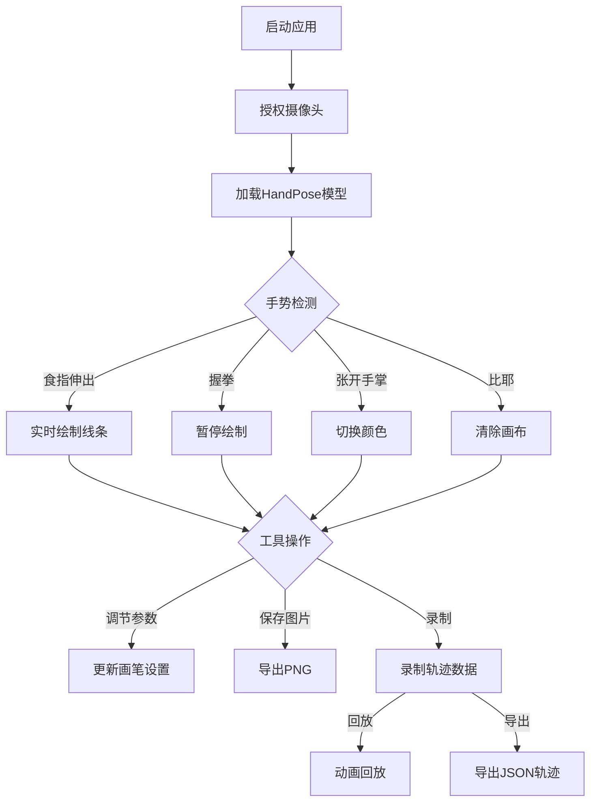

## 1. 产品概述

AI手势绘图板是一款基于浏览器的创意绘图工具，用户通过摄像头用手势在空中绘制线条，系统使用TensorFlow.js的HandPose模型实时追踪食指指尖位置并在Canvas画布上绘制轨迹。目标用户为创意工作者、艺术爱好者及AI交互研究者。

- 解决传统绘图板需要物理触控设备的问题，实现"隔空作画"的沉浸式体验
- 提供完整的手势控制体系，结合录制回放、轨迹导出等功能，可用于艺术创作、交互演示及训练数据收集

## 2. 核心功能

### 2.1 用户角色

| 角色 | 注册方式 | 核心权限 |
|------|----------|----------|
| 普通用户 | 无需注册 | 使用全部绘图与手势功能 |

### 2.2 功能模块

1. **主画布页面**：摄像头预览、Canvas绘制区、手势识别状态、工具栏、录制回放控制

### 2.3 页面详情

| 页面名称 | 模块名称 | 功能描述 |
|----------|----------|----------|
| 主画布页面 | 摄像头区域 | 实时显示摄像头画面，叠加手部关键点可视化 |
| 主画布页面 | 画布绘制区 | 基于Canvas的实时线条绘制，支持背景网格和底图 |
| 主画布页面 | 手势识别状态 | 显示当前手势图标、名称、置信度百分比 |
| 主画布页面 | 工具栏 | 画笔颜色（红/绿/蓝）、粗细、透明度调节 |
| 主画布页面 | 录制回放控制 | 开始/停止录制、回放动画、导出JSON轨迹 |
| 主画布页面 | 灵敏度校准 | 手势识别灵敏度滑块调节 |
| 主画布页面 | 触摸屏模式 | 备用触摸绘制模式开关 |

## 3. 核心流程

1. 用户打开页面，授权摄像头权限
2. 系统加载HandPose模型，开始识别手部关键点
3. 用户伸出食指→系统追踪指尖位置并实时绘制线条
4. 手势控制：
   - 握拳→暂停绘制
   - 张开手掌→切换颜色（红→绿→蓝→红循环）
   - 比耶（剪刀手）→清除画布
5. 用户可通过工具栏调节画笔参数、保存图片、录制过程
6. 录制完成后可回放动画或导出JSON轨迹数据

## 4. 用户界面设计

### 4.1 设计风格

- **主色调**：深色背景（#0a0a0f）搭配霓虹青色（#00f5d4）和品红色（#f72585）点缀
- **次色调**：暗灰面板（#1a1a2e），半透明玻璃态效果
- **按钮风格**：圆角胶囊形，带霓虹发光边框，hover时光晕增强
- **字体**：显示字体用 Orbitron（科技感），UI字体用 Quicksand（圆润友好）
- **布局**：左侧工具栏 + 中央画布 + 右侧状态面板
- **图标风格**：线性霓虹风格，手绘质感线条图标

### 4.2 页面设计概览

| 页面名称 | 模块名称 | UI元素 |
|----------|----------|--------|
| 主画布页面 | 摄像头区域 | 圆角矩形视频框，半透明叠加关键点，霓虹色指尖标记 |
| 主画布页面 | 画布绘制区 | 深色背景Canvas，可选网格线，中央发光十字准星 |
| 主画布页面 | 手势识别状态 | 玻璃态卡片，手势图标（✊/✋/✌️/👆），置信度进度条 |
| 主画布页面 | 工具栏 | 垂直排列图标按钮，颜色选择圆点，粗细/透明度滑块 |
| 主画布页面 | 录制回放控制 | 底部浮动条，录制红点闪烁，进度条，播放/暂停按钮 |
| 主画布页面 | 灵敏度校准 | 设置抽屉面板，滑块+实时预览数值 |
| 主画布页面 | 触摸屏模式 | 工具栏切换按钮，触摸时显示虚拟光标 |

### 4.3 响应式设计

- 桌面优先设计，画布占据主要空间
- 平板端：工具栏收缩为底部浮动条
- 移动端：画布全屏，工具栏为可展开的底部抽屉，触摸绘制模式优先
- 触摸优化：大号触摸目标（最小44px），防误触延迟

### 4.4 动效设计

- 页面加载：工具栏元素依次滑入（staggered reveal）
- 手势切换：状态卡片内容过渡动画，图标缩放弹跳
- 绘制时：指尖位置处显示脉冲光环效果
- 颜色切换：画笔指示器颜色渐变过渡
- 清除画布：涟漪扩散擦除效果
- 录制中：录制按钮脉冲红光，时间码闪烁
