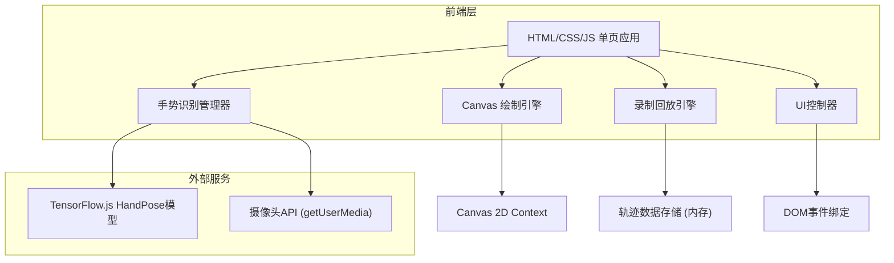

## 1. 架构设计



## 2. 技术说明

- **前端**：HTML5 + CSS3 + 原生JavaScript (ES2020)
- **构建工具**：Vite（开发服务器 + 打包）
- **手势识别**：TensorFlow.js + @tensorflow-models/hand-pose-detection + @mediapipe/hands
- **画布**：HTML5 Canvas 2D API
- **后端**：无（纯前端应用）
- **数据库**：无（所有数据存储在浏览器内存/LocalStorage）

## 3. 路由定义

| 路由 | 用途 |
|------|------|
| / | 主画布页面，包含所有功能 |

## 4. 文件结构

```
├── index.html              # 主入口HTML
├── package.json            # 项目依赖
├── vite.config.js          # Vite配置
├── src/
│   ├── main.js             # 应用入口
│   ├── styles/
│   │   └── main.css        # 主样式文件
│   ├── core/
│   │   ├── camera.js       # 摄像头管理
│   │   ├── gesture.js      # 手势识别与分类
│   │   ├── drawer.js       # 画布绘制引擎
│   │   └── recorder.js     # 录制与回放引擎
│   ├── ui/
│   │   ├── toolbar.js      # 工具栏控制器
│   │   ├── status.js       # 手势状态显示
│   │   └── settings.js     # 设置面板控制器
│   └── utils/
│       ├── math.js         # 数学工具函数
│       └── storage.js      # 导出与存储工具
```

## 5. 核心模块设计

### 5.1 手势识别模块 (gesture.js)

- 使用 @tensorflow-models/hand-pose-detection 检测21个手部关键点
- 手势分类算法：
  - **食指伸出**：食指指尖(8)y < 食指PIP(6)y，其余手指弯曲
  - **握拳**：所有指尖y > 对应PIP关节y
  - **张开手掌**：所有指尖y < 对应PIP关节y，五指展开
  - **比耶**：食指和中指伸出，其余弯曲
- 灵敏度校准：通过调节关键点距离阈值控制识别灵敏度
- 置信度计算：基于关键点检测分数和手势匹配度

### 5.2 绘制引擎 (drawer.js)

- 双Canvas架构：底层绘制Canvas + 顶层UI叠加Canvas
- 坐标映射：摄像头坐标 → Canvas坐标转换
- 平滑绘制：贝塞尔曲线插值，避免断点
- 画笔属性：颜色、粗细（1-30px）、透明度（0.1-1.0）
- 背景管理：纯色/网格/导入图片

### 5.3 录制回放引擎 (recorder.js)

- 轨迹数据结构：
  ```json
  {
    "version": "1.0",
    "canvasSize": { "width": 800, "height": 600 },
    "frames": [
      {
        "timestamp": 0,
        "points": [{ "x": 100, "y": 200, "color": "#ff0000", "size": 3, "opacity": 0.8 }],
        "gesture": { "type": "pointing", "confidence": 0.95 }
      }
    ]
  }
  ```
- 录制：每帧记录指尖位置 + 画笔状态 + 手势信息
- 回放：按时间戳重绘轨迹，支持倍速播放
- JSON导出：完整轨迹数据导出，可用于动画重现或训练数据

### 5.4 摄像头管理 (camera.js)

- getUserMedia获取视频流
- 视频帧 → HandPose模型推理
- 关键点可视化叠加渲染
- 镜像翻转处理（自然绘图体验）

## 6. 关键依赖版本

| 依赖 | 版本 | 用途 |
|------|------|------|
| @tensorflow/tfjs | ^4.x | TensorFlow.js核心 |
| @tensorflow-models/hand-pose-detection | ^2.x | 手部关键点检测 |
| @mediapipe/hands | ^0.4.x | MediaPipe Hands后端 |
| vite | ^5.x | 开发构建工具 |
