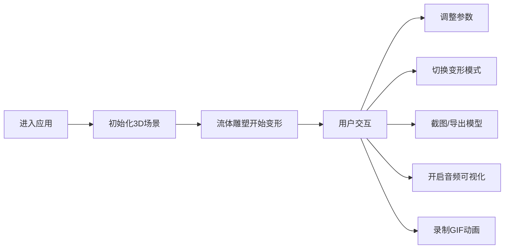

# 3D动态流体雕塑 - 产品需求文档

## 1. 产品概述

一款基于Three.js的交互式3D动态流体雕塑应用，展示实时演算的流体变形效果，提供丰富的参数控制和导出功能。

- 主要用途：艺术展示、创意设计、教育演示
- 核心价值：将抽象的流体物理转化为可视化的艺术作品

## 2. 核心功能

### 2.1 用户角色
无需用户注册，所有访客均可使用全部功能

### 2.2 功能模块
1. **主场景页面**：3D流体雕塑展示、控制面板、状态栏

### 2.3 页面详情

| 页面名称 | 模块名称 | 功能描述 |
|-----------|-------------|---------------------|
| 主场景 | 3D渲染区 | 实时渲染流体雕塑，支持相机拖拽/环绕 |
| 主场景 | 控制面板 | 流动性滑块、光滑度滑块、变形模式切换 |
| 主场景 | 工具栏 | 截图按钮、OBJ导出、GIF录制、音频控制 |
| 主场景 | 状态栏 | 显示帧率、顶点数、当前模式 |
| 主场景 | 环境设置 | 光源控制、背景切换 |

## 3. 核心流程

## 4. 用户界面设计

### 4.1 设计风格
- **主色调**：深色科技风，以黑色/深灰为背景，配合霓虹色流体
- **强调色**：青色 (#00FFFF)、品红 (#FF00FF)、金色 (#FFD700) 动态变化
- **按钮风格**：半透明玻璃态，圆角设计，发光边框
- **字体**：现代无衬线字体，数字使用等宽字体
- **布局**：全屏3D场景 + 右侧悬浮控制面板 + 底部状态栏
- **视觉效果**：毛玻璃背景、高斯模糊、微光粒子

### 4.2 页面设计概述

| 页面名称 | 模块名称 | UI元素 |
|-----------|-------------|-------------|
| 主场景 | 3D渲染区 | 全屏Canvas、流体雕塑、环境光/地面反射 |
| 主场景 | 控制面板 | 半透明侧边栏、滑块控件、切换按钮、下拉选择 |
| 主场景 | 工具栏 | 图标按钮组、悬停提示、状态指示 |
| 主场景 | 状态栏 | 半透明底部条、实时数据显示、模式标签 |

### 4.3 响应性
- 桌面端：全屏体验，右侧控制面板固定宽度
- 平板/移动端：自适应布局，控制面板可折叠
- 触控优化：支持触摸拖拽旋转、捏合缩放

### 4.4 3D场景指导
- **环境**：深色宇宙感背景，可选纯色或带反射地面
- **光照**：环境光 + 可调节点光源，营造金属质感
- **相机**：透视相机，默认自动环绕，支持手动控制
- **材质**：金属度0.8-1.0，粗糙度0.1-0.3，类似水银/液态金属
- **动画**：实时顶点位移，色相循环变化
- **后处理**：抗锯齿、泛光效果、轻微景深
- **性能**：保持60fps，顶点数控制在合理范围
