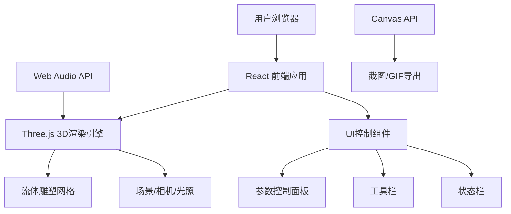

# 3D动态流体雕塑 - 技术架构文档

## 1. 架构设计



## 2. 技术描述

- **前端框架**: React@18 + TypeScript
- **构建工具**: Vite@5
- **样式方案**: TailwindCSS@3
- **3D引擎**: Three.js@latest
- **3D辅助**: OrbitControls, OBJExporter
- **GIF录制**: gif.js 或 canvas录屏方案
- **音频处理**: Web Audio API

## 3. 核心技术点

### 3.1 流体变形算法
- 使用改进的Perlin噪声/Simplex噪声实现顶点位移
- 湍流模式：多频率噪声叠加 + 时间偏移
- 呼吸模式：正弦函数驱动的径向变形 + 表面细节

### 3.2 性能优化
- 使用BufferGeometry进行高效顶点操作
- 顶点位移在CPU计算，GPU渲染
- 可调节细分级别平衡质量与性能

### 3.3 颜色系统
- HSL色彩空间，色相随时间循环
- 变形幅度影响饱和度/亮度

## 4. 项目结构

```
src/
├── components/
│   ├── Scene3D.tsx          # 3D场景主组件
│   ├── ControlPanel.tsx     # 控制面板
│   ├── ToolBar.tsx          # 工具栏
│   └── StatusBar.tsx        # 状态栏
├── hooks/
│   ├── useFluidSculpture.ts # 流体雕塑逻辑hook
│   └── useAudioVisualizer.ts# 音频可视化hook
├── utils/
│   ├── objExport.ts         # OBJ导出工具
│   ├── gifRecorder.ts       # GIF录制工具
│   └── screenshot.ts        # 截图工具
├── types/
│   └── index.ts             # 类型定义
├── App.tsx
├── main.tsx
└── index.css
```

## 5. 状态管理

使用React useState/useRef管理：
- 变形参数（流动性、光滑度）
- 当前模式（湍流/呼吸）
- 环境设置（背景、光源）
- 音频状态
- 录制状态

## 6. 关键接口定义

```typescript
// 流体雕塑参数
interface FluidParams {
  flowSpeed: number;      // 流动性 0-100
  smoothness: number;     // 光滑度 0-100
  mode: 'turbulence' | 'breathing';
  amplitude: number;      // 变形幅度
  hueSpeed: number;       // 色相变化速度
}

// 环境设置
interface EnvSettings {
  background: 'solid' | 'mirror';
  backgroundColor: string;
  ambientLight: boolean;
  pointLight: boolean;
  autoRotate: boolean;
}

// 状态信息
interface StatusInfo {
  fps: number;
  vertexCount: number;
  currentMode: string;
}
```
