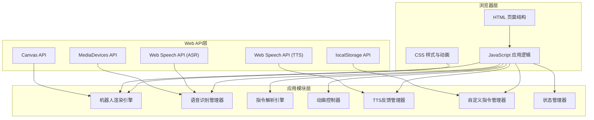

## 1. 架构设计



## 2. 技术描述

- **前端**：原生HTML5 + CSS3 + JavaScript (ES6+)
- **构建工具**：无，纯静态文件，直接在浏览器运行
- **语音识别**：Web Speech API (SpeechRecognition)，支持浏览器内置离线识别
- **语音合成**：Web Speech API (SpeechSynthesis)
- **图形绘制**：Canvas 2D API + CSS3 动画
- **数据存储**：localStorage 本地存储
- **兼容性**：Chrome/Edge 33+、Safari 14.1+、Firefox 不支持语音识别

## 3. 文件结构

| 文件路径 | 用途 |
|----------|------|
| `index.html` | 主页面结构，包含所有DOM元素 |
| `css/style.css` | 全局样式、机器人CSS样式、动画关键帧 |
| `js/robot.js` | 机器人Canvas绘制类，负责渲染和情绪表达 |
| `js/speech.js` | 语音识别和TTS管理类 |
| `js/commands.js` | 指令解析引擎和内置指令定义 |
| `js/animations.js` | 动画控制器，管理所有动画效果 |
| `js/storage.js` | localStorage管理，配置保存加载 |
| `js/app.js` | 主应用入口，协调各模块 |

## 4. 核心数据结构

### 4.1 指令定义

```javascript
interface Command {
  id: string;                    // 唯一标识
  name: string;                  // 指令名称
  keywords: string[];            // 触发关键词
  animation: string;             // 关联动画名称
  duration?: number;             // 默认持续时间(ms)
  emotion?: string;              // 执行时的情绪
  response?: string;             // TTS回应语
  custom?: boolean;              // 是否为用户自定义
}
```

### 4.2 机器人状态

```javascript
interface RobotState {
  position: { x: number; y: number };  // 位置坐标
  rotation: number;                    // 旋转角度
  scale: number;                       // 缩放比例
  emotion: 'happy' | 'sad' | 'surprised' | 'angry' | 'neutral';
  isAnimating: boolean;                // 是否正在执行动画
  currentAnimation: string | null;     // 当前动画名称
}
```

### 4.3 应用配置

```javascript
interface AppConfig {
  customCommands: Command[];           // 自定义指令列表
  voiceEnabled: boolean;               // 是否启用语音反馈
  language: 'zh-CN' | 'en-US';         // 识别语言
  continuousMode: boolean;             // 连续识别模式
  autoSave: boolean;                   // 自动保存配置
}
```

## 5. 指令解析规则

### 5.1 基础指令匹配
- 精确匹配："向左转" → 匹配 `turnLeft` 指令
- 模糊匹配："转一下左边" → 匹配 `turnLeft` 指令
- 关键词匹配：包含关键词数组中任意词即触发

### 5.2 多指令解析
- 分隔符识别："然后"、"接着"、"再" 等连词拆分
- 示例："向左转然后跳舞" → [`turnLeft`, `dance`]
- 队列执行：按顺序逐个执行，前一个完成后启动下一个

### 5.3 参数提取
- 数值参数：正则匹配 `/(\d+)\s*(秒|分钟|ms|s)/`
- 方向参数：识别 "左"、"右"、"前"、"后"
- 程度参数：识别 "快"、"慢"、"大"、"小"
- 示例："旋转5秒" → `{ animation: 'rotate', duration: 5000 }`

## 6. 动画系统设计

### 6.1 动画类型
- **CSS动画**：用于整体位移、旋转、缩放等变换
- **Canvas动画**：用于精细的表情变化、肢体动作
- **混合动画**：CSS处理整体，Canvas处理细节

### 6.2 内置动画列表
| 动画名称 | 描述 | 默认时长 |
|----------|------|----------|
| `turnLeft` | 向左旋转90度 | 1000ms |
| `turnRight` | 向右旋转90度 | 1000ms |
| `dance` | 跳舞动作（左右摇摆+上下跳动） | 3000ms |
| `grow` | 放大1.5倍 | 800ms |
| `shrink` | 缩小0.8倍 | 800ms |
| `rotate` | 360度旋转 | 2000ms |
| `jump` | 跳跃动作 | 500ms |
| `wave` | 挥手动作 | 1500ms |
| `blink` | 眨眼 | 300ms |

### 6.3 情绪映射
| 情绪 | 眼睛形状 | 眉毛角度 | 嘴巴形状 |
|------|----------|----------|----------|
| `happy` | 圆形 | 上挑15° | 上弧线 |
| `sad` | 半圆形 | 下垂15° | 下弧线 |
| `surprised` | 大圆 | 水平 | O形 |
| `angry` | 窄椭圆 | 下斜30° | 直线 |
| `neutral` | 椭圆 | 水平 | 直线 |
